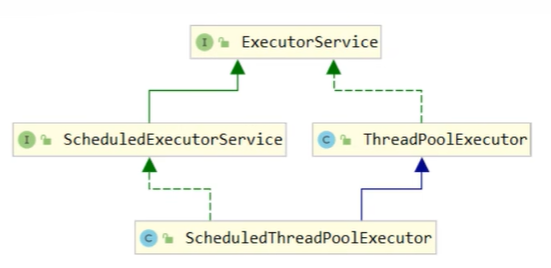

# ReentrantLock

`ReentrantLock` 是 `java.util.concurrent.locks` 包下的显式锁实现，基于 AQS（AbstractQueuedSynchronizer）构建，提供了比 `synchronized` 更灵活的锁控制能力。



## 非公平锁实现原理

ReentrantLock 默认使用非公平锁实现。

```java
// 默认构造器：非公平锁
public ReentrantLock() {
    sync = new NonfairSync();
}

// 指定公平性
public ReentrantLock(boolean fair) {
    sync = fair ? new FairSync() : new NonfairSync();
}
```

`NonfairSync` 继承自 AQS，通过 CAS 修改 state 实现加锁。

### 加锁成功流程

当线程调用 `lock()` 方法尝试获取锁时，如果锁未被占用，会直接通过 CAS 操作成功获取锁。

**核心源码**：

```java
// ReentrantLock.NonfairSync
final void lock() {
    // 1. 直接尝试 CAS 将 state 从 0 改为 1
    if (compareAndSetState(0, 1))
        // 2. CAS 成功，设置当前线程为锁的持有者
        setExclusiveOwnerThread(Thread.currentThread());
    else
        // 3. CAS 失败，进入 AQS 的 acquire 流程
        acquire(1);
}
```

**流程分析**：

1. **CAS 抢锁**：线程首先通过 `compareAndSetState(0, 1)` 尝试将 state 从 0 修改为 1
   - state = 0 表示锁未被占用
   - CAS 成功表示当前线程成功获取到锁

2. **设置持有者**：`setExclusiveOwnerThread(Thread.currentThread())` 将当前线程设置为锁的独占持有者
   - 这个字段用于判断重入场景（同一线程再次加锁）

3. **返回**：加锁成功，`lock()` 方法返回，线程继续执行临界区代码

### 加锁失败流程

当 CAS 操作失败时（state ≠ 0），说明锁已被占用，线程进入 AQS 的 `acquire(1)` 流程。

#### 1. acquire 入口

```java
// AbstractQueuedSynchronizer
public final void acquire(int arg) {
    // 1. 首先尝试获取锁，避免无竞争时进入等待队列；
    //    如果获取失败，不立即阻塞，而是先进入 AQS 队列，后续还会再次尝试获取锁，
    //    因为从本次获取失败到进入阻塞之间，锁可能已经被其他线程释放
    if (!tryAcquire(arg) &&
        // 2. 获取失败则加入 CLH 等待队列，在队列中循环竞争锁：
        //    前驱为 head 时再次尝试获取锁；获取失败才 park 挂起；
        //    被唤醒后继续循环竞争，直到成功获取锁
        acquireQueued(addWaiter(Node.EXCLUSIVE), arg))
        // 3. 若等待期间被中断，则在获取锁后恢复中断标志
        selfInterrupt();
}
```

**selfInterrupt 恢复中断状态**：

```java
static void selfInterrupt() {
    Thread.currentThread().interrupt();
}
```

**不可中断锁的中断处理机制**：

`lock()` 方法是**不可中断**的，但这不意味着忽略中断信号：

1. **等待期间的中断**：
   - 线程在 `LockSupport.park()` 中被中断会唤醒
   - `parkAndCheckInterrupt()` 检测到中断并清除标记
   - 线程继续尝试获取锁，不抛出异常

2. **获取锁后的处理**：
   - `acquireQueued()` 返回 `true` 表示等待期间发生过中断
   - `selfInterrupt()` 重新设置中断标记
   - 上层代码可以检查 `Thread.interrupted()` 并决定如何响应

**与可中断锁对比**：

| 锁类型 | 中断响应 | 使用场景 |
|--------|---------|---------|
| `lock()` | 不抛异常，恢复中断状态 | 必须获取锁的场景 |
| `lockInterruptibly()` | 立即抛出 `InterruptedException` | 允许取消等待的场景 |

#### 2. tryAcquire 尝试获取锁

`tryAcquire()` 是 AQS 的模板方法，由 `NonfairSync` 实现。

```java
// ReentrantLock.NonfairSync
protected final boolean tryAcquire(int acquires) {
    return nonfairTryAcquire(acquires);
}

// ReentrantLock.Sync
final boolean nonfairTryAcquire(int acquires) {
    final Thread current = Thread.currentThread();
    int c = getState();

    // 情况1: 锁未被占用，再次尝试 CAS 获取
    if (c == 0) {
        if (compareAndSetState(0, acquires)) {
            setExclusiveOwnerThread(current);
            return true;  // 获取成功
        }
    }
    // 情况2: 当前线程已持有锁（重入）
    else if (current == getExclusiveOwnerThread()) {
        int nextc = c + acquires;  // state + 1
        if (nextc < 0) // overflow
            throw new Error("Maximum lock count exceeded");
        setState(nextc);  // 不需要 CAS，因为只有持有锁的线程会执行到这里
        return true;  // 重入成功
    }
    // 情况3: 锁被其他线程占用
    return false;  // 获取失败
}
```

**重入逻辑**：
- 如果 `current == exclusiveOwnerThread`，说明当前线程已持有锁
- 将 state 值加 1，表示重入次数增加
- 后续解锁时需要调用相同次数的 `unlock()`

#### 3. addWaiter 加入等待队列

当 `tryAcquire()` 返回 `false` 时，线程需要加入 CLH 等待队列。

```java
// AbstractQueuedSynchronizer
private Node addWaiter(Node mode) {
    // 1. 创建新节点，包装当前线程
    Node node = new Node(Thread.currentThread(), mode);
    Node pred = tail;

    // 2. 快速尝试：如果队列已存在，直接 CAS 插入到队尾
    if (pred != null) {
        node.prev = pred;
        if (compareAndSetTail(pred, node)) {
            pred.next = node;
            return node;
        }
    }

    // 3. 快速插入失败或队列为空，进入完整入队流程
    enq(node);
    return node;
}

private Node enq(final Node node) {
    for (;;) {
        Node t = tail;
        // 队列为空，需要初始化（创建哨兵头节点）
        if (t == null) {
            if (compareAndSetHead(new Node()))
                tail = head;
        } else {
            // CAS 将节点插入队尾
            node.prev = t;
            if (compareAndSetTail(t, node)) {
                t.next = node;
                return t;
            }
        }
    }
}
```

**队列结构**：

```text
初始状态（队列为空）：
head = null, tail = null

    ↓ Thread-2 加入队列（创建哨兵节点）

head                    tail
  ↓                      ↓
[哨兵] ← → [Thread-2]

    ↓ Thread-3 加入队列

head                              tail
  ↓                                ↓
[哨兵] ← → [Thread-2] ← → [Thread-3]
```

::: tip 哨兵节点（Dummy Node）

AQS 使用哨兵节点作为队列的头节点，这是一种经典的链表设计技巧。

**为什么需要哨兵节点**：

1. **简化边界条件处理**：
   - 无需特殊处理空队列的情况
   - 所有等待线程节点都有前驱节点，代码逻辑统一

2. **head 节点的语义**：
   - head 节点不代表等待线程，而是代表**当前持有锁的线程**或**空占位节点**
   - head.next 才是第一个真正等待的线程

3. **出队操作更简单**：
   - 线程获取锁时，只需将自己设置为新的 head
   - 原 head 会被 GC 回收，无需复杂的删除操作

:::

#### 4. acquireQueued 阻塞等待

线程加入队列后，进入 `acquireQueued()` 方法，在循环中尝试获取锁或阻塞等待。

```java
// AbstractQueuedSynchronizer
final boolean acquireQueued(final Node node, int arg) {
    boolean failed = true;
    try {
        boolean interrupted = false;
        for (;;) {
            final Node p = node.predecessor();  // 获取前驱节点

            // 1. 只有当前驱节点是 head 时，当前线程才会尝试获取锁。
            if (p == head && tryAcquire(arg)) {
                setHead(node);  // 获取成功，当前节点成为新的 head
                p.next = null;  // 帮助 GC
                failed = false;
                return interrupted;
            }

            // 2. 判断是否需要阻塞，并执行阻塞
            if (shouldParkAfterFailedAcquire(p, node) &&
                parkAndCheckInterrupt())
                interrupted = true;
        }
    } finally {
        if (failed)
            cancelAcquire(node);
    }
}
```

**shouldParkAfterFailedAcquire 判断是否阻塞**：

```java
private static boolean shouldParkAfterFailedAcquire(Node pred, Node node) {
    int ws = pred.waitStatus;

    // 前驱节点状态为 SIGNAL，表示会唤醒当前节点，可以安全阻塞
    if (ws == Node.SIGNAL)
        return true;

    // 前驱节点被取消（waitStatus > 0），跳过这些节点
    if (ws > 0) {
        do {
            node.prev = pred = pred.prev;
        } while (pred.waitStatus > 0);
        pred.next = node;
    } else {
        // 将前驱节点状态设置为 SIGNAL，下次循环再阻塞
        compareAndSetWaitStatus(pred, ws, Node.SIGNAL);
    }
    return false;
}
```
**阻塞前的准备工作**：
- 第一次循环：设置前驱节点 waitStatus = SIGNAL
- 第二次循环：确认前驱状态为 SIGNAL，执行阻塞

**为什么不立即阻塞**：
- 持有锁的线程可能很快就释放锁
- 给当前线程一次"自旋"机会，避免不必要的上下文切换
- SIGNAL 状态确保前驱释放锁时会唤醒当前线程
  
**parkAndCheckInterrupt 阻塞线程**：

```java
private final boolean parkAndCheckInterrupt() {
    LockSupport.park(this);  // 阻塞当前线程
    return Thread.interrupted();  // 返回并清除中断标记
}
```

### 基本解锁流程

当线程调用 `unlock()` 方法释放锁时,会触发 AQS 的释放流程。如果释放后有等待线程,则会唤醒队列中的下一个线程。

**核心源码**:

```java
// ReentrantLock
public void unlock() {
    sync.release(1);
}

// AbstractQueuedSynchronizer
public final boolean release(int arg) {
    // 1. 尝试释放锁
    if (tryRelease(arg)) {
        Node h = head;
        // 2. 如果队列不为空且头节点状态不为 0,唤醒后继节点
        if (h != null && h.waitStatus != 0)
            unparkSuccessor(h);
        return true;
    }
    return false;
}
```

**tryRelease 释放锁**:

```java
// ReentrantLock.Sync
protected final boolean tryRelease(int releases) {
    // 1. 计算释放后的 state 值
    int c = getState() - releases;

    // 2. 检查当前线程是否持有锁
    if (Thread.currentThread() != getExclusiveOwnerThread())
        throw new IllegalMonitorStateException();

    boolean free = false;
    // 3. 判断是否完全释放(处理重入情况)
    if (c == 0) {
        free = true;
        setExclusiveOwnerThread(null);  // 清除持有者
    }
    setState(c);  // 更新 state
    return free;  // 返回是否完全释放
}
```

**重入锁的释放**:
- 如果锁被重入了 n 次,需要调用 n 次 `unlock()` 才能完全释放
- 每次 `unlock()` 将 state 减 1
- 只有当 state 减到 0 时,`tryRelease()` 才返回 `true`

**unparkSuccessor 唤醒后继节点**:

```java
// AbstractQueuedSynchronizer
private void unparkSuccessor(Node node) {
    int ws = node.waitStatus;
    // 1. 清除头节点的状态
    if (ws < 0)
        compareAndSetWaitStatus(node, ws, 0);

    // 2. 找到下一个需要唤醒的节点
    Node s = node.next;
    // 如果后继节点为空或已取消,从队尾向前找第一个有效节点
    if (s == null || s.waitStatus > 0) {
        s = null;
        for (Node t = tail; t != null && t != node; t = t.prev)
            if (t.waitStatus <= 0)
                s = t;
    }
    // 3. 唤醒找到的节点
    if (s != null)
        LockSupport.unpark(s.thread);
}
```

**为什么从尾部向前遍历**:
- `node.next` 可能为 null 或指向已取消的节点
- 在 `addWaiter()` 中,节点入队时先设置 `prev`,后设置 `next`
- 从 tail 向前遍历能保证找到所有已入队的有效节点

### 解锁竞争成功流程

当持有锁的线程调用 `unlock()` 释放锁后,等待队列中的线程被唤醒并成功获取锁。

**完整流程**:

1. **Thread-1 释放锁**:
   ```java
   // Thread-1 调用 unlock()
   unlock()
     → release(1)
     → tryRelease(1)  // state 从 1 变为 0,返回 true
     → unparkSuccessor(head)  // 唤醒 head.next 节点
   ```

2. **Thread-2 被唤醒**:
   ```java
   // Thread-2 在 acquireQueued() 的循环中被唤醒
   LockSupport.park(this);  // 阻塞在这里
   // ↓ 被 unpark() 唤醒
   return Thread.interrupted();  // 检查中断状态
   ```

3. **Thread-2 尝试获取锁**:
   ```java
   for (;;) {
       final Node p = node.predecessor();
       // Thread-2 的前驱是 head,尝试获取锁
       if (p == head && tryAcquire(arg)) {
           // 获取成功!
           setHead(node);  // Thread-2 成为新的 head
           p.next = null;  // 断开旧 head
           return false;   // 返回未中断
       }
       // ...
   }
   ```

**状态变化图**:

```text
释放前:
head(Thread-1)          tail
    ↓                    ↓
[Thread-1] ← → [Thread-2] ← → [Thread-3]
  持有锁        等待          等待

    ↓ Thread-1 调用 unlock(),唤醒 Thread-2

Thread-2 被唤醒并获取锁:
head(Thread-2)          tail
    ↓                    ↓
[Thread-2] ← → [Thread-3]
  持有锁        等待
```

**关键点**:
- 等待线程被唤醒后,继续在 `acquireQueued()` 的循环中执行
- 前驱节点是 head,满足获取锁的条件
- 通过 `tryAcquire()` 成功获取锁(此时 state = 0)
- 将自己设置为新的 head,完成锁的传递

### 解锁竞争失败流程

这是**非公平锁**的典型场景:当持有锁的线程释放锁并唤醒等待线程时,一个新来的线程可能会"插队"抢先获取锁。

**场景描述**:

```text
初始状态:
head(Thread-1)          tail
    ↓                    ↓
[Thread-1] ← → [Thread-2]
  持有锁        等待

Thread-1 释放锁,同时 Thread-3 新到达:
- Thread-1 调用 unlock(),唤醒 Thread-2
- Thread-3 调用 lock(),直接尝试 CAS 获取锁
```

**竞争时间线**:

| 时间点 | Thread-1(持有锁) | Thread-2(等待中) | Thread-3(新到达) |
|--------|-----------------|------------------|------------------|
| T1 | 调用 `unlock()` | 阻塞在 `park()` | - |
| T2 | 执行 `tryRelease()`,state = 0 | 阻塞在 `park()` | - |
| T3 | 执行 `unparkSuccessor()` | 阻塞在 `park()` | 调用 `lock()` |
| T4 | - | 被唤醒,准备 CAS | 执行 CAS 抢锁 |
| T5 | - | CAS 失败 ❌ | **CAS 成功** ✅ |

**详细流程分析**:

1. **Thread-3 的加锁流程** (非公平锁的插队机制):
   ```java
   // Thread-3 调用 lock()
   final void lock() {
       // 直接尝试 CAS,不检查等待队列
       if (compareAndSetState(0, 1))
           setExclusiveOwnerThread(Thread.currentThread());
       // ...
   }
   ```

2. **Thread-2 的唤醒流程**:
   ```java
   // Thread-2 被 unpark() 唤醒后继续执行
   for (;;) {
       final Node p = node.predecessor();
       if (p == head && tryAcquire(arg)) {  // 尝试获取锁
           // 但此时 state 已被 Thread-3 改为 1
           // tryAcquire() 返回 false
       }
       // 再次进入阻塞逻辑
       if (shouldParkAfterFailedAcquire(p, node) &&
           parkAndCheckInterrupt())
           interrupted = true;
   }
   ```

**状态变化过程**:

```text
1. Thread-1 释放锁,Thread-2 在队列中等待:
head                    tail
  ↓                      ↓
[哨兵] ← → [Thread-2]
          等待(即将被唤醒)

2. Thread-3 新到达,直接 CAS 抢锁(不入队):
Thread-3.lock() → CAS(0→1) 成功!

3. Thread-2 被唤醒但获取锁失败,继续等待:
head                    tail
  ↓                      ↓
[哨兵] ← → [Thread-2]
          等待(继续阻塞)

Thread-3 持有锁(未在队列中)
```

::: tip 为什么 Thread-3 不在队列中?

非公平锁的核心机制:
- **新线程直接竞争**:Thread-3 调用 `lock()` 时,首先尝试 CAS 获取锁
- **成功则不入队**:如果 CAS 成功,直接持有锁,无需进入等待队列
- **失败才入队**:只有 CAS 失败时,才会通过 `acquire()` 进入队列等待

这与队列中的线程不同:
- **队列线程**:已经尝试过获取锁但失败,在队列中等待被唤醒
- **新到达线程**:直接参与竞争,有机会"插队"获取锁

:::

**非公平锁的关键特性**:

1. **新线程可以插队**:
   - Thread-3 调用 `lock()` 时,直接执行 CAS,不检查等待队列
   - 如果此时锁刚好被释放(state = 0),Thread-3 可以立即获取锁
   - Thread-2 虽然被唤醒,但仍需要竞争,可能再次失败

2. **为什么允许插队**:
   - **减少线程唤醒开销**:线程从阻塞到就绪需要时间,新线程可以直接运行
   - **提高吞吐量**:避免 CPU 空闲等待线程唤醒
   - **适用于锁持有时间短的场景**:如果临界区很短,插队影响较小

3. **代价**:
   - **可能导致线程饥饿**:等待线程可能长时间获取不到锁
   - **不保证公平性**:先到达的线程不一定先获取锁

4. **Thread-2 的后续行为**:
   - 竞争失败后,继续在 `acquireQueued()` 循环中等待
   - 重新进入 `park()` 阻塞状态
   - 等待 Thread-3 释放锁后再次被唤醒
   - 下次唤醒时,仍可能被其他新线程插队


## 可重入原理

**可重入锁**（Reentrant Lock）是指同一个线程可以多次获取同一把锁，而不会造成死锁。ReentrantLock 通过 AQS 的 state 字段和 exclusiveOwnerThread 字段实现可重入机制。

### 核心机制

**关键字段**：

1. **state**：记录锁的持有次数
   - state = 0：锁未被占用
   - state = 1：锁被占用一次
   - state = n：锁被重入 n 次

2. **exclusiveOwnerThread**：记录当前持有锁的线程
   - 用于判断当前线程是否已持有锁
   - 只有持有锁的线程才能重入

### 加锁时的重入判断

在 `tryAcquire()` 方法中，如果检测到当前线程已持有锁，会进入重入逻辑：

```java
// ReentrantLock.Sync
final boolean nonfairTryAcquire(int acquires) {
    final Thread current = Thread.currentThread();
    int c = getState();

    if (c == 0) {
        // 锁未被占用，尝试获取
        if (compareAndSetState(0, acquires)) {
            setExclusiveOwnerThread(current);
            return true;
        }
    }
    // 重入判断：当前线程是否已持有锁
    else if (current == getExclusiveOwnerThread()) {
        int nextc = c + acquires;  // state 加 1
        if (nextc < 0) // 溢出检查
            throw new Error("Maximum lock count exceeded");
        setState(nextc);  // 直接修改 state，无需 CAS
        return true;  // 重入成功
    }

    return false;  // 锁被其他线程占用
}
```

**重入逻辑分析**：

1. **线程身份验证**：通过 `current == getExclusiveOwnerThread()` 判断是否为持有锁的线程
2. **state 递增**：将 state 值加 1，表示重入次数增加
3. **无需 CAS**：因为只有持有锁的线程会执行到这里，不存在竞争，直接使用 `setState()` 即可
4. **溢出保护**：如果 state 溢出（超过 `Integer.MAX_VALUE`），抛出异常

### 解锁时的重入处理

解锁时需要递减 state，只有当 state 减到 0 时才真正释放锁：

```java
// ReentrantLock.Sync
protected final boolean tryRelease(int releases) {
    int c = getState() - releases;  // state 减 1

    // 检查是否为持有锁的线程
    if (Thread.currentThread() != getExclusiveOwnerThread())
        throw new IllegalMonitorStateException();

    boolean free = false;
    if (c == 0) {
        // state 归零，完全释放锁
        free = true;
        setExclusiveOwnerThread(null);  // 清除持有者
    }
    setState(c);  // 更新 state
    return free;  // 只有完全释放才返回 true
}
```

**解锁逻辑分析**：

1. **递减 state**：每次 `unlock()` 将 state 减 1
2. **完全释放判断**：只有当 state = 0 时，才清除 `exclusiveOwnerThread` 并返回 `true`
3. **对称性要求**：重入了多少次，就必须解锁多少次

## 可打断原理

### 不可打断模式

**不可打断模式**对应 `lock()` 方法。在此模式下，线程在等待获取锁的过程中即使被中断，也不会抛出 `InterruptedException`，而是继续驻留在 AQS 队列中等待，直到成功获取锁后再恢复中断标记。

#### 中断处理流程

回顾前面讲解的 `acquire()` 方法：

```java
// AbstractQueuedSynchronizer
public final void acquire(int arg) {
    if (!tryAcquire(arg) &&
        acquireQueued(addWaiter(Node.EXCLUSIVE), arg))
        // 如果等待期间发生过中断，获取锁后恢复中断标记
        selfInterrupt();
}

static void selfInterrupt() {
    Thread.currentThread().interrupt();
}
```

**关键点**：
- `acquireQueued()` 返回 `true` 表示等待期间发生过中断
- 获取锁成功后才调用 `selfInterrupt()` 恢复中断标记
- 整个过程不抛出异常

#### acquireQueued 中的中断检测

```java
// AbstractQueuedSynchronizer
final boolean acquireQueued(final Node node, int arg) {
    boolean failed = true;
    try {
        boolean interrupted = false;  // 记录中断状态
        for (;;) {
            final Node p = node.predecessor();
            if (p == head && tryAcquire(arg)) {
                setHead(node);
                p.next = null;
                failed = false;
                return interrupted;  // 返回中断状态
            }

            if (shouldParkAfterFailedAcquire(p, node) &&
                parkAndCheckInterrupt())  // 检测中断
                interrupted = true;  // 记录中断，但不退出循环
        }
    } finally {
        if (failed)
            cancelAcquire(node);
    }
}

private final boolean parkAndCheckInterrupt() {
    LockSupport.park(this);  // 阻塞当前线程
    return Thread.interrupted();  // 返回并清除中断标记
}
```

**流程分析**：

1. **阻塞线程**：通过 `LockSupport.park()` 阻塞线程
2. **中断唤醒**：如果线程被中断，`park()` 会立即返回
3. **记录中断**：`Thread.interrupted()` 检测并清除中断标记，返回 `true`
4. **继续等待**：将 `interrupted` 设为 `true`，但继续在循环中尝试获取锁
5. **获取锁后返回**：成功获取锁后，返回 `interrupted` 标记

#### 中断状态恢复

```java
// 线程获取锁成功后
if (acquireQueued(addWaiter(Node.EXCLUSIVE), arg))
    selfInterrupt();  // 恢复中断标记
```

**为什么要恢复中断状态**：

- 虽然 `lock()` 不响应中断，但中断信号不应该被丢弃
- 上层代码可能需要知道线程在等待期间被中断过
- 通过 `Thread.interrupted()` 或 `Thread.isInterrupted()` 可以检测到

### 可打断模式

**可打断模式**对应 `lockInterruptibly()` 方法，线程在等待锁的过程中如果被中断，会立即抛出 `InterruptedException` 并退出等待队列。

#### lockInterruptibly 方法

```java
// ReentrantLock
public void lockInterruptibly() throws InterruptedException {
    sync.acquireInterruptibly(1);
}

// AbstractQueuedSynchronizer
public final void acquireInterruptibly(int arg) throws InterruptedException {
    // 1. 首先检查当前线程是否已被中断
    if (Thread.interrupted())
        throw new InterruptedException();

    // 2. 尝试获取锁
    if (!tryAcquire(arg))
        // 3. 获取失败，进入可中断的等待流程
        doAcquireInterruptibly(arg);
}
```

**与 lock() 的区别**：

| 特性 | lock() | lockInterruptibly() |
|------|--------|---------------------|
| 方法签名 | `void lock()` | `void lockInterruptibly() throws InterruptedException` |
| 中断响应 | 不抛异常，恢复中断状态 | 立即抛出 `InterruptedException` |
| 等待队列 | 中断后继续等待 | 中断后退出队列 |
| 使用场景 | 必须获取锁的场景 | 允许取消等待的场景 |

#### doAcquireInterruptibly 实现

```java
// AbstractQueuedSynchronizer
private void doAcquireInterruptibly(int arg) throws InterruptedException {
    final Node node = addWaiter(Node.EXCLUSIVE);
    boolean failed = true;
    try {
        for (;;) {
            final Node p = node.predecessor();
            if (p == head && tryAcquire(arg)) {
                setHead(node);
                p.next = null;
                failed = false;
                return;  // 获取锁成功，正常返回
            }

            if (shouldParkAfterFailedAcquire(p, node) &&
                parkAndCheckInterrupt())
                // 关键区别：检测到中断后立即抛出异常
                throw new InterruptedException();
        }
    } finally {
        if (failed)
            cancelAcquire(node);  // 抛异常时清理节点
    }
}
```

**与 acquireQueued 的对比**：

```java
// acquireQueued: 不可打断
if (parkAndCheckInterrupt())
    interrupted = true;  // 只记录，继续循环

// doAcquireInterruptibly: 可打断
if (parkAndCheckInterrupt())
    throw new InterruptedException();  // 立即抛异常，退出循环
```

#### 中断流程示例

**场景**：Thread-2 在等待锁时被中断

```text
初始状态：
head(Thread-1)          tail
    ↓                    ↓
[Thread-1] ← → [Thread-2]
  持有锁        等待中(park)

    ↓ Thread-2.interrupt() 被调用

Thread-2 被中断：
1. LockSupport.park() 立即返回
2. parkAndCheckInterrupt() 返回 true
3. 抛出 InterruptedException
4. 执行 finally 块中的 cancelAcquire(node)

结果：
head(Thread-1)          tail
    ↓                    ↓
[Thread-1]
  持有锁

Thread-2 节点从队列中移除，线程退出等待
```

## 公平锁实现原理

**公平锁**保证锁的获取顺序符合请求锁的时间顺序，即先到先得（FIFO）。与非公平锁不同，公平锁在尝试获取锁之前会先检查 AQS 等待队列中是否有其他线程在排队，如果有则不会"插队"，而是乖乖排到队尾等待。

### 构造公平锁

```java
// ReentrantLock 构造器
public ReentrantLock(boolean fair) {
    sync = fair ? new FairSync() : new NonfairSync();
}

// 创建公平锁
ReentrantLock fairLock = new ReentrantLock(true);
```

### FairSync 实现

```java
// ReentrantLock.FairSync
static final class FairSync extends Sync {
    final void lock() {
        // 公平锁不会直接 CAS 抢锁，而是直接调用 acquire
        acquire(1);
    }

    protected final boolean tryAcquire(int acquires) {
        final Thread current = Thread.currentThread();
        int c = getState();

        if (c == 0) {
            // 关键区别：先检查队列中是否有等待线程
            if (!hasQueuedPredecessors() &&
                compareAndSetState(0, acquires)) {
                setExclusiveOwnerThread(current);
                return true;
            }
        }
        // 重入逻辑与非公平锁相同
        else if (current == getExclusiveOwnerThread()) {
            int nextc = c + acquires;
            if (nextc < 0)
                throw new Error("Maximum lock count exceeded");
            setState(nextc);
            return true;
        }
        return false;
    }
}
```

### hasQueuedPredecessors 检查队列

公平锁的核心在于 `hasQueuedPredecessors()` 方法，它用于判断当前线程之前是否有其他线程在等待：

```java
// AbstractQueuedSynchronizer
public final boolean hasQueuedPredecessors() {
    Node t = tail;  // 尾节点
    Node h = head;  // 头节点
    Node s;

    // 返回 true 表示有前驱节点在等待
    return h != t &&
        ((s = h.next) == null || s.thread != Thread.currentThread());
}
```

**逻辑分析**：

1. **h != t**：队列不为空（head 和 tail 不是同一个节点）
2. **s = h.next**：获取 head 的下一个节点
3. **s == null || s.thread != Thread.currentThread()**：
   - `s == null`：head.next 为空（可能正在初始化）
   - `s.thread != Thread.currentThread()`：head.next 不是当前线程

**返回值含义**：

| 返回值 | 含义 | 当前线程行为 |
|--------|------|-------------|
| `true` | 队列中有其他线程在等待 | 不能获取锁，需要排队 |
| `false` | 队列为空或当前线程是第一个等待者 | 可以尝试获取锁 |

### 公平锁 vs 非公平锁

| 维度 | 公平锁 | 非公平锁（默认） |
|------|--------|-----------------|
| **实现类** | FairSync | NonfairSync |
| **获取锁流程** | 调用 `acquire(1)` | 先 CAS 抢锁，失败再调用 `acquire(1)` |
| **队列检查** | 通过 `hasQueuedPredecessors()` 检查 | 不检查队列，直接竞争 |
| **插队行为** | 禁止插队，严格 FIFO | 允许插队，新线程可以优先获取 |
| **吞吐量** | 较低（频繁线程切换） | 较高（减少切换，利用缓存） |
| **延迟** | 较高（必须排队等待） | 较低（可以立即尝试） |
| **公平性** | 严格公平，防止饥饿 | 可能导致线程饥饿 |
| **适用场景** | 需要严格顺序、防止饥饿 | 追求高性能、锁竞争激烈 |
| **默认选择** | 需显式指定 `new ReentrantLock(true)` | 默认行为 `new ReentrantLock()` |

**加锁流程对比**：

```java
// 非公平锁：NonfairSync.lock()
final void lock() {
    // 1. 直接尝试 CAS 抢锁
    if (compareAndSetState(0, 1))
        setExclusiveOwnerThread(Thread.currentThread());
    else
        acquire(1);  // 失败才进入队列
}

// 公平锁：FairSync.lock()
final void lock() {
    // 直接调用 acquire，不会插队
    acquire(1);
}
```

**tryAcquire 对比**：

```java
// 非公平锁：不检查队列，直接 CAS
if (c == 0) {
    if (compareAndSetState(0, acquires)) {
        setExclusiveOwnerThread(current);
        return true;
    }
}

// 公平锁：先检查队列，有人排队则不尝试
if (c == 0) {
    if (!hasQueuedPredecessors() &&  // 关键区别
        compareAndSetState(0, acquires)) {
        setExclusiveOwnerThread(current);
        return true;
    }
}
```

## 条件变量实现原理

### await()

### signal()
