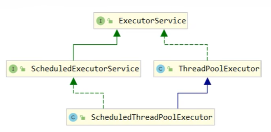
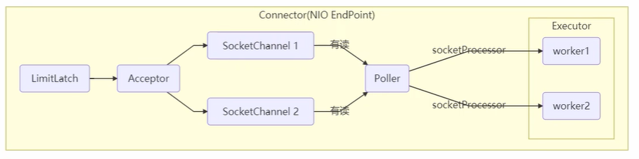

# ThreadPoolExecutor

JDK 提供的标准线程池实现，是 Java 并发编程中最重要的工具之一。通过深入理解其核心参数、工作原理和使用场景，可以有效管理线程资源，提升系统性能。



## 线程池状态

ThreadPoolExecutor使用int的高3位表示线程池状态，低 29 位表示线程池中的线程数量


| 状态 | 高3位 | 接受新任务 | 处理队列任务 | 说明 |
|------|----------------|-----------|-------------|------|
| **RUNNING** | `111`（负数） | ✅ | ✅ | 线程池正常运行，可以接收新任务并执行任务 |
| **SHUTDOWN** | `000` | ❌ | ✅ | 调用 `shutdown()` 后进入该状态，不再接收新任务，但会继续处理队列中的任务和正在执行的任务 |
| **STOP** | `001` | ❌ | ❌ | 调用 `shutdownNow()` 后进入该状态，不再处理队列任务，并尝试中断正在执行的线程 |
| **TIDYING** | `010` | ❌ | ❌ | 所有任务已经执行完成，所有 Worker 已退出，线程池即将执行 `terminated()` |
| **TERMINATED** | `011` | ❌ | ❌ | `terminated()` 执行完成，线程池生命周期彻底结束 |

从数字上比较，RUNNING < SHUTDOWN < STOP < TIDYING < TERMINATED

ThreadPoolExecutor 使用一个 `AtomicInteger` 类型的 `ctl` 变量同时维护两个信息，将线程池状态与线程数量合二为一，可以用一次 CAS 原子操作同时更新两个信息，避免使用两个变量带来的并发问题。

```java
// 一次 CAS 操作同时更新状态和线程数
ctl.compareAndSet(c, ctlOf(targetState, workerCountOf(c)))

private static int ctlOf(int rs, int wc) { return rs | wc; }
```

### 状态转换

```
RUNNING
 ├─► SHUTDOWN ─► TIDYING ─► TERMINATED
 └─► STOP     ─► TIDYING ─► TERMINATED
```

| 状态转换 | 触发条件 |
|----------|----------|
| → RUNNING | 创建线程池 |
| RUNNING → SHUTDOWN | 调用 `shutdown()` |
| RUNNING → STOP | 调用 `shutdownNow()` |
| SHUTDOWN → TIDYING | 队列为空且所有 Worker 已退出 |
| STOP → TIDYING | 所有 Worker 已退出 |
| TIDYING → TERMINATED | 执行完 `terminated()` 钩子方法 |

## 构造方法

ThreadPoolExecutor 提供了完整的构造方法，包含 7 个核心参数。

### 核心参数

```java
public ThreadPoolExecutor(
    int corePoolSize,                   // 核心线程数
    int maximumPoolSize,                // 最大线程数
    long keepAliveTime,                 // 救急线程存活时间
    TimeUnit unit,                      // 时间单位
    BlockingQueue<Runnable> workQueue,  // 任务队列
    ThreadFactory threadFactory,        // 线程工厂
    RejectedExecutionHandler handler    // 拒绝策略
)
```

**参数说明**：

| 参数 | 说明 |
|------|------|
| `corePoolSize` | 核心线程数，线程池维持的最小线程数量 |
| `maximumPoolSize` | 最大线程数，包含核心线程和救急线程的总数 |
| `keepAliveTime` | 救急线程的空闲存活时间，核心线程默认不受影响 |
| `unit` | 存活时间的单位 |
| `workQueue` | 阻塞队列，用于存放等待执行的任务 |
| `threadFactory` | 线程工厂，用于创建线程，可以取名 |
| `handler` | 拒绝策略，队列满且线程数达到上限时的处理策略 |

### 工作流程

```text
提交任务
  ↓
线程数 < corePoolSize?
  ├─ 是 → 创建核心线程执行任务
  │
  └─ 否 → 尝试加入任务队列
           ↓
         队列是否已满?
           ├─ 否 → 任务进入队列等待
           │
           └─ 是 → 线程数 < maximumPoolSize?
                    ├─ 是 → 创建救急线程执行任务
                    │
                    └─ 否 → 执行拒绝策略
```

1. **线程池启动时没有线程**，当任务提交后才创建线程执行任务

2. **线程数 < corePoolSize**：直接创建核心线程执行任务，即使有空闲线程也会创建新线程

3. **线程数 = corePoolSize**：新任务加入 `workQueue` 队列排队，等待空闲线程

4. **队列已满且线程数 < maximumPoolSize**：创建救急线程执行任务（前提是使用**有界队列**）

5. **线程数 = maximumPoolSize 且队列已满**：执行拒绝策略

6. **高峰过后**：救急线程空闲超过 `keepAliveTime` 后被回收，核心线程保持存活

::: tip 核心线程超时
默认情况下，核心线程不会超时回收。调用 `allowCoreThreadTimeOut(true)` 可以让核心线程也应用 `keepAliveTime` 策略。
:::

### 拒绝策略

JDK 提供了 4 种内置拒绝策略：

#### 1. AbortPolicy（默认）

抛出 `RejectedExecutionException` 异常，让调用者感知任务被拒绝。

```java
public static class AbortPolicy implements RejectedExecutionHandler {
    public void rejectedExecution(Runnable r, ThreadPoolExecutor e) {
        throw new RejectedExecutionException("任务被拒绝");
    }
}
```

**适用场景**：需要明确感知任务失败的情况

#### 2. CallerRunsPolicy

让提交任务的线程自己执行任务，既不抛弃任务，又能降低任务提交速度。

```java
public static class CallerRunsPolicy implements RejectedExecutionHandler {
    public void rejectedExecution(Runnable r, ThreadPoolExecutor e) {
        if (!e.isShutdown()) {
            r.run();  // 调用者自己执行
        }
    }
}
```

**适用场景**：任务不能丢失，但可以接受降低吞吐量

#### 3. DiscardPolicy

默默丢弃任务，不做任何处理。

```java
public static class DiscardPolicy implements RejectedExecutionHandler {
    public void rejectedExecution(Runnable r, ThreadPoolExecutor e) {
        // 什么都不做
    }
}
```

**适用场景**：任务可以丢失，不需要感知

#### 4. DiscardOldestPolicy

丢弃队列中最早的任务，让新任务有机会加入队列。

```java
public static class DiscardOldestPolicy implements RejectedExecutionHandler {
    public void rejectedExecution(Runnable r, ThreadPoolExecutor e) {
        if (!e.isShutdown()) {
            e.getQueue().poll();  // 移除队首任务
            e.execute(r);         // 重新提交
        }
    }
}
```

**适用场景**：优先执行新任务，旧任务可以丢弃

::: tip 常见框架的自定义拒绝策略

- **Dubbo**：抛异常前记录日志并 Dump 线程栈信息，方便排查问题
- **Netty**：创建临时线程执行任务
- **ActiveMQ**：等待一段时间后再次尝试入队
- **PinPoint**：采用责任链模式，依次尝试多个拒绝策略

:::


## Executors

Executors 工具类提供了多个工厂方法快速创建线程池，这些方法内部都是基于 `ThreadPoolExecutor` 实现。

::: warning 阿里巴巴开发规范
不允许使用 Executors 创建线程池，而应通过 `ThreadPoolExecutor` 构造方法显式创建。

**原因**：Executors 返回的线程池对象弊端如下：
- `FixedThreadPool` 和 `SingleThreadExecutor`：使用无界队列 `LinkedBlockingQueue`，可能堆积大量请求导致 OOM
- `CachedThreadPool`：最大线程数为 `Integer.MAX_VALUE`，可能创建大量线程导致 OOM
:::

### newFixedThreadPool

创建固定线程数的线程池。

```java
public static ExecutorService newFixedThreadPool(int nThreads) {
    return new ThreadPoolExecutor(
        nThreads, nThreads,                      // 核心线程数 = 最大线程数
        0L, TimeUnit.MILLISECONDS,               // 无需超时时间
        new LinkedBlockingQueue<Runnable>()      // 无界队列
    );
}
```

**特点**：
- 核心线程数 = 最大线程数，没有救急线程
- 使用无界队列 `LinkedBlockingQueue`，可以放任意数量的任务
- 线程数固定，不会因空闲而回收

**适用场景**：任务量已知，相对耗时的任务

**风险**：队列无界，可能导致内存溢出

### newCachedThreadPool

创建可缓存的线程池，线程数根据任务量动态调整。

```java
public static ExecutorService newCachedThreadPool() {
    return new ThreadPoolExecutor(
        0, Integer.MAX_VALUE,                    // 无核心线程，最大线程数无限制
        60L, TimeUnit.SECONDS,                   // 线程空闲 60 秒后回收
        new SynchronousQueue<Runnable>()         // 同步队列（不存储元素）
    );
}
```

**特点**：
- 核心线程数为 0，全部是救急线程
- 最大线程数为 `Integer.MAX_VALUE`，理论上无限制
- 使用 `SynchronousQueue`，不缓存任务，必须有线程立即处理
- 线程空闲 60 秒后自动回收

**SynchronousQueue 特性**：
- 不存储元素的阻塞队列
- 每个 `put` 操作必须等待一个 `take` 操作
- 适合传递性场景，任务直接交给线程执行

```java
SynchronousQueue<Integer> queue = new SynchronousQueue<>();

// 生产者线程
new Thread(() -> {
    try {
        System.out.println("准备放入元素");
        queue.put(1);  // 阻塞，直到有消费者取走
        System.out.println("元素已被取走");
    } catch (InterruptedException e) {
        e.printStackTrace();
    }
}).start();

Thread.sleep(1000);

// 消费者线程
new Thread(() -> {
    try {
        Integer value = queue.take();  // 取走元素
        System.out.println("取到元素: " + value);
    } catch (InterruptedException e) {
        e.printStackTrace();
    }
}).start();
```

**适用场景**：任务密集但执行时间短的情况

**风险**：可能创建大量线程，导致内存溢出

### newSingleThreadExecutor

创建单线程的线程池，保证任务按顺序执行。

```java
public static ExecutorService newSingleThreadExecutor() {
    return new FinalizableDelegatedExecutorService(
        new ThreadPoolExecutor(
            1, 1,                                    // 核心线程数 = 最大线程数 = 1
            0L, TimeUnit.MILLISECONDS,               // 无需超时时间
            new LinkedBlockingQueue<Runnable>()      // 无界队列
        )
    );
}
```

**特点**：
- 只有 1 个线程执行任务
- 任务按提交顺序串行执行
- 线程异常终止后会自动创建新线程，保证线程池正常工作
- 使用 `FinalizableDelegatedExecutorService` 包装，防止调用者修改线程池配置

**适用场景**：希望多个任务排队执行，且线程数固定为 1

**与自己创建单线程的区别**：
| 对比项    | `new Thread()` | `newSingleThreadExecutor()` |
| ------ | -------------- | --------------------------- |
| 线程异常退出 | 线程结束           | 自动创建新线程                     |
| 后续任务执行 | 无法继续           | 继续处理队列中的任务                  |
| 任务管理   | 手动维护           | 线程池统一管理                     |
| 任务提交   | 需自行处理          | 支持 `submit()`、`execute()`   |


**与 `newFixedThreadPool(1)` 的区别**：
| 对比项      | `newSingleThreadExecutor()` | `newFixedThreadPool(1)` |
| -------- | --------------------------- | ----------------------- |
| 线程数量     | 固定为 1                       | 默认 1                    |
| 是否允许修改配置 | 否                           | 可以                      |
| 返回类型     | 装饰后的 `ExecutorService`      | 底层 `ThreadPoolExecutor` |
| 线程池规模    | 始终保持单线程                     | 可通过强转后修改                |


**风险**：队列无界，可能导致内存溢出

## 提交任务 API

ThreadPoolExecutor 提供了多种任务提交方式，支持单任务执行和批量任务处理。

### execute

执行无返回值的任务，不会阻塞调用线程。

```java
void execute(Runnable command);
```

**特点**：
- 提交 `Runnable` 任务，无返回值
- 异步执行，不阻塞调用线程
- 任务异常不会传播到调用者，需要在任务内部捕获处理

**使用示例**：

```java
ExecutorService pool = new ThreadPoolExecutor(2, 5,
    0L, TimeUnit.MILLISECONDS,
    new LinkedBlockingQueue<>());

pool.execute(() -> {
    System.out.println("执行任务");
});
```

### submit

提交任务并返回 `Future` 对象，可以获取任务执行结果或取消任务。

```java
<T> Future<T> submit(Callable<T> task);
Future<?> submit(Runnable task);
<T> Future<T> submit(Runnable task, T result);
```

**特点**：
- 支持 `Callable` 和 `Runnable` 任务
- 返回 `Future` 对象，可以获取结果、取消任务或检查状态
- 任务异常会被封装在 `Future` 中，调用 `get()` 时抛出

**使用示例**：

```java
Future<String> future = pool.submit(() -> {
    Thread.sleep(1000);
    return "任务结果";
});

// 获取结果（阻塞）
String result = future.get();
```

### invokeAll

批量提交任务，等待所有任务完成后返回 `Future` 列表。

```java
// 提交 tasks 中所有任务
<T> List<Future<T>> invokeAll(
    Collection<? extends Callable<T>> tasks
) throws InterruptedException;

// 提交 tasks 中所有任务，带超时时间
<T> List<Future<T>> invokeAll(
    Collection<? extends Callable<T>> tasks,
    long timeout,
    TimeUnit unit
) throws InterruptedException;
```

**特点**：
- 批量提交 `Callable` 任务
- 阻塞等待所有任务完成或超时
- 返回的 `Future` 列表顺序与提交顺序一致
- 超时后未完成的任务会被取消

**使用示例**：

```java
List<Callable<String>> tasks = Arrays.asList(
    () -> "任务1",
    () -> "任务2",
    () -> "任务3"
);

List<Future<String>> futures = pool.invokeAll(tasks);

for (Future<String> future : futures) {
    System.out.println(future.get());
}
```

### invokeAny

批量提交任务，返回最先完成的任务结果，其他任务会被取消。

```java
<T> T invokeAny(
    Collection<? extends Callable<T>> tasks
) throws InterruptedException, ExecutionException;

// 带超时
<T> T invokeAny(
    Collection<? extends Callable<T>> tasks,
    long timeout,
    TimeUnit unit
) throws InterruptedException, ExecutionException, TimeoutException;
```

**特点**：
- 批量提交 `Callable` 任务
- 阻塞等待任意一个任务成功完成
- 返回最快完成任务的结果
- 其他未完成的任务会被取消
- 如果所有任务都失败，抛出 `ExecutionException`

**使用示例**：

```java
List<Callable<String>> tasks = Arrays.asList(
    () -> { Thread.sleep(100); return "任务1"; },
    () -> { Thread.sleep(200); return "任务2"; },
    () -> { Thread.sleep(300); return "任务3"; }
);

// 返回 "任务1"（最快完成）
String result = pool.invokeAny(tasks);
```

### 方法对比

| 方法 | 返回值 | 阻塞 | 适用场景 |
|------|--------|------|---------|
| `execute` | 无 | 否 | 执行无返回值的任务，不关心结果 |
| `submit` | `Future` | 否 | 需要获取任务结果或控制任务执行 |
| `invokeAll` | `List<Future>` | 是 | 批量执行任务，需要所有结果 |
| `invokeAny` | 结果值 | 是 | 批量执行任务，只需要最快的结果 |

## 异常处理

线程池中的任务异常处理方式与提交方法密切相关，不当的异常处理可能导致异常被吞掉，难以排查问题。

### execute 方式的异常处理

使用 `execute()` 提交的任务，异常会直接抛出到线程池的 `UncaughtExceptionHandler`。

```java
ExecutorService pool = new ThreadPoolExecutor(2, 5,
    0L, TimeUnit.MILLISECONDS,
    new LinkedBlockingQueue<>());

pool.execute(() -> {
    System.out.println("任务开始");
    int result = 1 / 0;  // 抛出 ArithmeticException
    System.out.println("任务结束");  // 不会执行
});

// 输出：
// 任务开始
// Exception in thread "pool-1-thread-1" java.lang.ArithmeticException: / by zero
```

**特点**：
- 异常会打印到控制台（标准错误输出）
- 抛出异常的线程会终止，但线程池会创建新线程替代
- 调用者无法捕获异常

### submit 方式的异常处理

使用 `submit()` 提交的任务，异常会被封装在 `Future` 对象中，只有调用 `get()` 时才会抛出。

```java
ExecutorService pool = new ThreadPoolExecutor(2, 5,
    0L, TimeUnit.MILLISECONDS,
    new LinkedBlockingQueue<>());

Future<Integer> future = pool.submit(() -> {
    System.out.println("任务开始");
    int result = 1 / 0;  // 异常不会立即抛出
    return result;
});

System.out.println("任务已提交");  // 会执行

try {
    Integer result = future.get();  // 这里才抛出异常
} catch (ExecutionException e) {
    System.out.println("捕获异常: " + e.getCause());
}
```

**特点**：
- 异常不会打印到控制台
- 异常被封装在 `ExecutionException` 中，通过 `getCause()` 获取原始异常
- 如果不调用 `get()`，异常会被静默吞掉
- 线程不会终止，可以继续执行其他任务

::: danger 异常被吞掉的风险
使用 `submit()` 但不调用 `future.get()` 是常见的错误模式，会导致异常被完全忽略：

```java
// ❌ 错误：异常被吞掉
pool.submit(() -> {
    throw new RuntimeException("这个异常不会被看到");
});

// ✅ 正确：使用 execute 或调用 get
pool.execute(() -> {
    throw new RuntimeException("异常会打印到控制台");
});

Future<?> future = pool.submit(() -> {
    throw new RuntimeException("异常会被捕获");
});
future.get();  // 必须调用 get
```
:::

### 自定义异常处理器

通过自定义 `ThreadFactory` 为每个线程设置 `UncaughtExceptionHandler`，可以统一处理未捕获的异常。

```java
ThreadFactory factory = new ThreadFactory() {
    private final AtomicInteger threadNumber = new AtomicInteger(1);

    @Override
    public Thread newThread(Runnable r) {
        Thread thread = new Thread(r);
        thread.setName("MyPool-" + threadNumber.getAndIncrement());

        // 设置未捕获异常处理器
        thread.setUncaughtExceptionHandler((t, e) -> {
            System.err.println("线程 " + t.getName() + " 抛出异常:");
            e.printStackTrace();
            // 可以记录到日志、发送告警等
        });

        return thread;
    }
};

ExecutorService pool = new ThreadPoolExecutor(
    2, 5,
    0L, TimeUnit.MILLISECONDS,
    new LinkedBlockingQueue<>(),
    factory  // 使用自定义线程工厂
);

pool.execute(() -> {
    throw new RuntimeException("自定义处理器会捕获此异常");
});
```

**适用场景**：
- 统一的异常日志记录
- 异常监控和告警
- 异常统计和分析

::: warning 注意事项
`UncaughtExceptionHandler` 只对 `execute()` 提交的任务有效，对 `submit()` 提交的任务无效（因为异常已被 `Future` 捕获）。
:::

### 最佳实践

**1. 明确选择提交方式**

- 需要获取结果或异常：使用 `submit()` + `get()`
- 不需要结果：使用 `execute()` 或任务内部捕获

**2. 避免异常被吞掉**

- 使用 `submit()` 必须调用 `get()`
- 或在任务内部使用 `try-catch`

**3. 任务内部捕获异常（推荐）**

最可靠的做法是在任务内部捕获并处理异常，不依赖外部机制：

```java
pool.execute(() -> {
    try {
        // 业务逻辑
        performTask();
    } catch (Exception e) {
        logger.error("任务执行失败", e);
        // 异常处理：重试、告警、降级等
    }
});
```

**4. 统一异常处理**

自定义 `ThreadFactory` 设置 `UncaughtExceptionHandler`，作为最后的兜底：

```java
ThreadFactory factory = r -> {
    Thread t = new Thread(r);
    t.setUncaughtExceptionHandler((thread, e) ->
        logger.error("线程 {} 异常", thread.getName(), e));
    return t;
};
```

**推荐的完整模板**：

```java
public class SafeThreadPool {
    private final ExecutorService pool;
    private final Logger logger = LoggerFactory.getLogger(SafeThreadPool.class);

    public SafeThreadPool() {
        // 1. 自定义线程工厂，设置 UncaughtExceptionHandler
        ThreadFactory factory = r -> {
            Thread t = new Thread(r);
            t.setUncaughtExceptionHandler((thread, e) ->
                logger.error("线程 {} 异常", thread.getName(), e));
            return t;
        };

        // 2. 创建线程池
        this.pool = new ThreadPoolExecutor(
            10, 20,
            60L, TimeUnit.SECONDS,
            new LinkedBlockingQueue<>(100),
            factory,
            new ThreadPoolExecutor.CallerRunsPolicy()
        );
    }

    // 3. 任务执行方法，内部捕获异常
    public void executeTask(Runnable task) {
        pool.execute(() -> {
            try {
                task.run();
            } catch (Exception e) {
                logger.error("任务执行失败", e);
                // 可以添加重试、告警等逻辑
            }
        });
    }

    // 4. 支持返回结果的任务
    public <T> Future<T> submitTask(Callable<T> task) {
        return pool.submit(() -> {
            try {
                return task.call();
            } catch (Exception e) {
                logger.error("任务执行失败", e);
                throw e;  // 重新抛出，让调用者通过 get() 获取
            }
        });
    }
}
```

## 关闭线程池

线程池提供了多种关闭方式，用于优雅停止或立即中断任务执行。

### shutdown

平滑关闭线程池，不再接收新任务，但会继续执行队列中的任务和正在执行的任务。

```java
public void shutdown() {
    final ReentrantLock mainLock = this.mainLock;
    mainLock.lock();
    try {
        checkShutdownAccess();
        advanceRunState(SHUTDOWN);           // 将状态设置为 SHUTDOWN
        interruptIdleWorkers();              // 中断空闲线程
        onShutdown();                        // 钩子方法，供 ScheduledThreadPoolExecutor 使用
    } finally {
        mainLock.unlock();
    }
    // 尝试终止线程池
    tryTerminate();
}
```

**核心逻辑**：

1. **修改状态**：将线程池状态从 `RUNNING` 改为 `SHUTDOWN`
2. **中断空闲线程**：对空闲的 Worker 线程发送中断信号
3. **不中断正在执行的线程**：正在执行任务的线程不受影响
4. **继续处理队列任务**：队列中的任务会继续执行完毕

**特点**：
- 调用后立即返回，不会阻塞调用线程，也不会等待任务执行完成
- 不接收新任务，提交新任务会执行拒绝策略
- 已提交的任务会继续执行完成
- 多次调用 `shutdown()` 不会报错

**使用示例**：

```java
ExecutorService pool = new ThreadPoolExecutor(2, 5,
    0L, TimeUnit.MILLISECONDS,
    new LinkedBlockingQueue<>());

pool.execute(() -> System.out.println("任务1"));
pool.execute(() -> System.out.println("任务2"));

pool.shutdown();  // 平滑关闭

// 等待任务完成
pool.awaitTermination(1, TimeUnit.MINUTES);
```

### shutdownNow

立即关闭线程池，使用中断（interrupt）机制尝试中断所有线程，并返回未执行的任务列表。

```java
public List<Runnable> shutdownNow() {
    List<Runnable> tasks;
    final ReentrantLock mainLock = this.mainLock;
    mainLock.lock();
    try {
        checkShutdownAccess();
        advanceRunState(STOP);               // 将状态设置为 STOP
        interruptWorkers();                  // 中断所有线程（包括正在执行的）
        tasks = drainQueue();                // 清空队列，返回未执行的任务
    } finally {
        mainLock.unlock();
    }
    tryTerminate();
    return tasks;
}
```

**核心逻辑**：

1. **修改状态**：将线程池状态改为 `STOP`
2. **中断所有线程**：对所有 Worker 线程（包括正在执行任务的）发送中断信号
3. **清空队列**：将队列中未执行的任务移除并返回
4. **返回未执行任务**：调用者可以根据返回的任务列表进行后续处理

**特点**：
- 调用后立即返回，不会阻塞调用线程
- 不再处理队列中等待的任务
- 返回未执行的任务列表
- 不保证正在执行的任务一定会停止（取决于任务是否响应中断）

**使用示例**：

```java
ExecutorService pool = new ThreadPoolExecutor(2, 5,
    0L, TimeUnit.MILLISECONDS,
    new LinkedBlockingQueue<>());

pool.execute(() -> {
    try {
        Thread.sleep(5000);
        System.out.println("任务完成");
    } catch (InterruptedException e) {
        System.out.println("任务被中断");
    }
});

// 立即关闭，返回未执行的任务
List<Runnable> notExecuted = pool.shutdownNow();
System.out.println("未执行任务数: " + notExecuted.size());
```

### 辅助方法

线程池提供了三个方法用于判断状态和等待终止。

#### isShutdown

判断线程池是否已关闭（调用了 `shutdown()` 或 `shutdownNow()`）。

```java
public boolean isShutdown() {
    return runStateAtLeast(ctl.get(), SHUTDOWN);
}
```

**返回值**：
- `true`：线程池不处于 `RUNNING` 状态（即状态 >= `SHUTDOWN`）
- `false`：线程池仍处于 `RUNNING` 状态

#### isTerminated

判断线程池是否已完全终止（所有任务执行完成且所有线程已退出）。

```java
public boolean isTerminated() {
    return runStateAtLeast(ctl.get(), TERMINATED);
}
```

**返回值**：
- `true`：线程池已完全终止，状态为 `TERMINATED`
- `false`：线程池还有任务在执行或等待执行

#### awaitTermination

阻塞等待线程池终止或超时返回，通常配合 shutdown() 或 shutdownNow() 使用，以确保线程池中的任务处理完毕后再继续执行后续逻辑。

```java
public boolean awaitTermination(long timeout, TimeUnit unit)
    throws InterruptedException {
    long nanos = unit.toNanos(timeout);
    final ReentrantLock mainLock = this.mainLock;
    mainLock.lock();
    try {
        while (runStateLessThan(ctl.get(), TERMINATED)) {
            if (nanos <= 0L)
                return false;
            nanos = termination.awaitNanos(nanos);
        }
        return true;
    } finally {
        mainLock.unlock();
    }
}
```

**参数**：
- `timeout`：等待时长
- `unit`：时间单位

**返回值**：
- `true`：线程池在超时前终止
- `false`：超时后线程池仍未终止

**使用示例**：

```java
pool.shutdown();

// 等待 1 分钟
if (pool.awaitTermination(1, TimeUnit.MINUTES)) {
    System.out.println("线程池已终止");
} else {
    System.out.println("超时，强制关闭");
    pool.shutdownNow();
}
```

### 最佳实践

优雅关闭线程池的标准模式（来自 [Oracle 官方文档 - ExecutorService](https://docs.oracle.com/javase/8/docs/api/java/util/concurrent/ExecutorService.html) 和《Java 并发编程实战》）：

```java
// 优雅关闭线程池的标准模式
pool.shutdown();  // 不再接收新任务

try {
    // 等待 60 秒
    if (!pool.awaitTermination(60, TimeUnit.SECONDS)) {
        // 超时后强制关闭
        pool.shutdownNow();

        // 再等待一段时间
        if (!pool.awaitTermination(60, TimeUnit.SECONDS)) {
            System.err.println("线程池未能正常终止");
        }
    }
} catch (InterruptedException e) {
    pool.shutdownNow();
    Thread.currentThread().interrupt();
}
```

**执行流程**：

1. **`shutdown()`** - 平滑关闭，已提交任务继续执行
2. **`awaitTermination(60s)`** - 等待任务完成，超时则进入下一步
3. **`shutdownNow()`** - 强制关闭，中断所有线程
4. **再次 `awaitTermination(60s)`** - 等待线程响应中断
5. **捕获 `InterruptedException`** - 立即强制关闭并恢复中断状态

**设计理念**：

- 先优雅后强制，给任务正常完成的机会
- 超时保护，避免无限期等待
- 中断传播，遵循 Java 中断处理规范

## 异步模式之工作线程

使用有限的工作线程来轮流处理无限多的异步任务，这是一种典型的分工模式，线程池是其标准实现。

**设计理念**：

相比 Thread-Per-Message 模式（每个任务创建一个线程），工作线程模式具有以下优势：
- 线程复用，避免频繁创建销毁线程的开销
- 控制并发度，防止线程数量无限增长
- 任务队列缓冲，平滑处理突发流量

::: warning 线程池隔离
不同类型的任务应该使用不同的线程池，避免相互影响导致饥饿问题，提升整体执行效率。
:::

### 饥饿现象

固定大小的线程池可能出现饥饿（Starvation）现象，注意这不是死锁。

**典型场景**：

```java
ExecutorService pool = Executors.newFixedThreadPool(2);

// 任务1：点餐任务，会提交做菜任务
pool.execute(() -> {
    System.out.println("处理点餐");
    Future<String> future = pool.submit(() -> {
        System.out.println("做菜");
        return "菜品";
    });
    // 等待做菜完成
    future.get();  // 可能永远等不到！
});

// 任务2：点餐任务，会提交做菜任务
pool.execute(() -> {
    System.out.println("处理点餐");
    Future<String> future = pool.submit(() -> {
        System.out.println("做菜");
        return "菜品";
    });
    future.get();  // 可能永远等不到！
});
```

**问题分析**：
- 2 个线程都在执行点餐任务
- 2 个做菜任务提交到队列中等待
- 点餐任务在等待做菜任务完成，但做菜任务无法获得线程执行
- 形成饥饿：有任务等待执行，但所有线程都在等待这些任务的结果

**等待链条**：
```
执行中的任务 → 等待队列中的任务完成
队列中的任务 → 等待空闲线程
空闲线程     → 不存在（都被执行中的任务占用）
```

::: warning 饥饿 vs 死锁
虽然两者都形成了等待环，但本质不同：

**死锁**：
- 涉及**锁资源**的循环等待（A持有锁1等锁2，B持有锁2等锁1）
- 逻辑错误，无论增加多少资源都无法解决
- 满足死锁四个必要条件：互斥、持有并等待、不可抢占、循环等待

**线程池饥饿**：
- 涉及**线程容量**不足，不是锁资源问题
- 资源配置问题，增加线程池大小即可解决
- 增加线程数后问题消失（如改为 `newFixedThreadPool(4)`）

这种饥饿也不同于传统的活跃性饥饿（低优先级线程被高优先级线程持续抢占）：
- 活跃性饥饿：调度不公平，任务理论上有机会执行
- 线程池饥饿：资源依赖死循环，任务在当前配置下永远无法执行
:::

**解决方案**：使用不同的线程池处理不同类型的任务

```java
ExecutorService orderPool = Executors.newFixedThreadPool(2);  // 点餐线程池
ExecutorService cookPool = Executors.newFixedThreadPool(2);   // 做菜线程池

orderPool.execute(() -> {
    System.out.println("处理点餐");
    Future<String> future = cookPool.submit(() -> {  // 使用独立的做菜线程池
        System.out.println("做菜");
        return "菜品";
    });
    future.get();  // 不会饥饿
});
```

### 线程池大小设置

线程池大小直接影响系统性能和资源利用率。

**设置过小的问题**：
- 无法充分利用系统资源（CPU、内存、I/O）
- 任务堆积在队列中，响应时间变长
- 容易出现饥饿现象

**设置过大的问题**：
- 频繁的线程上下文切换，降低 CPU 效率
- 占用过多内存（每个线程占用栈空间，默认 1MB）
- 可能触发 OOM

#### CPU 密集型任务

CPU 密集型任务的特点是主要消耗 CPU 资源进行计算，很少发生阻塞。

**推荐配置**：

```java
int threadCount = Runtime.getRuntime().availableProcessors() + 1;
```

**原理说明**：
- CPU 核数 + 1 能实现最优的 CPU 利用率
- "+1" 的作用：当某个线程因页缺失故障（Page Fault）或其他原因暂停时，额外的线程可以顶上，避免 CPU 时钟周期浪费

**适用场景**：
- 加密解密
- 数据压缩解压
- 正则表达式匹配
- 数学计算

#### I/O 密集型任务

I/O 密集型任务的特点是频繁等待 I/O 操作（磁盘、网络、数据库等），CPU 占用较低。

**推荐配置**：

```java
// 经验公式
线程数 = CPU核数 × 期望CPU利用率 × (1 + 等待时间/计算时间)
```

**公式推导**：

假设：
- CPU 核数 = N
- 任务总时间 = T
- CPU 计算时间 = T_cpu
- I/O 等待时间 = T_wait
- 期望 CPU 利用率 = U（0 < U ≤ 1）

当线程数设置为 `N × U × (T_cpu + T_wait) / T_cpu` 时，可以达到期望的 CPU 利用率。

**使用示例**：

```java
// 假设 4 核 CPU，期望 CPU 利用率 100%
// 通过监控工具发现：任务总耗时 100ms，其中 CPU 计算 20ms，I/O 等待 80ms
int threadCount = 4 × 1.0 × (20 + 80) / 20 = 20;

ExecutorService pool = new ThreadPoolExecutor(
    20, 20,
    0L, TimeUnit.MILLISECONDS,
    new LinkedBlockingQueue<>(100)
);
```

**如何测量 CPU 计算时间**：

1. **使用 JProfiler、VisualVM 等分析工具**
2. **使用 APM 监控工具**（如 SkyWalking、Pinpoint）
3. **简单测试**：

```java
long start = System.nanoTime();
// 执行任务
long cpuTime = System.nanoTime() - start;
```

**适用场景**：
- 数据库查询
- HTTP 请求
- 文件读写
- RPC 调用

::: tip 动态调整
实际生产环境中，建议通过压测和监控数据动态调整线程池大小，公式只是参考起点。可以使用 `ThreadPoolExecutor` 的 `setCorePoolSize()` 和 `setMaximumPoolSize()` 方法动态调整。
:::

## Tomcat 线程池

Tomcat 作为 Java Web 应用服务器，对标准 ThreadPoolExecutor 进行了扩展和定制，以更好地适应 HTTP 请求处理的特点。



### 设计目标

标准 ThreadPoolExecutor 的工作流程不适合 Web 服务器场景：

**标准线程池的问题**：

```text
请求到达 → 线程数 < corePoolSize?
           ├─ 是 → 创建线程处理
           └─ 否 → 加入队列
                   ↓
                 队列满?
                   ├─ 否 → 等待（可能很久）
                   └─ 是 → 创建救急线程
```

**问题场景**：

```java
// 假设配置：核心线程 10，最大线程 200，队列容量 1000
ThreadPoolExecutor executor = new ThreadPoolExecutor(
    10, 200,
    60L, TimeUnit.SECONDS,
    new LinkedBlockingQueue<>(1000)
);

// 场景：突发 500 个请求
// 结果：
// - 前 10 个请求：立即处理（创建核心线程）
// - 第 11-1010 个请求：进入队列等待（最多等待很久）
// - 第 1011-1200 个请求：创建救急线程处理
// - 第 1201+ 个请求：拒绝

// 问题：有 190 个救急线程空闲，却让请求在队列中等待
```

**Tomcat 的改进思路**：

在队列满之前，优先创建线程到 maximumPoolSize，充分利用线程资源，提高吞吐量。

```text
请求到达 → 线程数 < corePoolSize?
           ├─ 是 → 创建线程处理
           └─ 否 → 线程数 < maximumPoolSize?
                   ├─ 是 → 创建线程处理（优先）
                   └─ 否 → 加入队列
                           ↓
                         队列满?
                           ├─ 否 → 等待
                           └─ 是 → 拒绝
```

### 核心实现

Tomcat 通过自定义 `TaskQueue` 和 `ThreadPoolExecutor` 实现了上述逻辑。

#### TaskQueue

继承自 `LinkedBlockingQueue`，重写 `offer()` 方法改变入队逻辑。

```java
public class TaskQueue extends LinkedBlockingQueue<Runnable> {
    private ThreadPoolExecutor parent = null;

    @Override
    public boolean offer(Runnable o) {
        // 如果线程池为 null，使用默认行为
        if (parent == null) return super.offer(o);

        // 如果线程数已达到最大值，只能入队
        if (parent.getPoolSize() == parent.getMaximumPoolSize()) {
            return super.offer(o);
        }

        // 如果有空闲线程，入队让空闲线程处理
        if (parent.getSubmittedCount() < parent.getPoolSize()) {
            return super.offer(o);
        }

        // 如果线程数 < 最大线程数，返回 false 触发创建新线程
        if (parent.getPoolSize() < parent.getMaximumPoolSize()) {
            return false;
        }

        // 其他情况入队
        return super.offer(o);
    }
}
```

**核心逻辑**：

1. 如果线程数 < maximumPoolSize 且没有空闲线程，`offer()` 返回 `false`
2. ThreadPoolExecutor 发现入队失败，会尝试创建新线程（addWorker）
3. 实现了"优先创建线程，队列作为缓冲"的效果

#### ThreadPoolExecutor 扩展

Tomcat 的 `org.apache.tomcat.util.threads.ThreadPoolExecutor` 继承标准线程池并配合 TaskQueue 工作。

```java
public class ThreadPoolExecutor extends java.util.concurrent.ThreadPoolExecutor {
    // 记录已提交但未完成的任务数
    private final AtomicInteger submittedCount = new AtomicInteger(0);

    @Override
    public void execute(Runnable command) {
        if (command == null) throw new NullPointerException();

        // 提交任务时计数
        submittedCount.incrementAndGet();
        try {
            super.execute(command);
        } catch (RejectedExecutionException e) {
            // 如果被拒绝，尝试再次入队
            if (!((TaskQueue) getQueue()).force(command)) {
                submittedCount.decrementAndGet();
                throw new RejectedExecutionException("队列已满");
            }
        }
    }

    @Override
    protected void afterExecute(Runnable r, Throwable t) {
        // 任务完成后计数减 1
        submittedCount.decrementAndGet();
    }

    public int getSubmittedCount() {
        return submittedCount.get();
    }
}
```

### 配置方式

在 Tomcat 的 `server.xml` 中配置线程池：

```xml
<Executor
    name="tomcatThreadPool"
    namePrefix="catalina-exec-"
    maxThreads="200"           <!-- 最大线程数 -->
    minSpareThreads="10"       <!-- 最小空闲线程数（核心线程数）-->
    maxIdleTime="60000"        <!-- 线程空闲时间，单位毫秒 -->
    maxQueueSize="100"         <!-- 最大队列长度 -->
    prestartminSpareThreads="false"  <!-- 是否启动时创建核心线程 -->
/>

<Connector
    executor="tomcatThreadPool"
    port="8080"
    protocol="HTTP/1.1"
    connectionTimeout="20000"
/>
```

**参数说明**：

| 参数 | 说明 | 默认值 |
|------|------|--------|
| `maxThreads` | 最大线程数 | 200 |
| `minSpareThreads` | 核心线程数（最小空闲线程） | 25 |
| `maxIdleTime` | 线程最大空闲时间（毫秒） | 60000 |
| `maxQueueSize` | 任务队列最大长度 | Integer.MAX_VALUE |
| `prestartminSpareThreads` | 启动时是否创建核心线程 | false |

### 工作流程对比

| 场景 | 标准 ThreadPoolExecutor | Tomcat ThreadPoolExecutor |
|------|------------------------|--------------------------|
| **10个核心线程，200最大线程** | | |
| 第 1-10 个请求 | 创建线程处理 | 创建线程处理 |
| 第 11 个请求 | 进入队列等待 | 创建新线程处理（优先） |
| 第 12-200 个请求 | 进入队列等待 | 继续创建线程处理 |
| 第 201 个请求 | 进入队列 | 进入队列 |
| 队列满后 | 拒绝执行 | 拒绝执行 |

**性能提升**：

```java
// 场景：突发 100 个请求，每个耗时 1 秒
// 配置：核心 10，最大 200

// 标准线程池：
// - 前 10 个：立即处理，1 秒后完成
// - 后 90 个：进入队列，10 个线程依次处理，需要 9 秒
// 总耗时：约 10 秒

// Tomcat 线程池：
// - 创建 100 个线程并发处理
// 总耗时：约 1 秒

// 吞吐量提升：10 倍
```

### 最佳实践

**1. 合理设置 maxThreads**

```java
// 根据业务特点设置
maxThreads = CPU核数 × (1 + 平均等待时间/平均计算时间)

// 示例：4核CPU，请求平均耗时100ms，其中20ms计算，80ms等待
maxThreads = 4 × (1 + 80/20) = 20
```

**2. 控制队列长度**

```xml
<!-- 推荐设置有界队列，避免内存溢出 -->
<Executor
    maxQueueSize="1000"
    <!-- 队列满时快速失败，而不是无限堆积 -->
/>
```

**3. 监控线程池状态**

```java
ThreadPoolExecutor executor =
    (ThreadPoolExecutor) connector.getProtocolHandler().getExecutor();

// 监控指标
int activeCount = executor.getActiveCount();        // 活跃线程数
int poolSize = executor.getPoolSize();             // 当前线程数
int queueSize = executor.getQueue().size();        // 队列大小
int submittedCount = executor.getSubmittedCount(); // 已提交任务数

// 告警条件
if (activeCount > poolSize * 0.8) {
    // 线程池使用率超过 80%，考虑扩容
}
```

**4. 预启动核心线程**

```xml
<!-- 启动时创建核心线程，避免首次请求延迟 -->
<Executor prestartminSpareThreads="true" />
```

::: tip Tomcat 线程池的优势
- **快速响应**：优先创建线程而非排队，降低请求延迟
- **资源利用**：充分利用线程资源处理突发流量
- **平滑降级**：流量高峰过后自动回收空闲线程

适用于对响应时间敏感的 Web 应用场景。
:::

::: warning 注意事项
1. **线程数不是越多越好**：过多线程导致上下文切换开销，反而降低性能
2. **需要监控内存**：每个线程占用约 1MB 栈空间，200 个线程约占 200MB
3. **配合连接数调优**：`maxConnections` 应大于 `maxThreads`，避免连接被拒绝
:::
