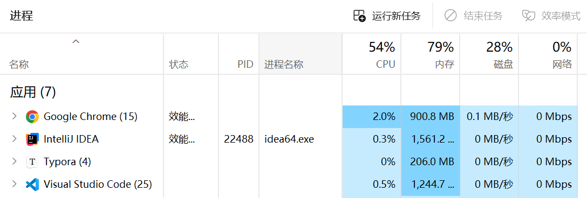
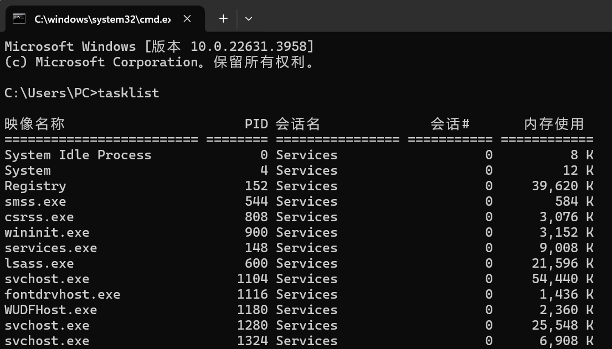

# 查看进程线程

本文介绍在不同操作系统下查看和管理进程、线程的常用方法和工具。

## Windows 

### 一、任务管理器

Windows 自带的图形化工具，可以直观地查看进程和线程数，也可以用来结束进程。

**使用方式：** `Ctrl + Shift + Esc` 或右键任务栏选择「任务管理器」



### 二、`tasklist` 

查看当前系统中运行的所有进程列表。

```bash
# 查看所有进程
tasklist

# 查看详细信息
tasklist /v

# 查找特定进程
tasklist | findstr "java"
```



### 三、`taskkill` 

用于结束指定的进程。

```bash
# 正常结束进程
taskkill /PID <PID>

# 强制结束进程
taskkill /F /PID <PID>

# 按进程名结束
taskkill /IM <进程名.exe> /F
```


## Linux 平台

### 一、`ps` 

用于查看进程和线程的静态快照。

```bash
# 查看所有进程（完整信息）
ps -ef

# 查找指定进程
ps -ef | grep java

# 过滤掉 grep 自身
ps -ef | grep java | grep -v grep

# 查看某个进程的所有线程
ps -fT -p <PID>

# 查看线程数
ps -Lf <PID> | wc -l
```

### 二、`top` 

实时监控系统进程和资源使用情况，适合定位性能问题。

```bash
# 实时查看某个进程的所有线程
top -H -p <PID>

# 按 CPU 使用率排序（默认）
top

# 按内存使用率排序（进入 top 后按 M）
# 按 CPU 使用率排序（进入 top 后按 P）
```

**常用操作：**
- `P`：按 CPU 使用率排序
- `M`：按内存使用率排序
- `H`：显示线程
- `q`：退出

### 三、`kill` 

用于向进程发送信号，通常用于结束进程。

```bash
# 正常结束进程（发送 SIGTERM 信号）
kill <PID>

# 强制结束进程（发送 SIGKILL 信号，慎用）
kill -9 <PID>

# 重启进程（发送 SIGHUP 信号）
kill -1 <PID>
```

::: warning 注意
`kill -9` 会强制终止进程，不给进程清理资源的机会，可能导致数据丢失或资源泄漏，应优先使用 `kill` 正常结束。
:::


## Java 工具

### 一、`jps` 

查看当前系统中运行的所有 Java 进程。

```bash
# 查看 Java 进程列表
jps

# 显示完整的类名或 JAR 路径
jps -l

# 显示传递给 main 方法的参数
jps -m

# 显示传递给 JVM 的参数
jps -v
```

### 二、`jstack` 

输出指定 Java 进程的线程栈信息（线程快照），用于分析线程状态和死锁问题。

```bash
# 打印线程栈信息
jstack <PID>

# 打印额外的锁信息
jstack -l <PID>

# 强制打印（当进程挂起时）
jstack -F <PID>
```

**使用场景：**
- 排查死锁问题
- 分析线程阻塞原因
- 定位 CPU 占用高的线程

### 三、jconsole 工具

Java 自带的图形化监控工具，提供实时的 JVM 运行状态监控。

**监控功能：**
- 内存使用情况（堆内存、非堆内存）
- 线程数量和状态
- GC 活动情况
- 类加载信息
- CPU 使用率

**启动方式：**

```bash
# 直接启动（会列出本地 Java 进程）
jconsole

# 连接指定进程
jconsole <PID>
```

**远程监控配置：**

1. 启动 Java 应用时添加 JMX 参数：

```bash
java -Dcom.sun.management.jmxremote \
     -Dcom.sun.management.jmxremote.port=9000 \
     -Dcom.sun.management.jmxremote.authenticate=false \
     -Dcom.sun.management.jmxremote.ssl=false \
     -jar your-app.jar
```

2. 打开 jconsole，选择「远程进程」
3. 输入 `host:port`（例如：`192.168.1.100:9000`）
4. 如果开启了认证，输入用户名和密码
5. 连接成功后即可监控远程 JVM

::: tip 提示
生产环境建议开启认证和 SSL，避免安全风险。
:::

## 实用技巧

### 一、定位高 CPU 占用的线程

1. 使用 `top -H -p <PID>` 找到占用 CPU 高的线程 ID
2. 将线程 ID 转换为十六进制：`printf "%x\n" <线程ID>`
3. 使用 `jstack <PID> | grep <十六进制线程ID>` 查看线程栈

### 二、快速查看 Java 进程线程数

```bash
# Linux
ps -Lf <PID> | wc -l

# 或使用 jstack
jstack <PID> | grep "java.lang.Thread.State" | wc -l
```