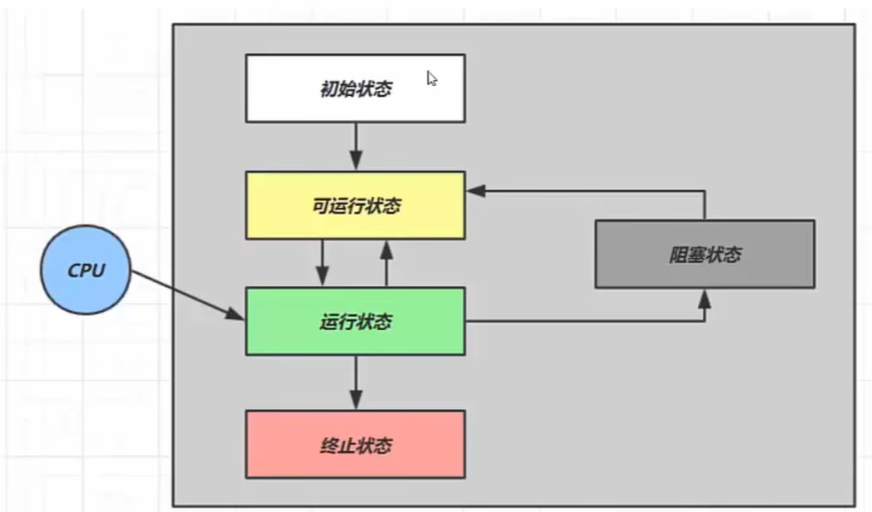
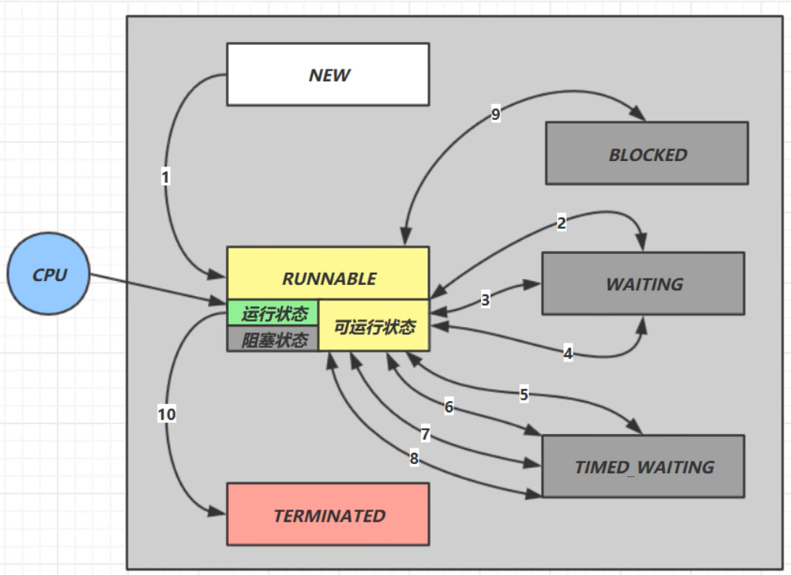

# 线程状态

## 一、五种状态

从操作系统层面描述



- **初始状态**：仅在语言层面创建了线程对象，还未与操作系统线程关联
- **可运行状态（就绪状态）**：线程已准备好运行，等待 CPU 分配时间片
- **运行状态**：线程获取了 CPU 时间片，正在执行
  > 时间片用完后，运行状态变为可运行状态，导致线程上下文切换
- **阻塞状态**：线程等待某个事件（I/O、锁等）而暂停执行
  > 调用阻塞 API（如 BIO 读写文件）时进入阻塞状态；
  > 操作完毕后由 OS 唤醒，转换为可运行状态
- **终止状态**：线程执行完毕或被强制终止，生命周期结束

## 二、Java 线程的六种状态

从Java API层面描述，Java 线程在其生命周期中会经历以下六种状态，定义在 `Thread.State` 枚举中



| 状态 | 说明 | 进入条件 | 离开条件 |
|------|------|--------|--------|
| **NEW** | 新建 | 创建 Thread 对象 | 调用 start() |
| **RUNNABLE** | 可运行 | 调用 start() | 获得 CPU 时间片或进入其他状态 |
| **BLOCKED** | 阻塞 | 等待获取监视器锁 | 获得锁 |
| **WAITING** | 等待 | 调用 wait()、join()、LockSupport.park() | 被 notify()、notifyAll()、unpark() 唤醒 |
| **TIMED_WAITING** | 超时等待 | 调用 sleep()、wait(timeout)、join(timeout) | 超时或被唤醒 |
| **TERMINATED** | 终止 | run() 方法执行完毕或异常 | 线程结束 |

::: info 重要说明
- Java 的 RUNNABLE 状态涵盖了操作系统中的可运行、运行和阻塞状态（BIO 导致的阻塞）
- Java 线程状态 API 中没有 RUNNING 状态，它被归类为 RUNNABLE 的一部分
:::

## 三、各状态详解

### 1. NEW（新建）

线程对象被创建但还未启动。

```java
Thread t = new Thread(() -> System.out.println("线程执行"));
System.out.println(t.getState());  // NEW
```

### 2. RUNNABLE（可运行）

调用 `start()` 后，线程进入可运行状态。此时线程可能正在运行，也可能在等待 CPU 时间片。

```java
Thread t = new Thread(() -> System.out.println("线程执行"));
t.start();
System.out.println(t.getState());  // RUNNABLE
```

### 3. BLOCKED（阻塞）

线程在等待获取监视器锁（synchronized 锁）时进入阻塞状态。

```java
Object lock = new Object();

Thread t1 = new Thread(() -> {
    synchronized (lock) {
        try {
            Thread.sleep(5000);  // 持有锁 5 秒
        } catch (InterruptedException e) {
            e.printStackTrace();
        }
    }
});

Thread t2 = new Thread(() -> {
    synchronized (lock) {  // 等待获取锁
        System.out.println("t2 获得锁");
    }
});

t1.start();
Thread.sleep(100);  // 确保 t1 先获得锁
t2.start();
Thread.sleep(100);
System.out.println(t2.getState());  // BLOCKED
```

### 4. WAITING（等待）

线程调用以下方法后进入等待状态，需要被其他线程唤醒：
- `Object.wait()`
- `Thread.join()`
- `LockSupport.park()`

```java
Object lock = new Object();

Thread t1 = new Thread(() -> {
    synchronized (lock) {
        try {
            lock.wait();  // 进入 WAITING 状态
        } catch (InterruptedException e) {
            e.printStackTrace();
        }
    }
});

t1.start();
Thread.sleep(100);
System.out.println(t1.getState());  // WAITING

// 唤醒线程
synchronized (lock) {
    lock.notifyAll();
}
```

### 5. TIMED_WAITING（超时等待）

线程调用以下方法后进入超时等待状态，超时后自动返回：
- `Thread.sleep(long millis)`
- `Object.wait(long timeout)`
- `Thread.join(long millis)`
- `LockSupport.parkNanos()`
- `LockSupport.parkUntil()`

```java
Thread t = new Thread(() -> {
    try {
        Thread.sleep(3000);  // 进入 TIMED_WAITING 状态
    } catch (InterruptedException e) {
        e.printStackTrace();
    }
});

t.start();
Thread.sleep(100);
System.out.println(t.getState());  // TIMED_WAITING
```

### 6. TERMINATED（终止）

线程执行完毕或异常退出后进入终止状态。

```java
Thread t = new Thread(() -> System.out.println("线程执行"));
t.start();
t.join();  // 等待线程执行完毕
System.out.println(t.getState());  // TERMINATED
```

