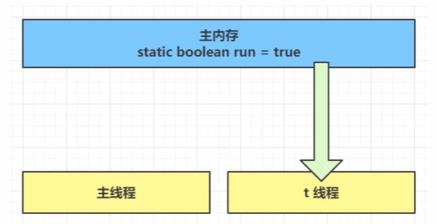
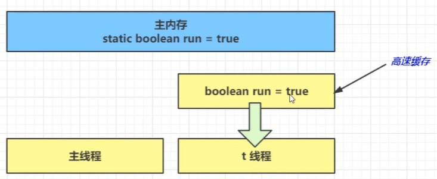
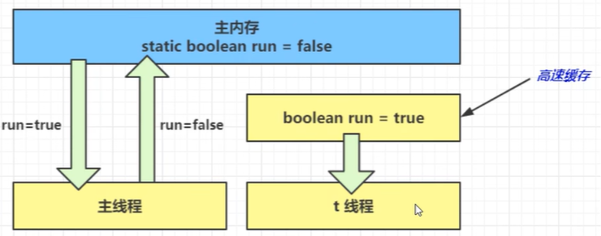

# 可见性

**可见性**是指当一个线程修改了共享变量的值，其他线程能够立即得知这个修改。Java 内存模型通过在变量修改后将新值同步回主内存，在变量读取前从主内存刷新变量值来实现可见性。

## 退不出的循环

### 问题演示

```java
public class VisibilityDemo {
    // 没有使用 volatile
    static boolean run = true;

    public static void main(String[] args) throws InterruptedException {
        Thread t = new Thread(() -> {
            while (run) {
                // 空循环
            }
            System.out.println("线程停止");
        });

        t.start();

        // 主线程休眠 1 秒
        Thread.sleep(1000);

        System.out.println("停止线程");
        run = false;
    }
}
```

**现象**：主线程将 `run` 修改为 `false` 后，t 线程可能无法停止，一直处于运行状态。

### 问题分析

**1. 初始状态**

t 线程从主内存读取 `run` 的值到工作内存：



**2. JIT 优化**

因为 t 线程要频繁读取 `run` 的值，JIT 编译器会将 `run` 的值缓存到 t 线程的工作内存高速缓存中，减少对主内存的访问，提高效率：



**3. 可见性问题**

1 秒后，主线程修改 `run = false` 并同步到主内存，而 t 线程从工作内存的高速缓存中读取变量值，得到的永远是旧值 `true`，因此循环无法停止：



::: warning 为什么会出现可见性问题？
现代 CPU 为了提升性能，都有多级缓存（L1、L2、L3）。线程在读写变量时，会先将变量加载到 CPU 缓存中，而不是每次都访问主内存。这就导致了一个线程对变量的修改，可能不会立即被其他线程看到。
:::

## 解决方案

### 方案1：volatile 关键字

`volatile` 可以用来修饰成员变量和静态成员变量，避免线程从自己的工作缓存中查找变量的值，必须到主内存中获取。

```java
public class VisibilityDemo {
    // 使用 volatile 修饰
    static volatile boolean run = true;

    public static void main(String[] args) throws InterruptedException {
        Thread t = new Thread(() -> {
            while (run) {
                // 空循环
            }
            System.out.println("线程停止");
        });

        t.start();
        Thread.sleep(1000);

        System.out.println("停止线程");
        run = false;  // volatile 保证可见性
    }
}
```

**volatile 的作用**：
- 读取 volatile 变量时，强制从主内存读取
- 写入 volatile 变量时，强制将值刷新到主内存
- 保证所有线程看到的 volatile 变量值是一致的

### 方案2：synchronized 关键字

`synchronized` 不仅保证原子性，也保证可见性：

```java
public class VisibilityDemo {
    static boolean run = true;
    static final Object lock = new Object();

    public static void main(String[] args) throws InterruptedException {
        Thread t = new Thread(() -> {
            while (true) {
                synchronized (lock) {
                    if (!run) {
                        break;
                    }
                }
            }
            System.out.println("线程停止");
        });

        t.start();
        Thread.sleep(1000);

        System.out.println("停止线程");
        synchronized (lock) {
            run = false;
        }
    }
}
```

**synchronized 的作用**：
- 线程进入 `synchronized` 块时，会清空工作内存中的共享变量值
- 线程从主内存读取共享变量的最新值
- 线程退出 `synchronized` 块时，会将修改后的值刷新到主内存

::: tip 如何选择？
- **volatile**：适合一个线程写、多个线程读的场景，性能更好
- **synchronized**：适合需要保证原子性和可见性的场景，功能更强，但属于重量级操作，性能相对更低
:::

::: details 思考题：为什么加入 `System.out.println()` 后循环能正常停止？

在最初的死循环示例中，如果在循环体内加入 `System.out.println()`，会发现即使不使用 `volatile`，线程也能看到 `run` 变量的修改：

```java
Thread t = new Thread(() -> {
    while (run) {
        System.out.println("running...");  // 加入这行后，循环可以正常停止
    }
    System.out.println("线程停止");
});
```

**现象**：主线程修改 `run = false` 后，t 线程能够正常停止，不再出现"退不出的循环"问题。

**原因分析**：

`System.out.println()` 方法内部使用了 `synchronized` 同步块。根据 `synchronized` 的可见性保证：

1. **进入同步块时**：清空工作内存中共享变量的缓存值
2. **读取变量时**：从主内存重新获取 `run` 的最新值
3. **结果**：能够看到主线程对 `run` 的修改，循环得以退出

这个例子再次印证了 `synchronized` 除了保证原子性，还具有可见性保证的特性。

**注意**：这只是一个用于理解可见性的示例，实际开发中不应依赖这种"副作用"来解决可见性问题，应该明确使用 `volatile` 或 `synchronized` 来保证线程安全。
:::

## 可见性 vs 原子性

### 区别对比

| 特性 | 可见性 | 原子性 |
|------|--------|--------|
| 定义 | 一个线程对变量的修改对其他线程可见 | 操作不可被中断，要么全部执行，要么全不执行 |
| 问题根源 | CPU 缓存导致变量值不同步 | 线程切换导致操作被打断 |
| 典型场景 | 标志位（boolean flag） | 复合操作（i++） |
| volatile | ✅ 保证 | ❌ 不保证 |
| synchronized | ✅ 保证 | ✅ 保证 |

### 示例：volatile 不保证原子性

```java
public class VolatileAtomicDemo {
    static volatile int count = 0;

    public static void main(String[] args) throws InterruptedException {
        Thread[] threads = new Thread[10];

        for (int i = 0; i < 10; i++) {
            threads[i] = new Thread(() -> {
                for (int j = 0; j < 1000; j++) {
                    count++;  // 不是原子操作
                }
            });
            threads[i].start();
        }

        for (Thread t : threads) {
            t.join();
        }

        System.out.println("count = " + count);  // 结果 < 10000
    }
}
```

**输出**：count 的值小于 10000（每次运行结果不同）

**原因**：`count++` 不是原子操作，分为三步：
1. 读取 count 的值
2. 将 count 加 1
3. 将结果写回 count

即使 count 是 volatile，也只能保证每次读取的是最新值，但多个线程同时执行这三步操作时，仍然会相互干扰。

**解决方案**：
- 使用 `synchronized` 保证原子性
- 使用 `AtomicInteger` 等原子类

```java
// 方案1：synchronized
synchronized (lock) {
    count++;
}

// 方案2：AtomicInteger
AtomicInteger count = new AtomicInteger(0);
count.incrementAndGet();
```

## 总结

**可见性问题的本质**：
- CPU 多级缓存导致变量值不一致
- 一个线程的修改可能对其他线程不可见

**解决方案**：
- **volatile**：轻量级，只保证可见性和有序性，适用于标志位
- **synchronized**：重量级，保证原子性、可见性和有序性，适用于临界区

**可见性 vs 原子性**：
- 可见性关注变量值的同步
- 原子性关注操作的完整性
- `volatile` 只保证可见性，不保证原子性
- `synchronized` 同时保证可见性和原子性

::: tip 工程实践
- 优先使用 `synchronized`，简单且不易出错
- 只在明确只需要可见性时使用 `volatile`（如标志位）
- 对于计数等需要原子性的操作，使用 `AtomicXXX` 原子类
:::
