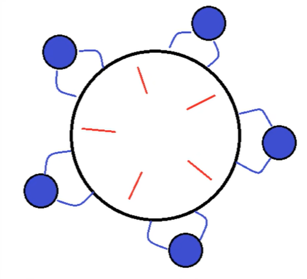

# 活跃性

**活跃性（Liveness）** 是指程序能够持续推进执行，最终完成任务。在并发编程中，如果线程无法继续执行，就会出现活跃性问题。

常见的活跃性问题包括：

- **死锁（Deadlock）**：线程互相等待对方释放资源，导致永久阻塞
- **活锁（Livelock）**：线程持续响应对方，但没有实际进展
- **饥饿（Starvation）**：线程长期无法获得所需资源

## 死锁

**死锁**是指两个或多个线程互相持有对方需要的资源，导致所有线程都无法继续执行。

### 死锁产生的四个必要条件

1. **互斥条件（Mutual Exclusion）**：资源不能被多个线程同时使用
2. **持有并等待（Hold and Wait）**：线程持有至少一个资源，同时等待获取其他资源
3. **不可剥夺（No Preemption）**：资源只能由持有它的线程主动释放，不能被强制剥夺
4. **循环等待（Circular Wait）**：存在一个线程等待链，形成环路

::: tip 破坏死锁
只要破坏四个条件中的任意一个，就可以避免死锁。实践中通常通过破坏"循环等待"条件来预防死锁。
:::

### 死锁示例

一个线程需要同时获取多把锁，此时就容易形成死锁。

**场景：**
- t1 线程获取锁 A，并等待锁 B
- t2 线程获取锁 B，并等待锁 A

```java
public class DeadLockDemo {
    public static void main(String[] args) {
        Object lockA = new Object();
        Object lockB = new Object();

        Thread t1 = new Thread(() -> {
            synchronized (lockA) {
                System.out.println("t1 获得锁 A");
                try {
                    Thread.sleep(100);
                } catch (InterruptedException e) {
                    e.printStackTrace();
                }
                System.out.println("t1 等待锁 B...");
                synchronized (lockB) {
                    System.out.println("t1 获得锁 B");
                }
            }
        }, "t1");

        Thread t2 = new Thread(() -> {
            synchronized (lockB) {
                System.out.println("t2 获得锁 B");
                try {
                    Thread.sleep(100);
                } catch (InterruptedException e) {
                    e.printStackTrace();
                }
                System.out.println("t2 等待锁 A...");
                synchronized (lockA) {
                    System.out.println("t2 获得锁 A");
                }
            }
        }, "t2");

        t1.start();
        t2.start();
    }
}
```

**运行结果：**

```
t1 获得锁 A
t2 获得锁 B
t1 等待锁 B...
t2 等待锁 A...
# 程序卡死，发生死锁
```

## 定位死锁

### 方法 1：使用 jconsole 工具

`jconsole` 是 JDK 自带的图形化监控工具，可以直观地检测死锁。

**使用步骤：**

1. 运行存在死锁的 Java 程序
2. 在命令行输入 `jconsole` 启动工具
3. 选择要监控的 Java 进程
4. 切换到"线程"标签页
5. 点击"检测死锁"按钮

如果存在死锁，工具会显示死锁的线程信息和锁依赖关系。

### 方法 2：使用 jstack 命令

**步骤 1：定位进程 ID**

```bash
jps
```

输出示例：
```
12345 DeadLockDemo
12346 Jps
```

**步骤 2：打印线程堆栈**

```bash
jstack 12345
```

**死锁报告示例：**

```
Found one Java-level deadlock:
=============================
"t2":
  waiting to lock monitor 0x00007f8b1c004e00 (object 0x000000076ad85e80, a java.lang.Object),
  which is held by "t1"
"t1":
  waiting to lock monitor 0x00007f8b1c006e00 (object 0x000000076ad85e90, a java.lang.Object),
  which is held by "t2"

Java stack information for the threads listed above:
===================================================
"t2":
        at DeadLockDemo.lambda$main$1(DeadLockDemo.java:32)
        - waiting to lock <0x000000076ad85e80> (a java.lang.Object)
        - locked <0x000000076ad85e90> (a java.lang.Object)
        ...
"t1":
        at DeadLockDemo.lambda$main$0(DeadLockDemo.java:18)
        - waiting to lock <0x000000076ad85e90> (a java.lang.Object)
        - locked <0x000000076ad85e80> (a java.lang.Object)
        ...

Found 1 deadlock.
```

::: tip 分析死锁报告
- `waiting to lock`：线程正在等待获取的锁
- `which is held by`：该锁被哪个线程持有
- `locked`：线程已经持有的锁
- 通过分析等待关系，可以找到死锁环路
:::

## 哲学家就餐问题

**哲学家就餐问题**是经典的死锁和资源竞争问题。

### 问题描述



- 5 位哲学家围坐在圆桌旁
- 每两位哲学家之间有一根筷子（共 5 根）
- 哲学家的状态：思考 → 拿起左边筷子 → 拿起右边筷子 → 进餐 → 放下筷子
- **目标**：设计算法让所有哲学家都能进餐，避免死锁和饥饿

```java
public class DiningPhilosophers {
    public static void main(String[] args) {
        Chopstick[] chopsticks = new Chopstick[5];
        for (int i = 0; i < 5; i++) {
            chopsticks[i] = new Chopstick();
        }

        for (int i = 0; i < 5; i++) {
            int left = i;
            int right = (i + 1) % 5;
            new Philosopher(i, chopsticks[left], chopsticks[right]).start();
        }
    }
}

class Philosopher extends Thread {
    private int id;
    private Chopstick left;
    private Chopstick right;

    public Philosopher(int id, Chopstick left, Chopstick right) {
        this.id = id;
        this.left = left;
        this.right = right;
    }

    @Override
    public void run() {
        while (true) {
            think();
            synchronized (left) {      // 拿起左边筷子
                synchronized (right) {  // 拿起右边筷子
                    eat();
                }
            }
        }
    }

    private void think() {
        System.out.println("哲学家 " + id + " 正在思考");
        sleep(100);
    }

    private void eat() {
        System.out.println("哲学家 " + id + " 正在进餐");
        sleep(100);
    }
}

class Chopstick {
}
```

**死锁场景：** 所有哲学家同时拿起左边的筷子，然后等待右边的筷子 → 死锁

### 解决方案

**1. 固定加锁顺序**

让所有哲学家按照统一的顺序获取筷子（例如总是先拿编号小的筷子），打破循环等待条件。

::: warning 注意
此方案在高并发场景下可能导致某些哲学家长时间无法获取资源，产生饥饿问题。
:::

**2. 限制并发数**

使用信号量限制最多只有 4 位哲学家同时进餐，确保至少有一位哲学家能获得两根筷子。

**3. 超时重试**

使用 `ReentrantLock` 的 `tryLock(timeout)` 方法，如果无法在超时时间内获取锁，则释放已持有的锁并重试。

**4. 奇偶策略**

奇数编号的哲学家先拿左边筷子，偶数编号的哲学家先拿右边筷子，避免所有人同时拿同一侧的筷子。

## 活锁

**活锁**是指线程虽然没有阻塞，但由于某些条件无法满足，导致线程持续重试相同的操作，无法继续执行。活锁通常出现在两个线程互相改变对方的结束条件，最后谁也无法结束的场景中。

**示例场景：** 两个线程互相干扰对方的执行条件

```java
public class LiveLockDemo {
    static volatile int count = 10;
    static final Object lock = new Object();

    public static void main(String[] args) { 
        new Thread(() -> { 
            while (count > 0) { 
                sleep(0.2);
                count--;
                log.debug("count：{}", count);
            }
        }, "t1").start();

         new Thread(() -> { 
            while (count < 20) { 
                sleep(0.2);
                count++;
                log.debug("count：{}", count);
            }
        }, "t2").start();
    }
}
```

**现象：** 两个线程都在运行（非阻塞状态），但都在等待对方，无法继续执行。

**解决方案：** 通过在等待时加入随机时间间隔（如 `Thread.sleep(100 + (int)(Math.random() * 100))`），打破线程间的同步节奏，使它们不再同时重试。

::: tip 活锁 vs 死锁
- **死锁**：线程处于 BLOCKED 状态，完全阻塞，无法继续执行
- **活锁**：线程处于 RUNNABLE 状态，持续执行但无实际进展
- 活锁通常由**过度谦让**或**重试策略不当**导致
:::

## 饥饿

**饥饿**是指某个线程长期无法获得所需资源，导致无法执行。

**产生原因：**

1. **线程优先级设置不当**：高优先级线程始终抢占资源
2. **持有锁的线程长时间不释放**：其他线程长期等待
3. **读写锁中的写饥饿**：大量读线程导致写线程无法获得锁

**示例代码：** 使用固定加锁顺序可能导致饥饿

```java
public class StarvationDemo {
    public static void main(String[] args) {
        Chopstick[] chopsticks = new Chopstick[5];
        for (int i = 0; i < 5; i++) {
            chopsticks[i] = new Chopstick(i);
        }

        // 所有哲学家都按照固定顺序（编号从小到大）获取筷子
        for (int i = 0; i < 5; i++) {
            int left = i;
            int right = (i + 1) % 5;
            new Thread(() -> {
                while (true) {
                    // 总是先获取编号小的筷子
                    Chopstick first = chopsticks[Math.min(left, right)];
                    Chopstick second = chopsticks[Math.max(left, right)];

                    synchronized (first) {
                        synchronized (second) {
                            System.out.println("哲学家 " + left + " 正在进餐");
                            sleep(10);
                        }
                    }
                }
            }).start();
        }
    }
}

class Chopstick {
    int id;
    Chopstick(int id) { this.id = id; }
}
```

**现象：** 在高并发场景下，某些哲学家可能长时间无法同时获取两根筷子，导致饥饿。

**解决方案：**

1. **公平锁**：使用 `ReentrantLock(true)` 创建公平锁，按照请求顺序分配锁

```java
Lock lock = new ReentrantLock(true);  // 公平锁
```

2. **避免设置线程优先级**：让 JVM 自动调度
3. **使用公平的读写锁**：`ReentrantReadWriteLock(true)`

## 总结

| 问题类型 | 表现 | 线程状态 | 解决方案 |
|---------|------|---------|---------|
| **死锁** | 线程互相等待，永久阻塞 | BLOCKED | 固定加锁顺序、tryLock 超时、避免嵌套锁 |
| **活锁** | 线程持续响应但无进展 | RUNNABLE | 引入随机性、改进重试策略 |
| **饥饿** | 线程长期无法获得资源 | WAITING/BLOCKED | 使用公平锁、避免优先级设置 |

::: warning 设计原则
- **预防优于检测**：设计时避免死锁条件，而不是运行时检测
- **简化锁结构**：减少锁的数量和嵌套层次
- **使用高级并发工具**：优先使用 `java.util.concurrent` 包中的工具
- **充分测试**：并发问题往往难以复现，需要充分的压力测试
:::
