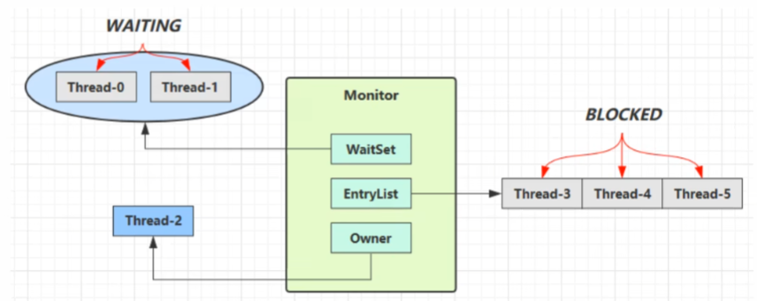

# Monitor

## Java 对象头（64 位 JVM，开启压缩指针）

Java 对象在内存中的布局通常包括三部分：

1. **对象头（Object Header）**
2. **实例数据（Instance Data）**
3. **对齐填充（Padding）**

### 对象头结构

| 部分 | 大小 | 内容说明 |
|------|------|----------|
| **Mark Word** | 8 字节 | 存储对象自身状态，包括锁信息（偏向锁、轻量级锁、重量级锁）、hashCode、GC 分代年龄等 |
| **Klass Pointer** | 4 字节 | 指向对象的类元数据（Class Metadata），确定对象所属类型 |
| **数组长度 length（仅数组对象）** | 4 字节 | 数组对象特有字段，存储数组元素个数；普通对象无此字段 |
| **对齐填充（Padding）** | 可选 | 为了满足 8 字节对齐规则，HotSpot 会自动填充 |

::: tip 注意
- 对象头中 Mark Word 的具体内容会随对象锁状态动态变化
- 数组对象在对象头上比普通对象多了一个 `length` 字段
- 开启压缩指针（-XX:+UseCompressedOops）时，Klass Pointer 为 4 字节；否则为 8 字节
- 由于对象头直接管理对象元数据和锁状态，实例字段尽量使用基本类型（如 `int`）而非包装类型（如 `Integer`），可以减少额外对象引用开销，提高内存利用率。
:::

### Mark Word 结构

Mark Word 是对象头中最重要的部分，它的内容会根据锁的状态动态变化。在 64 位 JVM 中，Mark Word 占用 8 字节（64 位）。

| 锁状态 | 存储内容 (前 61 位) | 偏向锁标志 (倒数第 3 位) | 锁标志位 (后 2 位) | 说明 |
|--------|-------------------|---------------------|-----------------|------|
| 无锁 (Unlocked) | 对象 hashCode + GC 分代年龄等 | 0 | 01 | 对象未加锁，Mark Word 可存 hashCode 和 GC 信息，开销最小 |
| 偏向锁 (Biased Lock) | 持有锁线程 ID + 偏向时间戳/epoch | 1 | 01 | 单线程访问优化，无竞争时无需 CAS，降低同步开销 |
| 轻量级锁 (Lightweight Lock) | 指向栈中 Lock Record 的指针 | - | 00 | 多线程轻度竞争，通过 CAS 自旋，不阻塞线程 |
| 重量级锁 (Heavyweight Lock / Monitor) | 指向 Monitor 对象的指针 | - | 10 | 高竞争情况下膨胀为重量级锁，涉及线程阻塞和唤醒 |
| GC 标记 (Marked for GC) | GC 相关信息 | - | 11 | 垃圾回收时使用 |

## Monitor（监视器 / 管程）

在 Java 中，每个对象都自带一把锁，这把锁就是 **Monitor**（监视器，或称管程）。它是 JVM 用来实现 `synchronized` 的核心机制。



### Monitor 的基本概念

- 每个对象头中都有 **Mark Word**，其中存储锁信息。
- 当对象被 `synchronized` 保护时，JVM 会根据竞争情况决定使用哪种锁：
  - **偏向锁（Biased Lock）**：无竞争，单线程快速获取锁
  - **轻量级锁（Lightweight Lock）**：低竞争，多线程自旋获取锁
  - **重量级锁（Heavyweight Lock / Monitor）**：高竞争，线程阻塞等待

- **Monitor** 本质是重量级锁结构，也就是当锁膨胀（inflate）后，线程会真正阻塞在 Monitor 上。

### Monitor 内部结构

Monitor 主要包含以下信息：

| 字段 | 作用 |
|------|------|
| Owner | 当前持有锁的线程 |
| EntryList | 等待获取锁的线程队列 |
| WaitSet | 调用 `wait()` 后进入等待状态的线程集合 |
| Recursions / Count | 重入计数，支持可重入锁 |

::: tip 可重入性
JVM 实现中，Monitor 支持可重入性，同一个线程多次进入同步块时不会阻塞，而是通过重入计数器记录进入次数。
:::

### Monitor 的工作原理

**获取锁**：
- 线程尝试通过 **CAS** 修改对象头 Mark Word
- 如果无竞争，可能只使用偏向锁或轻量级锁
- 如果竞争激烈，锁膨胀为重量级锁，线程阻塞在 Monitor 上

**释放锁**：
- 偏向锁：无需操作，其他线程尝试获取锁会撤销偏向
- 轻量级锁：CAS 回滚对象头
- 重量级锁：唤醒 Monitor 上的阻塞线程

**wait() / notify()**：
- 调用 `wait()` 的线程会进入 Monitor 的 WaitSet，释放锁并挂起
- 调用 `notify()` 或 `notifyAll()` 的线程会从 WaitSet 中唤醒一个或所有线程，重新进入 EntryList 竞争锁

### 字节码角度分析

从字节码层面看，`synchronized` 关键字会被编译为 `monitorenter` 和 `monitorexit` 指令来实现同步。

**示例代码**：

```java
public class MonitorDemo {
    private static final Object lock = new Object();

    public static void main(String[] args) {
        synchronized (lock) {
            System.out.println("临界区代码");
        }
    }
}
```

**对应的字节码**：

```
 0: getstatic     #2    // 获取 lock 对象引用
 3: dup                 // 复制栈顶引用（用于 monitorexit）
 4: astore_1            // 将引用存储到局部变量表
 5: monitorenter        // 进入 Monitor，获取锁
 6: getstatic     #3    // 获取 System.out
 9: ldc           #4    // 加载字符串常量
11: invokevirtual #5    // 调用 println 方法
14: aload_1             // 加载 lock 引用
15: monitorexit         // 退出 Monitor，释放锁
16: goto          24    // 跳转到方法结束
19: astore_2            // 异常处理：存储异常对象
20: aload_1             // 加载 lock 引用
21: monitorexit         // 确保释放锁
22: aload_2             // 加载异常对象
23: athrow              // 重新抛出异常
24: return              // 方法返回
```

**关键指令说明**：

| 指令 | 作用 |
|------|------|
| `monitorenter` | 尝试获取对象的 Monitor 锁，如果成功则进入同步块；如果失败则阻塞等待 |
| `monitorexit` | 释放对象的 Monitor 锁，唤醒等待队列中的线程 |

**执行流程**：

1. **monitorenter**：
   - 如果 Monitor 的 Owner 为空，当前线程成为 Owner，计数器设为 1
   - 如果当前线程已是 Owner（重入），计数器加 1
   - 如果 Monitor 被其他线程占用，当前线程进入 EntryList 阻塞

2. **monitorexit**：
   - 计数器减 1
   - 当计数器为 0 时，释放 Monitor，唤醒 EntryList 中的线程

::: tip 异常安全机制
字节码中会生成两个 `monitorexit` 指令：
- 第一个在正常执行路径（第 15 行）
- 第二个在异常处理路径（第 21 行）

这确保了即使同步块中抛出异常，锁也能被正确释放，避免死锁。
:::

### 锁升级路径

JVM 的锁优化策略是“低成本优先，必要时升级”：无锁 → 偏向锁 → 轻量级锁 → 重量级锁

- **无锁 / 偏向锁**：减少线程切换和 CAS 开销
- **轻量级锁**：自旋等待，避免阻塞
- **重量级锁**：高竞争下保证线程安全，但开销大

### 总结

- Monitor 是每个对象自带的同步器，核心是对象头的 Mark Word
- 锁机制是动态的，会根据线程竞争情况从偏向锁升级到重量级锁
- Monitor 内部管理 Owner、EntryList、WaitSet 等数据，支持可重入和 `wait/notify`
- 设计目标：在 **不同竞争强度下优化性能**，减少上下文切换和线程阻塞


