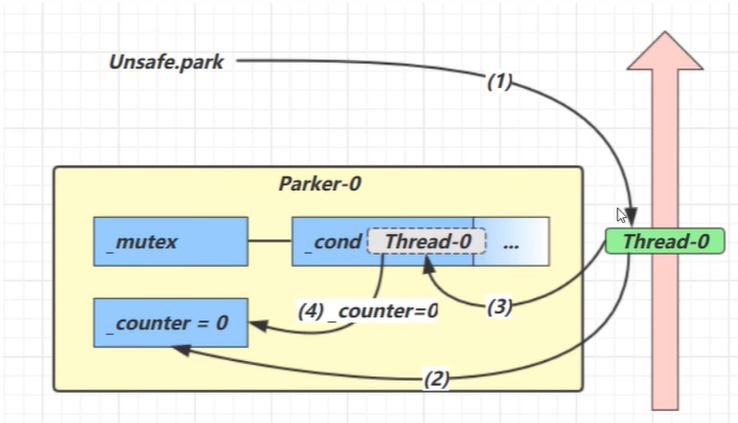
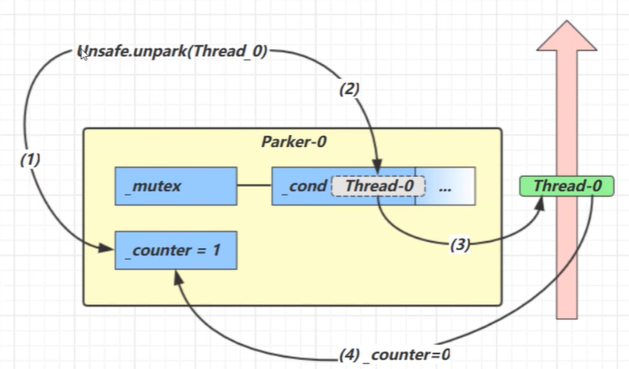

# park & unpark 机制

`park` 和 `unpark` 是 `LockSupport` 类提供的线程阻塞和唤醒机制，相比 `wait/notify` 更加灵活和底层。它们是构建高级并发工具（如 `ReentrantLock`、`CountDownLatch`）的基础。

## 核心特性

| 特性 | park/unpark | wait/notify |
|------|-------------|-------------|
| 所属类 | `LockSupport`（工具类） | `Object`（基类方法） |
| 是否需要锁 | 不需要 | 必须在 synchronized 块中 |
| 操作单位 | 以线程为单位，精确控制 | 以对象监视器为单位 |
| 唤醒方式 | `unpark(thread)` 指定线程 | `notify()` 随机唤醒一个 |
| 顺序要求 | 可以先 unpark 再 park | 必须先 wait 再 notify |
| 许可机制 | 基于许可（permit），最多 1 个 | 无许可概念 |
| 中断处理 | 响应中断但不抛异常 | 抛出 `InterruptedException` |
| 适用场景 | 实现自定义同步器（如 AQS） | 简单的线程协作 |

## API 与工作原理

### 核心方法

```java
// 阻塞当前线程
public static void park()

// 阻塞当前线程，最多等待指定纳秒
public static void parkNanos(long nanos)

// 阻塞当前线程，直到指定的截止时间（绝对时间，毫秒）
public static void parkUntil(long deadline)

// 唤醒指定线程
public static void unpark(Thread thread)
```

### 许可机制

每个线程都有一个 Parker 对象，包含：

- **_counter**：许可计数器（0 或 1）
- **_mutex**：互斥锁
- **_cond**：条件变量

park/unpark 基于**二元信号量**（0 或 1）工作：

**park() 行为：**
- 如果有许可（_counter = 1），消费许可并立即返回
- 如果无许可（_counter = 0），阻塞当前线程
- 响应中断但不抛出异常
- 可能发生虚假唤醒



1. 线程调用 `park()`
2. 检查 _counter = 0，获得_mutex互斥锁
3. 线程进入_cond条件变量阻塞
4. 设置_counter = 0

**unpark(thread) 行为：**
- 为指定线程提供一个许可（设置 _counter = 1）
- 如果线程正在 park 中，会被唤醒
- 如果线程还未 park，许可会被保留
- 许可最多只有 1 个，多次 unpark 不会累积




1. 线程调用 `unpark()`，设置 _counter = 1（提供许可）
2. 唤醒_cond条件变量中的Thread_0
3. Thread_0恢复运行
4. 消费许可（_counter = 0），无需阻塞

## 基本用法

### 示例1：简单的线程阻塞与唤醒

```java
public class ParkUnparkDemo {
    public static void main(String[] args) throws InterruptedException {
        Thread t1 = new Thread(() -> {
            System.out.println("线程开始运行");

            // 阻塞当前线程
            LockSupport.park();

            System.out.println("线程被唤醒");
        }, "t1");

        t1.start();

        // 主线程等待 1 秒
        Thread.sleep(1000);

        System.out.println("主线程唤醒 t1");
        // 唤醒 t1 线程
        LockSupport.unpark(t1);
    }
}
```

**输出：**
```
线程开始运行
主线程唤醒 t1
线程被唤醒
```

### 示例2：先 unpark 再 park

```java
public class UnparkFirstDemo {
    public static void main(String[] args) throws InterruptedException {
        Thread t1 = new Thread(() -> {
            System.out.println("线程开始运行");

            try {
                Thread.sleep(2000);
            } catch (InterruptedException e) {
                e.printStackTrace();
            }

            System.out.println("准备 park");
            // 此时已经有许可，不会阻塞
            LockSupport.park();

            System.out.println("park 立即返回，无需等待");
        }, "t1");

        t1.start();

        // 主线程先 unpark
        Thread.sleep(1000);
        System.out.println("主线程先 unpark");
        LockSupport.unpark(t1);
    }
}
```

**输出：**
```
线程开始运行
主线程先 unpark
准备 park
park 立即返回，无需等待
```

### 示例3：带超时的 park

```java
public class ParkTimeoutDemo {
    public static void main(String[] args) {
        Thread t1 = new Thread(() -> {
            System.out.println("线程开始，park 2 秒");
            long start = System.currentTimeMillis();

            // 最多阻塞 2 秒（2,000,000,000 纳秒）
            LockSupport.parkNanos(2_000_000_000L);

            long elapsed = System.currentTimeMillis() - start;
            System.out.println("park 结束，耗时：" + elapsed + "ms");
        }, "t1");

        t1.start();
    }
}
```

## 响应中断

park 会响应中断，但不会抛出 `InterruptedException`：

```java
public class ParkInterruptDemo {
    public static void main(String[] args) throws InterruptedException {
        Thread t1 = new Thread(() -> {
            System.out.println("线程开始 park");
            LockSupport.park();

            // park 返回后检查中断状态
            if (Thread.currentThread().isInterrupted()) {
                System.out.println("线程被中断");
            } else {
                System.out.println("线程正常唤醒");
            }
        }, "t1");

        t1.start();

        Thread.sleep(1000);
        System.out.println("主线程中断 t1");
        t1.interrupt();
    }
}
```

**输出：**
```
线程开始 park
主线程中断 t1
线程被中断
```

::: warning 中断处理
park 响应中断但不抛异常，需要手动检查中断状态：
```java
LockSupport.park();
if (Thread.interrupted()) {
    // 处理中断
}
```
:::

## 常见问题

### 1. park 后没有被唤醒

**原因：**
- unpark 在 park 之前调用，但许可已被消费
- 多次 unpark 不会累积许可

**解决：**
```java
// 错误：多次 unpark 不会累积
LockSupport.unpark(t1);
LockSupport.unpark(t1);  // 第二次无效
LockSupport.park();      // 消费 1 个许可
LockSupport.park();      // 会阻塞

// 正确：使用计数器
AtomicInteger permits = new AtomicInteger(0);
permits.incrementAndGet();
permits.incrementAndGet();
```

### 2. 忽略中断状态

**问题：**
```java
LockSupport.park();
// 没有检查中断状态
```

**正确做法：**
```java
LockSupport.park();
if (Thread.interrupted()) {
    // 处理中断或重新设置中断标志
    Thread.currentThread().interrupt();
}
```

### 3. 虚假唤醒

park 也可能发生虚假唤醒，需要配合条件检查：

```java
// 错误
if (!condition) {
    LockSupport.park();
}

// 正确
while (!condition) {
    LockSupport.park();
}
```

## 总结

- **park/unpark** 是更底层、更灵活的线程阻塞机制，不需要持有锁
- **许可机制**：基于二元信号量（0 或 1），unpark 可以在 park 之前调用
- **精确唤醒**：可以指定唤醒哪个线程，而不是随机唤醒
- **响应中断**：park 会响应中断但不抛异常，需要手动检查中断状态
- **应用广泛**：是 AQS 和 JUC 包中许多工具的基础
- **使用注意**：需要配合 while 循环应对虚假唤醒，注意处理中断

::: tip 工程实践
在实际开发中，直接使用 park/unpark 的场景较少，更多是使用基于它们构建的高级工具（如 ReentrantLock、CountDownLatch）。只有在实现自定义同步器时才需要直接使用。
:::
