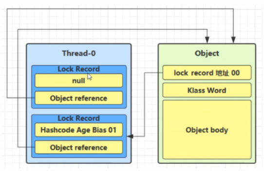
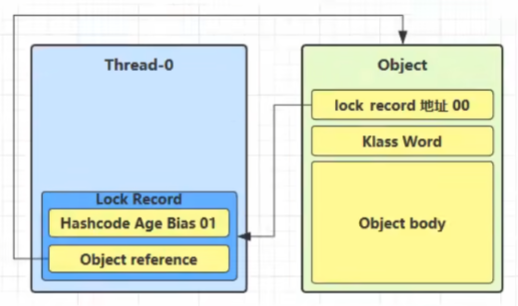
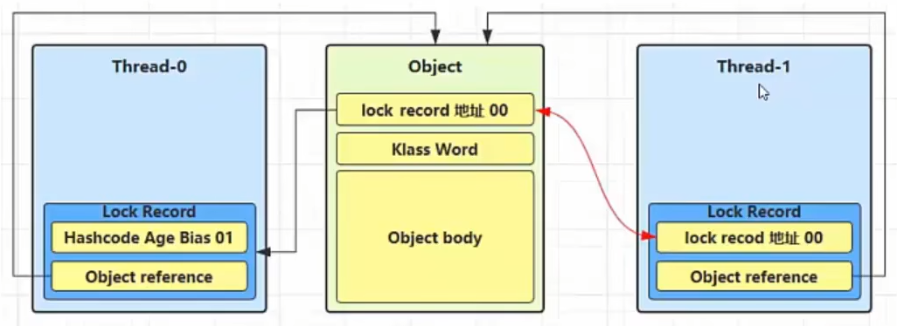
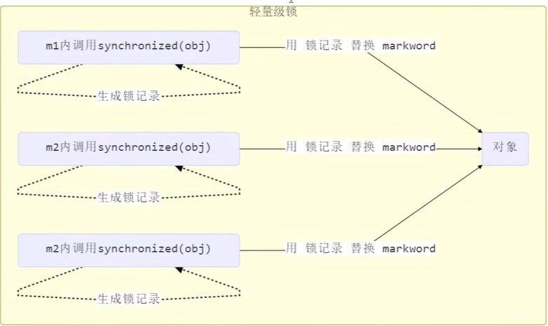
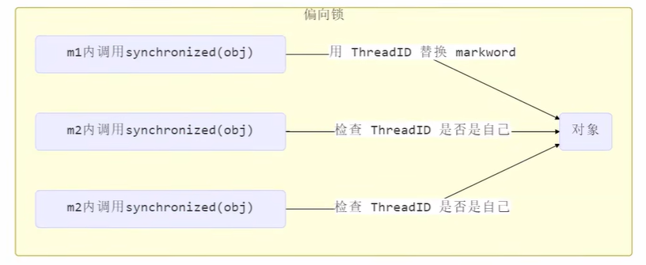

# synchronized 原理进阶

## 轻量级锁

轻量级锁是 JVM 在 synchronized 中用于无竞争或极低竞争场景的一种优化锁机制，它的核心目标是在不进入操作系统阻塞的情况下完成同步控制。相比重量级锁，轻量级锁避免了操作系统互斥量（Mutex）的开销，通过 CAS 操作实现加锁和解锁。

### 适用场景

轻量级锁适用于以下场景：

- 线程交替执行同步块，不存在真正的竞争
- 同步块执行时间非常短
- 锁重入的情况

### 示例场景

假设有两个方法同步块，利用同一个对象加锁：

```java
static final Object obj = new Object();

public static void method1() {
    synchronized (obj) {
        // 同步块 A
        method2();
    }
}

public static void method2() {
    synchronized (obj) {
        // 同步块 B
    }
}
```

### 加锁流程

#### 1. 创建锁记录

创建锁记录（Lock Record）对象，每个线程的栈帧都会包含一个锁记录的结构，内部可以存储锁定对象的 Mark Word。


#### 2. 尝试 CAS 替换

让锁记录中 Object Reference 指向锁对象，并尝试用 CAS 替换 Object 的 Mark Word，将 Mark Word 的值存入锁记录。


#### 3. CAS 成功

如果 CAS 替换成功，对象头中存储了锁记录地址和状态 `00`，表示由该线程给对象加锁。


#### 4. CAS 失败

如果 CAS 失败，有两种情况：

- **其他线程持有锁**：如果是其他线程已经持有了该 Object 的轻量级锁，这时表明有竞争，进入锁膨胀过程
- **锁重入**：如果是自己执行了 synchronized 锁重入，那么再添加一条 Lock Record 作为重入的计数



### 解锁流程

#### 1. 重入锁解锁

当退出 synchronized 代码块（解锁）时，如果有值为 `null` 的锁记录，表示有重入，这时重置锁记录，表示重入次数减一。



#### 2. 正常解锁

当退出 synchronized 代码块（解锁）时，锁记录的值不为 `null`，这时使用 CAS 将 Mark Word 的值恢复给对象头：

- **成功**：则解锁成功
- **失败**：说明轻量级锁进行了锁膨胀或已经升级为重量级锁，进入重量级锁解锁流程

## 锁膨胀

如果在尝试加轻量级锁的过程中，CAS 操作无法成功，说明其他线程已经持有了该对象的轻量级锁（有竞争），这时需要进行锁膨胀，将轻量级锁升级为重量级锁，保证线程安全。

### 示例场景

```java
static final Object obj = new Object();

public static void method1() {
    synchronized (obj) {
        // 同步块
    }
}
```

### 膨胀流程

#### 1. 竞争检测

当 Thread-1 进行轻量级锁加锁时，Thread-0 已经对该对象加了轻量级锁。



#### 2. 锁膨胀过程

这时 Thread-1 加轻量级锁失败，进入锁膨胀过程：

- 为 Object 对象申请 Monitor 锁，让 Object 指向重量级锁地址
- 然后自己进入 Monitor 的 EntryList BLOCKED


#### 3. 重量级锁解锁

当 Thread-0 退出同步块解锁时，使用 CAS 将 Mark Word 的值恢复给对象头，失败。这时会进入重量级锁解锁流程：

- 按照 Monitor 地址找到 Monitor 对象
- 设置 Owner 为 null
- 唤醒 EntryList 中 BLOCKED 线程

::: tip 锁膨胀的意义
锁膨胀虽然会带来性能开销，但它是保证多线程安全的必要机制。通过将轻量级锁升级为重量级锁，JVM 能够正确处理线程竞争，避免死锁和数据不一致问题。
:::

## 自旋优化

重量级锁竞争的场景下，线程获取锁失败后会进入阻塞状态，涉及用户态和内核态的切换，开销较大。自旋优化通过让线程在短时间内循环等待（自旋）而不是立即阻塞，如果在自旋期间成功获取到锁，就避免了昂贵的线程上下文切换。

### 自旋成功场景

当线程尝试获取重量级锁失败时，不会立即进入阻塞状态，而是执行忙循环（自旋）等待锁释放。如果持锁线程在短时间内释放了锁，自旋线程可以立即获取锁并继续执行，从而避免了线程阻塞和唤醒的开销。

| 时间顺序 | 线程1（cpu1） | 对象 Mark Word | 线程2（cpu2） |
|---|---|---|---|
| 初始状态 | - | `10（重量锁）` 重量锁指针 | - |
| 1 | 访问同步块，获取 monitor | `10（重量锁）` 重量锁指针 | - |
| 2 | 成功加锁 | `10（重量锁）` 重量锁指针 | - |
| 3 | 执行同步块 | `10（重量锁）` 重量锁指针 | - |
| 4 | 执行同步块 | `10（重量锁）` 重量锁指针 | 访问同步块，尝试获取 monitor |
| 5 | 执行同步块 | `10（重量锁）` 重量锁指针 | 开始自旋重试 |
| 6 | 执行完成 | `10（重量锁）` 重量锁指针 | 持续自旋 |
| 7 | 解锁成功 | `01（无锁）` | 自旋成功，准备获取锁 |
| 8 | - | `10（重量锁）` 重量锁指针 | CAS 成功，获取锁 |
| 9 | - | `10（重量锁）` 重量锁指针 | 执行同步块 |
| 10 | - | ... | ... |

### 自旋失败场景

自旋虽然可以避免线程切换的开销，但如果持锁线程长时间不释放锁，自旋会白白消耗 CPU 资源。因此 JVM 会限制自旋的次数，当自旋次数达到阈值后，线程会停止自旋并进入阻塞状态（BLOCKED），等待被唤醒。

| 时间顺序 | 线程1（cpu1） | 对象 Mark Word | 线程2（cpu2） |
|---|---|---|---|
| 初始状态 | - | `10（重量锁）` 重量锁指针 | - |
| 1 | 访问同步块，获取 monitor | `10（重量锁）` 重量锁指针 | - |
| 2 | 成功加锁 | `10（重量锁）` 重量锁指针 | - |
| 3 | 执行同步块 | `10（重量锁）` 重量锁指针 | - |
| 4 | 执行同步块 | `10（重量锁）` 重量锁指针 | 访问同步块，尝试获取 monitor |
| 5 | 执行同步块 | `10（重量锁）` 重量锁指针 | 第一次自旋重试 |
| 6 | 执行同步块 | `10（重量锁）` 重量锁指针 | 第二次自旋重试 |
| 7 | 执行同步块 | `10（重量锁）` 重量锁指针 | 第三次自旋重试 |
| 8 | 执行同步块 | `10（重量锁）` 重量锁指针 | 自旋次数达到阈值 |
| 9 | 执行同步块 | `10（重量锁）` 重量锁指针 | 停止自旋，进入阻塞（BLOCKED） |
| 10 | - | ... | ... |


::: info 自旋锁特性
**自适应自旋（Java 6+）**

JVM 会根据历史自旋成功率动态调整自旋次数。如果上一次自旋成功，会增加自旋次数；如果经常失败，则减少自旋次数甚至直接阻塞，实现智能优化。

**CPU 资源考量**

- **多核 CPU**：自旋线程和持锁线程可以并行运行，自旋能够发挥优势
- **单核 CPU**：自旋会浪费 CPU 时间片，不如直接阻塞让出 CPU

**自旋控制（Java 7+）**

JVM 完全接管自旋锁的控制逻辑，开发者无法手动控制，由 JVM 根据运行时情况自动决定。
:::

## 偏向锁

::: danger 偏向锁已被废弃
从 JDK 15 开始，偏向锁被标记为废弃（deprecated），并在 JDK 18 中默认禁用。Oracle 官方认为偏向锁带来的性能提升在现代应用中已经不明显，而其维护成本较高。建议在新项目中不再依赖偏向锁优化。

- **JDK 15**：偏向锁被标记为废弃，默认仍然开启
- **JDK 18**：偏向锁默认禁用，需要通过 `-XX:+UseBiasedLocking` 显式开启
- **未来版本**：可能完全移除偏向锁功能
:::

轻量级锁在没有竞争时，每次重入仍然需要执行 CAS 操作。Java 6 观察到大多数情况下，锁不仅不存在多线程竞争，而且总是由同一个线程多次获得。基于这一观察，引入了偏向锁来进一步优化：只有第一次使用 CAS 将线程 ID 设置到对象的 Mark Word，之后发现线程 ID 是自己的就表示没有竞争，不用重新 CAS。以后只要不发生竞争，这个对象就归该线程所有，从而让线程获得锁的代价更低。

### 示例场景

```java
static final Object obj = new Object();

public static void method1() {
    synchronized (obj) {
        // 同步块 A
        method2();
    }
}

public static void method2() {
    synchronized (obj) {
        // 同步块 B
        method3();
    }
}

public static void method3() {
    synchronized (obj) {
        // 同步块 C
    }
}
```

在上述代码中，同一个线程连续三次获取同一个锁对象。使用偏向锁后，只有第一次需要 CAS 操作，后续两次重入都无需 CAS，直接检查线程 ID 即可。




### 偏向状态

一个对象创建时：

- **开启偏向锁**：如果开启了偏向锁（默认开启），那么对象创建后，Mark Word 值为 `0x05` 即最后三位为 `101`，这时它的 thread、epoch、age 都为 0
- **延迟生效**：偏向锁是默认延迟的，不会在程序启动时立即生效，可通过 VM 参数 `-XX:BiasedLockingStartupDelay=0` 关闭延迟
- **未开启偏向锁**：如果没有开启偏向锁，那么对象创建后，Mark Word 值为 `0x01` 即最后三位为 `001`，这时它的 hashCode、age 都为 0，第一次用到 hashCode 才会赋值

::: tip 相关配置
- **查看对象头**：可利用 JOL（Java Object Layout）第三方工具来查看对象头信息
- **禁用偏向锁**：VM 参数 `-XX:-UseBiasedLocking`
- **关闭延迟**：VM 参数 `-XX:BiasedLockingStartupDelay=0`
:::

### 撤销

偏向锁在某些情况下会被撤销，恢复到无锁或升级为轻量级锁状态。

**调用 hashCode**

调用了对象的 hashCode，但偏向锁的对象 Mark Word 中存储的是线程 ID，如果调用 hashCode 会导致偏向锁被撤销：

- **轻量级锁**：会在锁记录中记录 hashCode
- **重量级锁**：会在 Monitor 中记录 hashCode

::: warning hashCode 与偏向锁的冲突
偏向锁的 Mark Word 结构中没有空间存储 hashCode，因此调用 hashCode 方法会导致偏向锁被撤销。这是偏向锁的一个限制。
:::

**其他线程使用对象**

当有其他线程使用偏向锁对象时，会将偏向锁升级为轻量级锁。这是因为偏向锁只适用于单线程场景，一旦出现多线程竞争，就需要升级为更高级别的锁。

**调用 wait/notify**

调用 wait/notify 方法需要使用 Monitor 机制，因此会导致偏向锁直接升级为重量级锁。

### 批量重偏向

当同一类型的对象偏向锁撤销次数达到 20 次（默认阈值）后，JVM 判断可能是偏向错了线程，而不是真正的多线程竞争，于是会触发批量重偏向优化。批量重偏向不会立即撤销所有对象的偏向锁，而是更新类的 epoch 值（版本号），当线程再次获取锁时，发现对象的 epoch 与类的 epoch 不一致，就直接将对象重新偏向至当前线程，无需撤销。

```java
List<Object> list = new ArrayList<>();

// 线程1创建30个对象并加锁
Thread t1 = new Thread(() -> {
    for (int i = 0; i < 30; i++) {
        Object obj = new Object();
        list.add(obj);
        synchronized (obj) {
            // 对象偏向线程1
        }
    }
});

// 线程2尝试获取这些对象的锁
Thread t2 = new Thread(() -> {
    for (int i = 0; i < 30; i++) {
        Object obj = list.get(i);
        synchronized (obj) {
            // 前19次：撤销偏向锁，升级为轻量级锁
            // 第20次：触发批量重偏向
            // 后续：直接偏向线程2
        }
    }
});
```

::: tip 批量重偏向的意义
批量重偏向避免了大量对象频繁在偏向锁和轻量级锁之间切换的开销，提高了性能。这在某些场景下非常有用，比如对象池、线程池等场景。
:::
### 批量撤销

当同一类型的对象偏向锁撤销次数达到 40 次（默认阈值）后，JVM 判断该类的对象存在真正的多线程竞争，不适合使用偏向锁。此时会将该类标记为不可偏向状态，撤销所有已存在对象的偏向锁，后续新创建的该类对象直接进入无锁状态（Mark Word 最后 3 位为 `001`），加锁时直接使用轻量级锁。

```java
List<Object> list = new ArrayList<>();

// 线程1创建50个对象并加锁
Thread t1 = new Thread(() -> {
    for (int i = 0; i < 50; i++) {
        Object obj = new Object();
        list.add(obj);
        synchronized (obj) {
            // 对象偏向线程1
        }
    }
});

// 线程2尝试获取这些对象的锁
Thread t2 = new Thread(() -> {
    for (int i = 0; i < 50; i++) {
        Object obj = list.get(i);
        synchronized (obj) {
            // 前19次：撤销偏向锁，升级为轻量级锁
            // 第20-39次：批量重偏向至线程2
            // 第40次：触发批量撤销
            // 后续：Object类不再支持偏向锁
        }
    }
});
```

::: warning 批量撤销的影响
批量撤销是一个不可逆的操作，一旦某个类被标记为不可偏向，该类的所有对象（包括未来创建的）都无法再使用偏向锁。因此 JVM 会谨慎地设置较高的阈值（40次）。
:::

## 锁消除

锁消除是 JIT 编译器在运行时进行的一种优化技术。通过逃逸分析（Escape Analysis）判断同步块中的锁对象是否只能被一个线程访问，如果锁对象不会逃逸出方法或线程，JIT 编译器会取消对这部分代码的同步，从而提高性能。

### 示例场景

**局部变量加锁**

```java
public String concat(String s1, String s2) {
    StringBuffer sb = new StringBuffer();
    sb.append(s1);
    sb.append(s2);
    return sb.toString();
}
```

`StringBuffer` 的 `append` 方法是同步方法，但 `sb` 是局部变量，不会逃逸出方法，JIT 编译器会消除 `append` 方法中的锁。

**不必要的同步块**

```java
public void process() {
    Object lock = new Object();
    synchronized (lock) {
        // 业务逻辑
    }
}
```

`lock` 对象是局部变量，不可能有其他线程访问，JIT 编译器会消除这个同步块。

::: tip 锁消除的实际应用
锁消除默认开启（`-XX:+EliminateLocks`），可以自动消除 `StringBuffer`、`Vector` 等线程安全类在单线程环境中的同步开销，让我们既能享受线程安全类的便利，又不会损失性能。
:::

## 总结

synchronized 的锁优化机制体现了 JVM 在性能和安全之间的平衡：

| 锁类型 | 适用场景 | 优点 | 缺点 |
|--------|----------|------|------|
| **偏向锁** | 单线程反复获取锁 | 几乎无开销，只需检查线程 ID | 多线程竞争时需要撤销 |
| **轻量级锁** | 线程交替执行，无实际竞争 | 通过 CAS 避免互斥量开销 | 自旋消耗 CPU |
| **重量级锁** | 多线程激烈竞争 | 不消耗 CPU，线程阻塞等待 | 用户态和内核态切换开销大 |
| **自旋优化** | 锁持有时间短 | 避免线程切换 | 长时间自旋浪费 CPU |
| **锁消除** | 锁对象不逃逸 | 完全消除同步开销 | 需要 JIT 编译器支持 |

这些优化机制使得 synchronized 在大多数场景下都能提供良好的性能，是 Java 并发编程中最常用的同步手段。