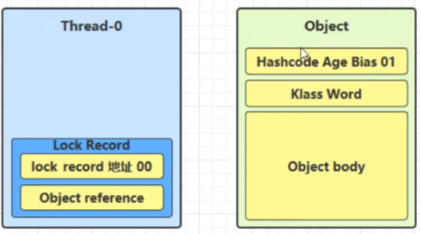
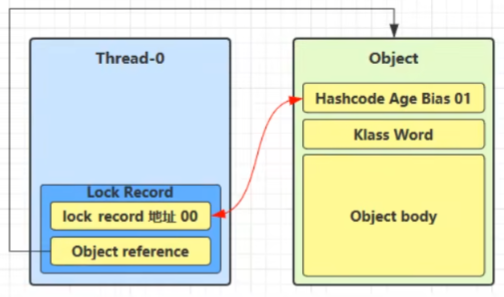
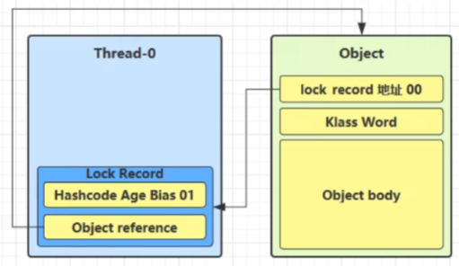
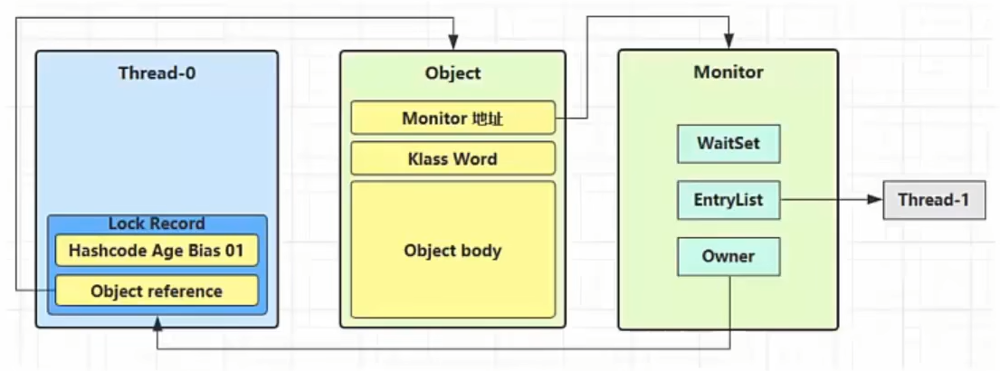

# synchronized 原理进阶

## 轻量级锁

轻量级锁是 JVM 在 synchronized 中用于无竞争或极低竞争场景的一种优化锁机制，它的核心目标是在不进入操作系统阻塞的情况下完成同步控制。

### 示例场景

假设有两个方法同步块，利用同一个对象加锁：

```java
static final Object obj = new Object();

public static void method1() {
    synchronized (obj) {
        // 同步块 A
        method2();
    }
}

public static void method2() {
    synchronized (obj) {
        // 同步块 B
    }
}
```

### 加锁流程

#### 1. 创建锁记录

创建锁记录（Lock Record）对象，每个线程的栈帧都会包含一个锁记录的结构，内部可以存储锁定对象的 Mark Word。



#### 2. 尝试 CAS 替换

让锁记录中 Object Reference 指向锁对象，并尝试用 CAS 替换 Object 的 Mark Word，将 Mark Word 的值存入锁记录。



#### 3. CAS 成功

如果 CAS 替换成功，对象头中存储了锁记录地址和状态 `00`，表示由该线程给对象加锁。



#### 4. CAS 失败

如果 CAS 失败，有两种情况：

- **其他线程持有锁**：如果是其他线程已经持有了该 Object 的轻量级锁，这时表明有竞争，进入锁膨胀过程
- **锁重入**：如果是自己执行了 synchronized 锁重入，那么再添加一条 Lock Record 作为重入的计数


### 解锁流程

#### 1. 重入锁解锁

当退出 synchronized 代码块（解锁）时，如果有值为 `null` 的锁记录，表示有重入，这时重置锁记录，表示重入次数减一。


#### 2. 正常解锁

当退出 synchronized 代码块（解锁）时，锁记录的值不为 `null`，这时使用 CAS 将 Mark Word 的值恢复给对象头：

- **成功**：则解锁成功
- **失败**：说明轻量级锁进行了锁膨胀或已经升级为重量级锁，进入重量级锁解锁流程

## 锁膨胀

如果在尝试加轻量级锁的过程中，CAS 操作无法成功，这时有一种情况就是其他线程对此对象加上了轻量级锁（有竞争），这时需要进行锁膨胀，将轻量级锁变为重量级锁。

### 示例场景

```java
static final Object obj = new Object();

public static void method1() {
    synchronized (obj) {
        // 同步块
    }
}
```

### 膨胀流程

#### 1. 竞争检测

当 Thread-1 进行轻量级锁加锁时，Thread-0 已经对该对象加了轻量级锁。


#### 2. 锁膨胀过程

这时 Thread-1 加轻量级锁失败，进入锁膨胀过程：

- 为 Object 对象申请 Monitor 锁，让 Object 指向重量级锁地址
- 然后自己进入 Monitor 的 EntryList BLOCKED



#### 3. 重量级锁解锁

当 Thread-0 退出同步块解锁时，使用 CAS 将 Mark Word 的值恢复给对象头，失败。这时会进入重量级锁解锁流程：

- 按照 Monitor 地址找到 Monitor 对象
- 设置 Owner 为 null
- 唤醒 EntryList 中 BLOCKED 线程