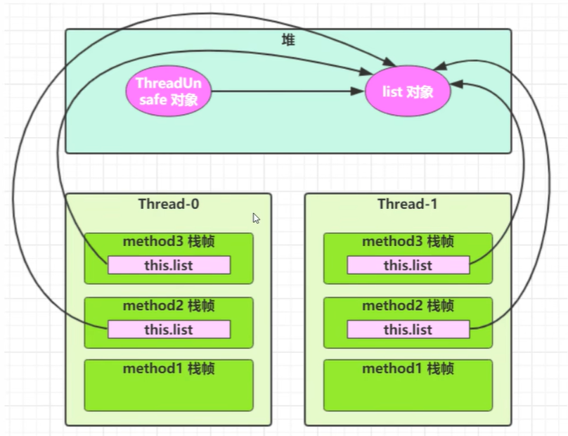
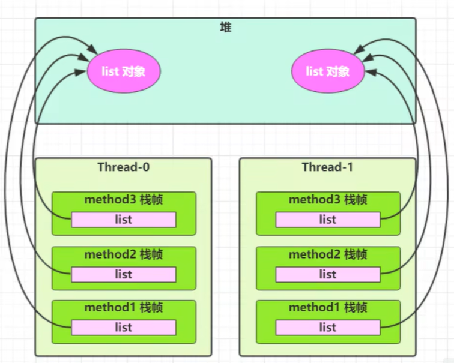
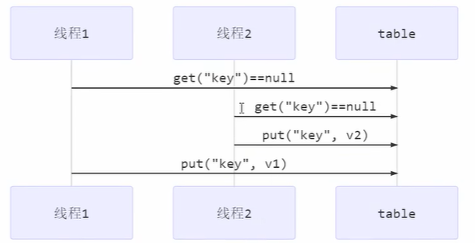

# 线程安全分析

判断一段代码是否线程安全，可以先看两个维度：

- **是否共享**：多个线程是否访问同一份数据。
- **是否可变**：这份数据在并发场景下是否会被修改。

> 结论：同时满足“共享 + 可变”，就需要重点考虑线程安全。

## 成员变量与静态变量

成员变量和静态变量通常位于堆或方法区，天然可能被多个线程共享。

### 判断规则

- **不共享**：线程安全。
- **共享但只读**：线程安全。
- **共享且读写**：属于临界区，需要同步手段（如 `synchronized`、`Lock`、并发容器等）。

### 示例：成员变量导致线程不安全

```java
class ThreadUnsafe {
    ArrayList<String> list = new ArrayList<>();

    public void method1(int loopNumber) {
        for (int i = 0; i < loopNumber; i++) {
            // 临界区
            method2();
            method3();
        }
    }

    private void method2() {
        list.add("1");
    }

    private void method3() {
        list.remove(0);
    }
}
```

```java
static final int THREAD_NUMBER = 2;
static final int LOOP_NUMBER = 200;

public static void main(String[] args) {
    ThreadUnsafe threadUnsafe = new ThreadUnsafe();
    for (int i = 0; i < THREAD_NUMBER; i++) {
        new Thread(() -> threadUnsafe.method1(LOOP_NUMBER), "Thread-" + (i + 1)).start();
    }
}
```

多线程操作的是同一个 `ThreadUnsafe` 实例中的 `list`。`ArrayList` 不是线程安全容器，在并发 `add/remove` 时可能出现竞态条件（例如 `IndexOutOfBoundsException`）。



## 局部变量

### 基本结论

- **局部变量本身**（如基本类型、引用变量）通常在线程栈中，线程私有，通常线程安全。
- 但**局部变量引用的对象**是否安全，要看对象是否发生“逃逸”：
  - **未逃逸**（只在当前方法内使用）：通常线程安全。
  - **发生逃逸**（被其他线程持有或异步使用）：可能线程不安全。

### 示例：局部变量未逃逸（线程安全）

```java
class ThreadSafe {
    public void method1(int loopNumber) {
        ArrayList<String> list = new ArrayList<>();
        for (int i = 0; i < loopNumber; i++) {
            // 临界区
            method2(list);
            method3(list);
        }
    }

    private void method2(ArrayList<String> list) {
        list.add("1");
    }

    private void method3(ArrayList<String> list) {
        list.remove(0);
    }
}
```

这里的 `list` 是 `method1` 的局部变量。每个线程调用 `method1` 时都会创建自己的 `list` 实例，因此不存在共享。



### 示例：局部变量引用逃逸（可能不安全）

```java
class ThreadSafe {
    public void method1(int loopNumber) {
        ArrayList<String> list = new ArrayList<>();
        for (int i = 0; i < loopNumber; i++) {
            // 临界区
            method2(list);
            method3(list);
        }
    }

    public void method2(ArrayList<String> list) {
        list.add("1");
    }

    public void method3(ArrayList<String> list) {
        list.remove(0);
    }
}

class ThreadSafeSubClass extends ThreadSafe {
    @Override
    public void method3(ArrayList<String> list) {
        new Thread(() -> list.remove(0)).start();
    }
}
```

子类把 `list` 交给新线程，导致对象引用逃逸到其他线程，此时线程安全被破坏。

这也说明 `private` / `final` 在并发设计中的价值：
它们可以限制扩展点，减少子类覆写导致的线程安全风险（体现开闭原则中的“对修改关闭”）。

## 常见线程安全类

常见线程安全类可以分为三类：

- **不可变类**：`String`、`Integer` 等。
- **同步类/容器**：`StringBuffer`、`Vector`、`Hashtable` 等。
- **并发工具类**：`java.util.concurrent` 包下的类。

补充：`Random` 是线程安全的，但在高并发下竞争明显，通常优先考虑 `ThreadLocalRandom`。

这里的“线程安全”通常是指：**多个线程调用同一个实例的单个方法时是安全的**。

- 单个方法往往具备原子性或内部同步。
- **多个方法组合起来通常不具备原子性**。

### 线程安全类的方法组合：仍可能不安全

下面代码是否线程安全？

```java
Hashtable<String, String> hashtable = new Hashtable<>();

// 线程1、线程2都可能执行到这里
if (hashtable.get("key") == null) {
    hashtable.put("key", "value");
}
```

答案：**不安全**。`get` 与 `put` 之间存在竞态窗口，两个线程都可能通过判断，导致复合逻辑失效。



如果需要“检查并写入”这类复合原子语义，应使用专门的原子复合操作（如 `ConcurrentHashMap#putIfAbsent`）或显式加锁。

### 不可变类为什么线程安全

`String`、`Integer` 等不可变类，其内部状态创建后不可改变，因此实例可被安全共享。

:::tip 思考题
`String` 有 `replace`、`substring` 等方法，看起来像“修改字符串”，为什么仍是线程安全的？

因为这些方法不会修改原对象，而是返回新对象；原字符串状态不变，所以可以被多个线程安全共享。
:::

## 实例分析

- [线程安全分析-实例分析 1~3](https://www.bilibili.com/video/BV16J411h7Rd?p=69)
- [线程安全分析-实例分析 4~7](https://www.bilibili.com/video/BV16J411h7Rd?p=70)
