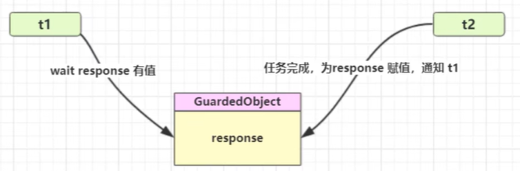
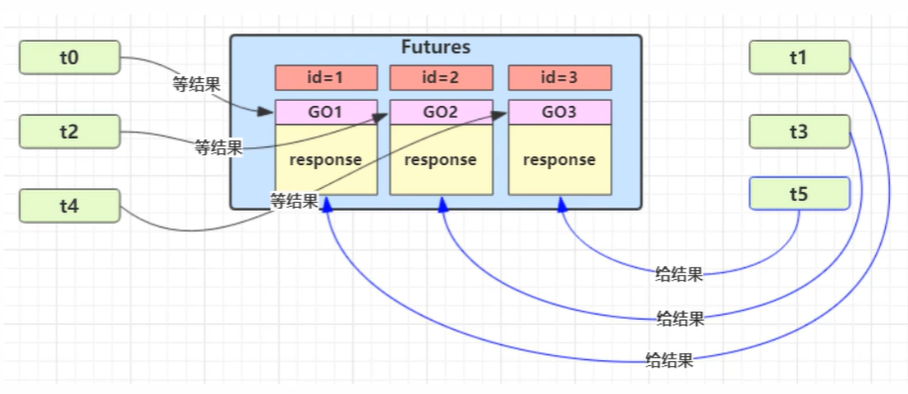
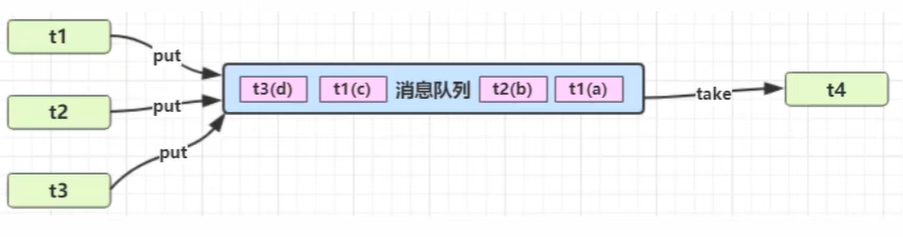

# wait / notify 机制

`synchronized` 解决的是**互斥访问**问题，即同一时刻只能有一个线程进入临界区；但它本身并不负责处理**线程协作**。

当线程拿到锁后，如果发现执行条件暂时不满足，与其不断轮询浪费 CPU，不如主动进入等待状态，等条件变化后再被其他线程唤醒继续执行。`wait / notify` 就是基于 **Monitor（管程）** 实现的这一套协作机制。

常见使用场景：

- **保护性暂停（Guarded Suspension）**：等待结果准备完成
- **生产者 / 消费者**：等待队列非空或非满
- **条件同步**：一个线程等待另一个线程更新共享状态

## 核心机制（基于 Monitor）

每个 Java 对象都可以作为一个监视器对象使用，因此 `wait()`、`notify()`、`notifyAll()` 都定义在 `Object` 类中。

### Monitor 中的三个关键区域

| 结构 | 作用 |
|------|------|
| `Owner` | 当前持有锁的线程 |
| `EntryList` | 等待获取锁的线程队列 |
| `WaitSet` | 调用 `wait()` 后进入等待状态的线程集合 |

### 线程等待流程

1. 线程进入 `synchronized(lock)` 同步块，成为该 Monitor 的 `Owner`
2. 线程发现条件不满足，调用 `lock.wait()`
3. 当前线程**释放锁**，进入该对象 Monitor 的 `WaitSet`
4. 线程状态变为 `WAITING`，如果调用的是 `wait(timeout)`，则进入 `TIMED_WAITING`

### 线程唤醒流程

1. 另一个线程进入同一个 `lock` 的同步块
2. 修改共享条件，使等待条件成立
3. 调用 `lock.notify()` 或 `lock.notifyAll()`
4. 被唤醒的线程从 `WaitSet` 转移到 `EntryList`
5. 通知线程退出同步块并释放锁后，被唤醒线程重新竞争锁
6. 竞争成功后，`wait()` 才真正返回，线程继续向下执行

::: tip 理解 wait() 的执行位置
可以把 `wait()` 理解为在代码执行位置打了一个"断点"：线程在此处暂停，被唤醒后会从这个位置继续执行。

但与真正的断点不同，`wait()` 返回前线程必须**重新获取锁**。因此完整的恢复过程是：
1. 被唤醒（从 `WaitSet` 转移到 `EntryList`）
2. 竞争锁（可能需要等待其他线程释放锁）
3. 获取锁成功后，`wait()` 才返回
4. 从 `wait()` 的下一行代码继续执行
:::

## API 语义与约束

### 方法总览

| 方法 | 是否必须持有该对象锁 | 是否释放锁 | 状态 / 效果 | 补充说明 |
|------|------------------|-----------|-------------|----------|
| `wait()` | 是 | 是 | 当前线程进入 `WaitSet`，状态变为 `WAITING` | 直到被 `notify / notifyAll`、中断，或发生虚假唤醒后才可能返回 |
| `wait(long timeout)` | 是 | 是 | 当前线程进入 `WaitSet`，状态变为 `TIMED_WAITING` | 最多等待指定毫秒数，也可能提前被唤醒 |
| `wait(long timeout, int nanos)` | 是 | 是 | 当前线程进入 `WaitSet`，状态变为 `TIMED_WAITING` | 语义与 `wait(long)` 相同，只是时间精度更细 |
| `notify()` | 是 | 否 | 从 `WaitSet` 中唤醒一个线程，转入 `EntryList` | 唤醒目标不可控，不保证公平 |
| `notifyAll()` | 是 | 否 | 唤醒 `WaitSet` 中所有线程，统一转入 `EntryList` | 更安全，但会带来更多锁竞争 |

::: warning 注意
`notify()` 或 `notifyAll()` 只是把等待线程从 `WaitSet` 挪到可竞争锁的位置，并**不意味着线程会立刻继续执行**。被唤醒线程必须重新获得同一把锁，`wait()` 才会返回。
:::

### 使用约束

- 必须在 `synchronized(obj)` 内部调用 `obj.wait()`、`obj.notify()`、`obj.notifyAll()`
- 等待和通知必须针对**同一个监视器对象**
- `wait()` 返回后，线程一定是**重新拿到锁**之后才继续执行
- `wait()` 可能因为以下原因返回：
  - 收到 `notify()`
  - 收到 `notifyAll()`
  - 等待超时
  - 线程被中断
  - 发生虚假唤醒

::: warning 为什么必须用 while，而不是 if
`wait / notify` 不是"信号计数器"，不会记住历史通知；同时 JVM 允许**虚假唤醒（Spurious Wakeup）**——线程可能在没有被显式唤醒的情况下从 `wait()` 返回（这是操作系统底层条件变量实现的特性，JVM 规范明确允许）。

**标准写法：**

```java
synchronized (lock) {
    while (!condition) {  // 必须用 while，不能用 if
        lock.wait();      // 线程挂起，释放 CPU
    }
    // 条件满足，继续执行
}
```

**为什么 `while` 是正确的？**

- 应对虚假唤醒：被唤醒后重新检查条件
- 处理多线程竞争：其他线程可能抢先消费了条件
- 处理 `notifyAll()`：多个线程被唤醒，但只有部分条件真正满足
- **不占用 CPU**：`wait()` 会让线程进入 `WAITING` 状态并挂起，只有被唤醒后才会重新执行循环检查，与忙等待（busy waiting）完全不同

如果写成 `if`，线程被唤醒后不会再次检查条件，容易导致逻辑错误。
:::

### notify() vs notifyAll()

#### 区别对比

| 对比项 | `notify()` | `notifyAll()` |
|--------|------------|---------------|
| 唤醒数量 | 一个等待线程 | 所有等待线程 |
| 唤醒目标 | 不可控，由 JVM 选择 | 全部转入锁竞争 |
| 锁竞争开销 | 更小 | 更大 |
| 适用场景 | 等待条件单一，且能确定任意被唤醒线程都可继续 | 多种等待条件共用同一把锁，或无法确定唤醒谁更合适 |
| 典型风险 | 可能唤醒“错误线程”，导致系统没有实质进展 | 会造成更多线程竞争，但正确性更高 |

#### `notify()` 示例：单一等待条件

```java
public final class SingleWaiterDemo {
    private final Object lock = new Object();
    private boolean ready = false;

    public void await() throws InterruptedException {
        synchronized (lock) {
            while (!ready) {
                lock.wait();
            }
        }
    }

    public void signal() {
        synchronized (lock) {
            ready = true;
            lock.notify();
        }
    }
}
```

这个场景适合使用 `notify()`，因为等待条件单一，并且只需要唤醒一个等待线程继续执行。

#### `notifyAll()` 示例：多个等待线程共享同一条件

```java
public final class MultiWaiterDemo {
    private final Object lock = new Object();
    private boolean ready = false;

    public void await() throws InterruptedException {
        synchronized (lock) {
            while (!ready) {
                lock.wait();
            }
            System.out.println(Thread.currentThread().getName() + " continue");
        }
    }

    public void publish() {
        synchronized (lock) {
            ready = true;
            lock.notifyAll();
        }
    }
}
```

当多个线程都在等待同一个结果时，`notifyAll()` 可以确保所有等待线程都被唤醒，随后各自重新竞争锁并再次检查条件。

#### 为什么多条件场景更适合 notifyAll

以生产者 / 消费者模型为例，同一把锁上可能同时存在两类等待条件：

- 消费者等待“队列非空”
- 生产者等待“队列未满”

如果这时只调用 `notify()`，可能把“暂时仍然无法继续执行”的那一类线程唤醒，结果它拿到锁之后发现条件依旧不满足，又重新 `wait()`，系统进展就会变慢，甚至出现“看起来像卡住”的现象。

因此在这类场景下，更常见也更安全的策略是：

- 共享状态变化后使用 `notifyAll()`
- 所有等待线程被唤醒后，再通过 `while` 判断自己是否真的满足执行条件

::: tip 选择建议
- 单一等待条件、且能确认唤醒任意一个线程都能继续执行时，可以考虑 `notify()`
- 多条件共用同一把锁，或无法准确控制应该唤醒谁时，优先使用 `notifyAll()`
:::

### wait(timeout) vs sleep(timeout)

`wait(timeout)` 和 `sleep(timeout)` 都能让线程暂停一段时间，但它们的语义完全不同。

| 对比维度 | `wait(timeout)` | `sleep(timeout)` |
|----------|-----------------|------------------|
| 所属类 | `Object` 实例方法 | `Thread` 静态方法 |
| 是否必须在同步块中调用 | 是 | 否 |
| 是否释放锁 | 是 | 否 |
| 主要用途 | 线程协作、等待条件成立 | 单纯让当前线程暂停执行 |
| 唤醒方式 | `notify`、`notifyAll`、超时、中断、虚假唤醒 | 超时或中断 |
| 典型线程状态 | `TIMED_WAITING`，返回前通常还要重新竞争锁 | `TIMED_WAITING` |
| 是否进入 `WaitSet` | 是 | 否 |

#### 结论

- 需要“**释放锁并等待条件变化**”时，用 `wait(timeout)`
- 只想“**让当前线程暂停一会儿**”时，用 `sleep(timeout)`

## 并发设计模式：保护性暂停（Guarded Suspension）

**Guarded Suspension** 是一种同步设计模式，用于一个线程等待另一个线程的执行结果。



### 模式特点

- **守护条件**：线程需要等待某个条件满足才能继续执行
- **结果传递**：通过共享的 `GuardedObject` 在线程间传递结果
- **同步等待**：等待线程会被挂起，而不是忙等待

### 典型应用

- `Thread.join()`：一个线程等待另一个线程执行完成
- `Future.get()`：等待异步任务返回结果
- 异步转同步：将异步回调转换为同步等待

### 实现示例

**GuardedObject 实现：**

```java
public final class GuardedObject {
    private final Object lock = new Object();
    private Object response;
    private boolean ready = false;

    public Object get() throws InterruptedException {
        synchronized (lock) {
            while (!ready) {
                lock.wait();
            }
            return response;
        }
    }

    public Object get(long timeout) throws InterruptedException {
        synchronized (lock) {
            long start = System.currentTimeMillis();  // 记录开始时间
            long remaining = timeout;                  // 剩余等待时间

            // 循环检查条件和剩余时间
            while (!ready && remaining > 0) {
                lock.wait(remaining);  // 等待剩余时间（而不是固定的 timeout）
                // 重新计算剩余时间，防止虚假唤醒导致总等待时间超过 timeout
                remaining = timeout - (System.currentTimeMillis() - start);
            }

            // 超时返回 null，条件满足返回结果
            return ready ? response : null;
        }
    }

    public void complete(Object value) {
        synchronized (lock) {
            response = value;
            ready = true;
            lock.notifyAll();
        }
    }
}
```

**实现要点：**

- **等待方**：使用 `while (!ready)` 循环检查条件，避免虚假唤醒
- **通知方**：先更新共享状态，再调用 `notifyAll()`，整个过程在同一把锁内完成
- **超时处理**：动态计算剩余时间，确保总等待时间不超过预期

### Thread.join()原理

`Thread.join()` 就是使用 Guarded Suspension 模式实现的经典案例。简化后的源码：

```java
public final synchronized void join(long millis) throws InterruptedException {
    long base = System.currentTimeMillis();
    long now = 0;

    if (millis == 0) {
        // 无限等待版本
        while (isAlive()) {
            wait(0);  // 等待线程结束
        }
    } else {
        // 超时等待版本
        while (isAlive()) {
            long delay = millis - now;
            if (delay <= 0) {
                break;  // 超时退出
            }
            wait(delay);
            now = System.currentTimeMillis() - base;
        }
    }
}
```

**关键设计：**

- **守护条件**：`isAlive()` - 等待目标线程执行完成
- **锁对象**：方法是 `synchronized`，锁就是线程对象本身
- **循环检查**：使用 `while` 循环应对虚假唤醒
- **超时计算**：与 `GuardedObject` 相同的剩余时间计算逻辑
- **自动通知**：线程结束时，JVM 会自动调用该线程对象的 `notifyAll()`

::: tip 工程建议
如果无法严格保证"任意一个被唤醒的线程都能继续执行"，优先使用 `notifyAll()` 配合 `while` 条件检查。这是最稳妥、最不容易出错的写法。
:::

### 扩展应用：解耦等待与生产

在 RPC 框架中，常见的场景是**多个线程同时发起请求，一个或多个 IO 线程接收响应**。这需要将"等待线程"和"生产结果的线程"解耦。



**核心思路：**

- 使用 `Map<Integer, GuardedObject>` 管理多个等待对象
- 每个请求分配唯一 ID
- 请求线程创建 `GuardedObject` 并等待
- IO 线程根据响应 ID 找到对应的 `GuardedObject` 并填充结果

**实现示例：**

```java
public class Mailboxes {
    private static final Map<Integer, GuardedObject> boxes = new ConcurrentHashMap<>();
    private static final AtomicInteger idGenerator = new AtomicInteger(0);

    // 生成唯一 ID
    public static int generateId() {
        return idGenerator.incrementAndGet();
    }

    // 创建 GuardedObject 并注册
    public static GuardedObject createGuardedObject() {
        GuardedObject go = new GuardedObject(generateId());
        boxes.put(go.getId(), go);
        return go;
    }

    // 根据 ID 获取 GuardedObject
    public static GuardedObject getGuardedObject(int id) {
        return boxes.remove(id);
    }

    // 获取所有等待中的 ID
    public static Set<Integer> getIds() {
        return boxes.keySet();
    }
}

public class GuardedObject {
    private final int id;
    private Object response;

    public GuardedObject(int id) {
        this.id = id;
    }

    public int getId() {
        return id;
    }

    // 等待结果
    public Object get(long timeout) {
        synchronized (this) {
            long start = System.currentTimeMillis();
            long remaining = timeout;

            while (response == null && remaining > 0) {
                try {
                    this.wait(remaining);
                } catch (InterruptedException e) {
                    Thread.currentThread().interrupt();
                    break;
                }
                remaining = timeout - (System.currentTimeMillis() - start);
            }

            return response;
        }
    }

    // 填充结果
    public void complete(Object response) {
        synchronized (this) {
            this.response = response;
            this.notifyAll();
        }
    }
}
```

**使用场景：**

```java
// 客户端线程 - 发起请求
public class RpcClient {
    public Object call(String request) {
        // 1. 创建 GuardedObject
        GuardedObject go = Mailboxes.createGuardedObject();
        int id = go.getId();

        // 2. 发送请求（带上 ID）
        sendRequest(id, request);

        // 3. 等待响应
        return go.get(3000);
    }
}

// IO 线程 - 接收响应
public class RpcHandler {
    public void onResponse(int id, Object response) {
        // 根据 ID 找到对应的 GuardedObject
        GuardedObject go = Mailboxes.getGuardedObject(id);
        if (go != null) {
            // 填充结果，唤醒等待线程
            go.complete(response);
        }
    }
}
```

**关键特点：**

- **解耦**：请求线程和响应处理线程完全分离
- **多对多**：支持多个客户端线程和多个 IO 线程
- **路由**：通过 ID 将响应准确路由到对应的等待线程
- **实际应用**：Dubbo 的 `DefaultFuture`、Netty 的 `Promise` 都采用类似设计

## 并发设计模式：生产者-消费者模式

**生产者-消费者模式**通过一个共享队列解耦生产者和消费者线程，实现异步处理和流量控制。



### 模式特点

与 Guarded Suspension 的对比：

| 特性 | Guarded Suspension | 生产者-消费者 |
|------|-------------------|--------------|
| 线程关系 | 一对一，等待特定结果 | 多对多，通过队列解耦 |
| 结果关联 | 生产者和消费者一一对应 | 不关心谁生产、谁消费 |
| 队列作用 | 传递单个结果 | 缓冲多个任务，平衡速率 |
| 典型应用 | RPC 调用、Future | 线程池、消息队列 |

**核心特点：**

- **解耦**：生产者只负责生产数据，消费者只负责处理数据
- **异步**：生产和消费可以不同步进行
- **缓冲**：队列可以平衡生产和消费的速率差异
- **容量限制**：队列满时生产者阻塞，队列空时消费者阻塞

### 实现示例

使用 `wait/notify` 实现一个简单的阻塞队列：

```java
public class MessageQueue {
    private final LinkedList<Message> queue = new LinkedList<>();
    private final int capacity;

    public MessageQueue(int capacity) {
        this.capacity = capacity;
    }

    // 生产者：放入消息
    public void put(Message message) throws InterruptedException {
        synchronized (queue) {
            // 队列满时等待
            while (queue.size() == capacity) {
                System.out.println("队列已满，生产者等待");
                queue.wait();
            }

            // 放入消息
            queue.addLast(message);
            System.out.println("生产消息：" + message);

            // 唤醒等待的消费者
            queue.notifyAll();
        }
    }

    // 消费者：取出消息
    public Message take() throws InterruptedException {
        synchronized (queue) {
            // 队列空时等待
            while (queue.isEmpty()) {
                System.out.println("队列为空，消费者等待");
                queue.wait();
            }

            // 取出消息
            Message message = queue.removeFirst();
            System.out.println("消费消息：" + message);

            // 唤醒等待的生产者
            queue.notifyAll();

            return message;
        }
    }
}

class Message {
    private final int id;
    private final String content;

    public Message(int id, String content) {
        this.id = id;
        this.content = content;
    }

    @Override
    public String toString() {
        return "Message{id=" + id + ", content='" + content + "'}";
    }
}
```

### 使用示例

```java
public class ProducerConsumerDemo {
    public static void main(String[] args) {
        MessageQueue queue = new MessageQueue(3);

        // 启动 3 个生产者
        for (int i = 0; i < 3; i++) {
            int producerId = i;
            new Thread(() -> {
                for (int j = 0; j < 5; j++) {
                    try {
                        queue.put(new Message(producerId * 100 + j, "来自生产者" + producerId));
                        Thread.sleep(100);
                    } catch (InterruptedException e) {
                        Thread.currentThread().interrupt();
                    }
                }
            }, "生产者-" + i).start();
        }

        // 启动 2 个消费者
        for (int i = 0; i < 2; i++) {
            new Thread(() -> {
                while (true) {
                    try {
                        queue.take();
                        Thread.sleep(200);
                    } catch (InterruptedException e) {
                        Thread.currentThread().interrupt();
                        break;
                    }
                }
            }, "消费者-" + i).start();
        }
    }
}
```

### 关键设计

1. **双向阻塞**：
   - 队列满时，生产者调用 `wait()` 阻塞
   - 队列空时，消费者调用 `wait()` 阻塞

2. **双向唤醒**：
   - 生产者放入消息后，调用 `notifyAll()` 唤醒消费者
   - 消费者取出消息后，调用 `notifyAll()` 唤醒生产者

3. **使用 notifyAll()**：
   - 因为有两类等待条件（队列满/空）
   - 使用 `notifyAll()` 确保正确的线程被唤醒

### JDK 中的应用

JDK 提供了多种现成的阻塞队列实现，都采用生产者-消费者模式：

- **ArrayBlockingQueue**：基于数组的有界阻塞队列
- **LinkedBlockingQueue**：基于链表的可选有界阻塞队列
- **PriorityBlockingQueue**：支持优先级的无界阻塞队列
- **SynchronousQueue**：不存储元素的阻塞队列，每个 put 必须等待 take

这些队列的底层实现使用了更高效的 `Condition`（基于 `Lock` 的 wait/notify 机制），但核心思想相同。

::: tip 工程实践
在实际开发中，优先使用 JDK 提供的 `BlockingQueue` 实现，而不是自己用 wait/notify 实现。它们经过充分优化和测试，更加可靠高效。
:::

## 常见错误与排查

### 1. 没有持有锁就调用 wait / notify

```java
lock.wait();
```

这会直接抛出 `IllegalMonitorStateException`。

正确写法：

```java
synchronized (lock) {
    lock.wait();
}
```

### 2. 用 if 判断等待条件

```java
synchronized (lock) {
    if (!ready) {
        lock.wait();
    }
}
```

问题在于：线程被唤醒后不会再次检查条件，容易因为虚假唤醒或竞争导致错误。

正确写法：

```java
synchronized (lock) {
    while (!ready) {
        lock.wait();
    }
}
```

### 3. 等待和通知不是同一个锁对象

如果线程在 `lock1` 上等待，却在 `lock2` 上通知，那么等待线程永远收不到对应通知。

`wait / notify` 的协作前提是：

- 使用同一个共享条件
- 绑定同一个监视器对象
- 基于同一把锁完成状态检查、状态修改和通知

### 4. 忽略中断信号

`wait()` 和 `wait(timeout)` 都会抛出 `InterruptedException`。如果直接吞掉异常，线程的中断语义可能被破坏。

常见处理方式有两种：

- 继续向上抛出异常
- 捕获后恢复中断标记：`Thread.currentThread().interrupt()`

::: tip 工程实践
`wait / notify` 是理解 Monitor 和线程协作的基础机制，但在实际业务开发中，通常更推荐优先使用更高层的并发工具，例如 `BlockingQueue`、`CountDownLatch`、`Condition` 等。
:::

## 总结

- `wait / notify` 是基于 `Monitor` 的线程协作机制，解决的是“条件不满足时如何等待”的问题
- 调用 `wait()` 的线程会释放锁并进入 `WaitSet`；被通知后还需要重新竞争锁
- `notify()` 只唤醒一个线程，`notifyAll()` 唤醒全部线程，但二者都不会立即释放锁
- 标准写法是 `while(条件不满足) { wait(); }`
- 多条件共享同一把锁时，优先使用 `notifyAll()` 配合 `while`，正确性更高
