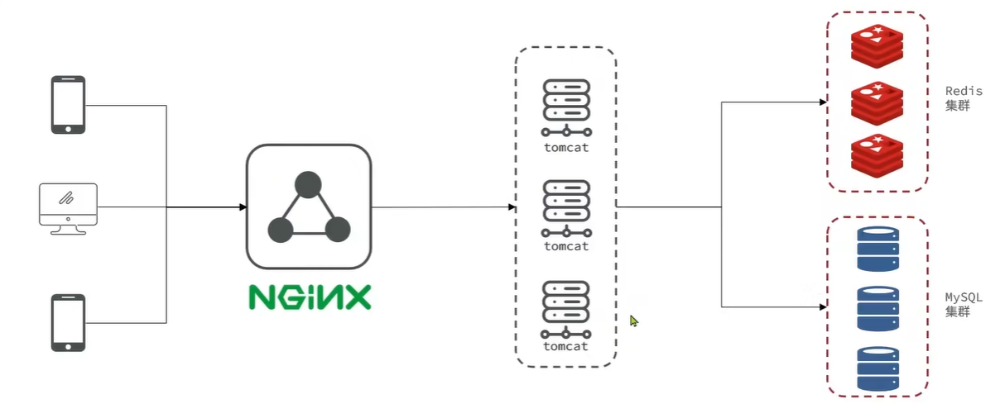

# Redis 实战篇

通过黑马点评项目实战，深入学习 Redis 在真实业务场景中的应用。本篇将涵盖缓存、分布式锁、消息队列、地理位置、统计分析等核心技术的实现方案。

## 项目介绍

**黑马点评项目** 是一个类似大众点评的本地生活服务平台，包含商户信息、优惠券、用户评价、签到等功能模块。

::: tip 项目导入
具体的项目导入步骤，可以观看视频教程：[导入黑马点评项目](https://www.bilibili.com/video/BV1cr4y1671t?p=25)
:::

**技术架构：** 采用单体应用架构（非微服务体系），便于学习和理解 Redis 的各种应用场景。

## 实战案例

以下 8 个实战案例按照由浅入深的顺序组织，每个案例都针对真实业务场景，展示 Redis 的不同数据结构和应用技巧。

### 1. 短信登录

**应用场景：** 用户认证与会话管理

**核心问题：** 传统 Session 存储在单机服务器内存中，无法实现分布式系统的会话共享。

**解决方案：** 使用 Redis 作为共享 Session 存储，实现跨服务器的用户会话管理。

**涉及知识点：**
- Redis String 数据类型
- Session 共享原理
- Token 认证机制
- 过期时间设置

---

### 2. 商户查询缓存

**应用场景：** 高频商户数据查询优化

**核心问题：** 商户信息查询频繁，数据库压力大，响应速度慢。

**解决方案：** 引入 Redis 缓存层，减轻数据库压力，提升查询性能。

**涉及知识点：**
- 缓存更新策略（Cache Aside Pattern）
- 缓存穿透（布隆过滤器、缓存空对象）
- 缓存雪崩（随机过期时间、服务降级）
- 缓存击穿（互斥锁、逻辑过期）

---

### 3. 优惠券秒杀

**应用场景：** 高并发限量商品抢购

**核心问题：** 超卖问题、库存扣减的原子性、订单异步处理。

**解决方案：** 利用 Redis 实现库存预减、分布式锁控制并发、消息队列异步下单。

**涉及知识点：**
- Redis 计数器（INCRBY、DECRBY）
- Lua 脚本保证操作原子性
- 分布式锁实现（SETNX、Redisson）
- 消息队列（List、PubSub、Stream）

---

### 4. 达人探店

**应用场景：** 内容点赞与热度排行

**核心问题：** 点赞状态记录、点赞用户列表展示、按点赞时间排序。

**解决方案：** 使用 Set 记录点赞用户，使用 SortedSet 实现时间排序。

**涉及知识点：**
- Redis Set 集合操作
- Redis SortedSet 有序集合
- 点赞去重与排序

---

### 5. 好友关注

**应用场景：** 社交关系管理与推荐

**核心问题：** 关注/取关、共同关注查询、Feed 流推送。

**解决方案：** 基于 Set 集合实现关注关系，利用集合交集查询共同关注，使用 SortedSet 实现 Feed 流。

**涉及知识点：**
- Set 集合的交集、并集运算
- 关注模型设计（推模式 vs 拉模式）
- Feed 流实现（Timeline、智能排序）
- 滚动分页查询

---

### 6. 附近的商户

**应用场景：** LBS 地理位置服务

**核心问题：** 根据用户位置查询附近商户，按距离排序。

**解决方案：** 使用 Redis GEO 数据类型存储商户经纬度，实现高效的地理位置搜索。

**涉及知识点：**
- Redis GEO 数据结构
- GeoHash 算法原理
- GEOADD、GEORADIUS 命令

---

### 7. 用户签到

**应用场景：** 用户行为统计与激励

**核心问题：** 记录用户每日签到状态，统计连续签到天数。

**解决方案：** 利用 Bitmap 实现高效的签到状态存储，极大节省内存空间。

**涉及知识点：**
- Bitmap 位图操作
- SETBIT、GETBIT、BITCOUNT 命令
- 内存优化（1 亿用户一个月签到数据仅需 37MB）

---

### 8. UV 统计

**应用场景：** 网站独立访客统计

**核心问题：** 海量用户访问数据的去重统计，内存消耗问题。

**解决方案：** 使用 HyperLogLog 实现高效的基数统计，误差率 0.81%。

**涉及知识点：**
- HyperLogLog 概率算法
- PFADD、PFCOUNT 命令
- UV vs PV 统计场景