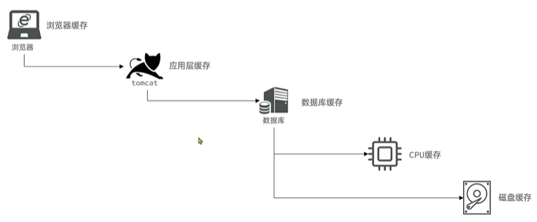
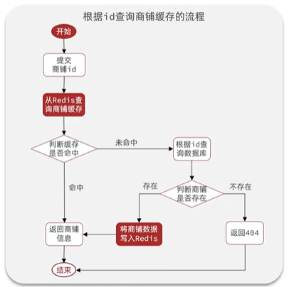
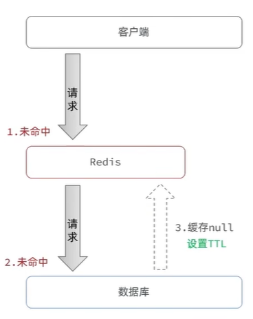
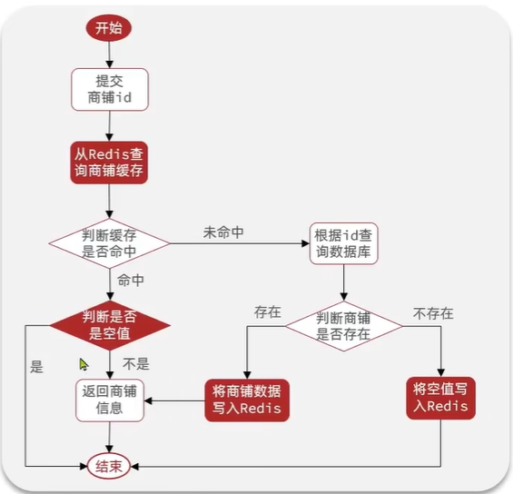
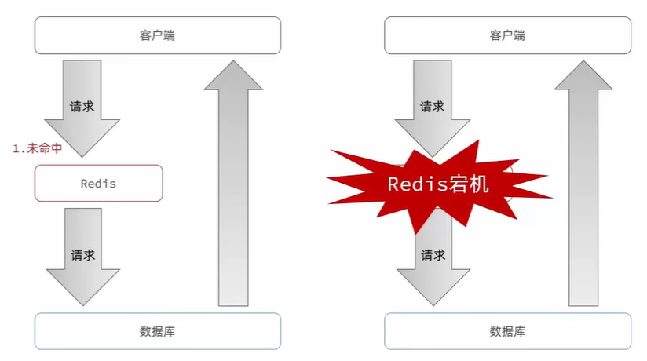
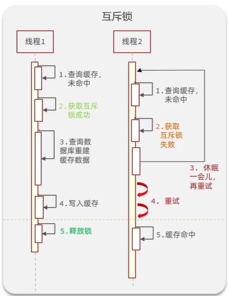
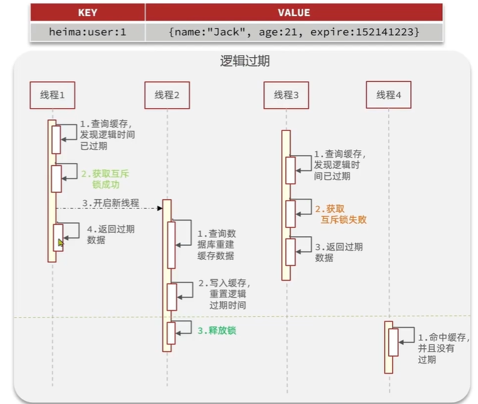
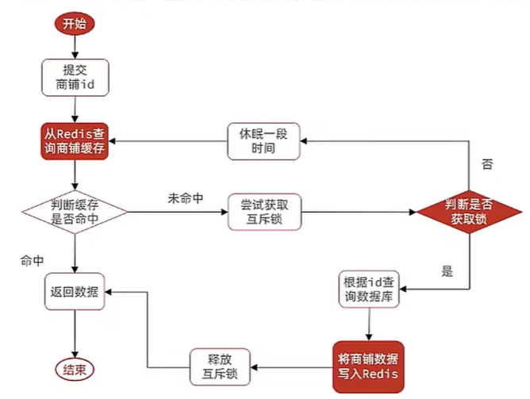
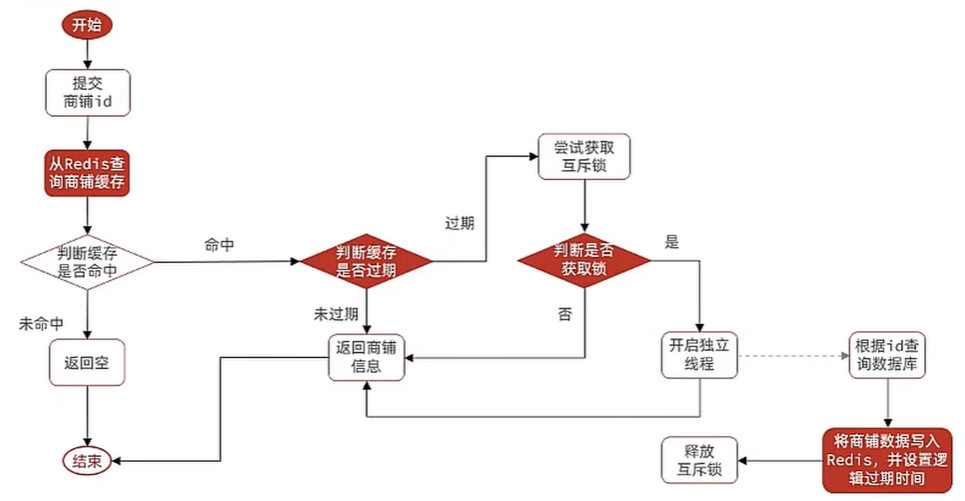

# 商户查询缓存

## 什么是缓存

缓存（cache）是数据交换的缓冲区，用于临时存储数据，通常具有较高的读写性能。



从上图可以看到，在现代应用架构中，缓存被广泛应用于多个层级，包括浏览器缓存、CDN 缓存、Nginx 缓存、Tomcat 进程缓存、Redis 缓存以及数据库缓存等，形成了完整的多级缓存体系。

### 缓存的作用与成本

| 缓存的作用 | 说明 | 缓存的成本 | 说明 |
| --- | --- | --- | --- |
| **降低后端负载** | 减少数据库等后端服务的访问压力 | **数据一致性成本** | 缓存与数据源之间可能存在数据不一致的问题 |
| **提高读写效率** | 利用高速存储介质加快数据访问速度 | **代码维护成本** | 需要额外编写和维护缓存相关的逻辑代码 |
| **降低响应时间** | 快速返回数据，提升用户体验 | **运维成本** | 需要部署和维护缓存服务器，增加系统复杂度 |

## 添加 Redis 缓存


当客户端发起查询请求时，系统首先从 Redis 缓存中查找数据。若缓存命中则直接返回结果；若缓存未命中，再查询数据库并将结果写入缓存，以便后续请求快速获取。

### 实现方案



根据 ID 查询商铺信息时，采用 Cache-Aside 模式：先查缓存，缓存命中则返回；缓存未命中则查数据库，查到后写入缓存并返回。

#### Controller 层

```java
@RestController
@RequestMapping("/shop")
public class ShopController {

    @Resource
    private ShopService shopService;

    @GetMapping("/{id}")
    public Result queryById(@PathVariable("id") Long id) {
        return shopService.queryById(id);
    }
}
```

#### Service 层

```java
@Service
public class ShopServiceImpl implements ShopService {

    @Resource
    private StringRedisTemplate stringRedisTemplate;

    @Resource
    private ShopMapper shopMapper;

    @Override
    public Result queryById(Long id) {
        String key = "cache:shop:" + id;

        // 1. 从 Redis 查询商铺缓存
        String shopJson = stringRedisTemplate.opsForValue().get(key);

        // 2. 判断缓存是否存在
        if (StrUtil.isNotBlank(shopJson)) {
            // 3. 存在，直接返回
            Shop shop = JSONUtil.toBean(shopJson, Shop.class);
            return Result.ok(shop);
        }

        // 4. 不存在，根据 id 查询数据库
        Shop shop = shopMapper.selectById(id);

        // 5. 数据库中不存在，返回错误
        if (shop == null) {
            return Result.fail("商铺不存在");
        }

        // 6. 存在，写入 Redis
        stringRedisTemplate.opsForValue().set(key, JSONUtil.toJsonStr(shop));

        // 7. 返回
        return Result.ok(shop);
    }
}
```

#### 依赖说明

代码中使用了以下工具类：
- `StrUtil`：Hutool 工具包中的字符串工具类，用于判断字符串是否为空
- `JSONUtil`：Hutool 工具包中的 JSON 工具类，用于对象与 JSON 字符串互转

Maven 依赖：

```xml
<dependency>
    <groupId>cn.hutool</groupId>
    <artifactId>hutool-all</artifactId>
    <version>5.8.16</version>
</dependency>
```

## 缓存更新策略

### 三种更新策略对比

| 策略 | 说明 | 一致性 | 维护成本 |
|---|---|---|---|
| **内存淘汰** | 依靠 Redis 内存淘汰机制,内存不足时自动淘汰数据,下次查询时重新加载 | 差 | 无 |
| **超时删除** | 为缓存设置 TTL 过期时间,到期自动删除,下次查询时重新加载 | 一般 | 低 |
| **主动更新** | 修改数据库时,同步更新缓存,保证数据实时一致 | 好 | 高 |

**如何选择**：根据业务场景的一致性要求选择合适的策略

- **低一致性需求**：使用内存淘汰策略，适用于允许短暂不一致的场景
  - 示例：店铺类型列表、商品分类等基础数据

- **高一致性需求**：采用主动更新策略，并配合 TTL 超时删除作为兜底
  - 示例：商品库存、用户余额、订单状态等核心业务数据

::: tip 选择建议
在实际应用中，需要根据业务特点在一致性和性能之间做出权衡。建议优先考虑数据的重要性、更新频率和访问量，核心业务数据采用主动更新保证一致性，非核心数据可适当降低一致性要求以提升性能。
:::

### 主动更新的三种实现模式

| 模式 | 说明 | 优点 | 缺点 |
|---|---|---|---|
| **Cache Aside**<br/>（旁路缓存） | 应用程序直接操作缓存和数据库。读取时先查缓存，未命中则查数据库并回写缓存；更新时先更新数据库，再删除缓存 | 实现简单，业务逻辑清晰，最常用的方案 | 需要应用程序维护缓存逻辑，增加代码复杂度 |
| **Read/Write Through**<br/>（读写穿透） | 缓存作为主存储，所有读写操作都通过缓存层，由缓存层负责与数据库同步。应用程序只需操作缓存，无需关心数据库 | 对应用透明，一致性由缓存层保证 | 实现复杂，需要缓存层具备完整的数据持久化能力 |
| **Write Behind Caching**<br/>（异步写入） | 写操作只更新缓存即可立即返回，由独立的异步线程负责将缓存数据批量写入数据库，类似消息队列的异步处理机制 | 写入性能极高，适合写多读少的场景 | 数据可能丢失，只能保证最终一致性 |

### Cache Aside 模式的实现细节

Cache Aside 是最常用的缓存模式，但在实现时需要仔细考虑以下三个关键问题：

#### 1. 删除缓存还是更新缓存？

**更新缓存**：每次修改数据库后立即更新缓存中的数据
- 缺点：如果数据被频繁写入但很少读取，会产生大量无效的缓存写操作
- 适用场景：读多写少，且每次写入后都会被读取的场景

**删除缓存**：每次修改数据库后删除缓存，下次读取时再从数据库加载（推荐）
- 优点：采用懒加载策略，只有被访问的数据才会加载到缓存
- 适用场景：通用场景，特别是写入后不一定会被读取的数据

#### 2. 如何保证缓存与数据库操作的原子性？

缓存和数据库是两个独立的系统，如何保证同时成功或同时失败？

**单体系统**：
- 利用 Spring 事务管理，将数据库和缓存操作放在同一事务中
- 如果缓存删除失败，回滚数据库事务

**分布式系统**：
- 采用 TCC（Try-Confirm-Cancel）等分布式事务方案
- 或使用消息队列实现最终一致性：先更新数据库，发送 MQ 消息，消费者删除缓存

#### 3. 先操作缓存还是先操作数据库？

这是 Cache Aside 模式中最容易出错的问题，操作顺序不同，并发安全性差异很大。

##### 方案一：先删除缓存，再更新数据库

**① 正常场景**（无并发冲突）

在两个线程串行执行、无时间重叠的情况下，数据保持一致：

| 时刻 | 线程 A（写操作） | 线程 B（读操作） | 数据库 | 缓存 |
|------|-----------------|---------|--------|------|
| T1   | 删除缓存        | -       | 旧值   | 无   |
| T2   | 更新数据库为新值 | -       | 新值   | 无   |
| T3   | -               | 查询缓存未命中 | 新值 | 无   |
| T4   | -               | 查询数据库得到新值 | 新值 | 无   |
| T5   | -               | 将新值写入缓存 | 新值 | 新值 |

**② 并发问题场景**（高并发下容易出现）

当线程 A 正在删除缓存和更新数据库时，线程 B 同时发起查询，出现数据不一致，数据库是新值，缓存是旧值：

| 时刻 | 线程 A（写操作） | 线程 B（读操作） | 数据库 | 缓存 |
|------|-----------------|-----------------|--------|------|
| T1   | 删除缓存        | -               | 旧值   | 无   |
| T2   | -               | 查询缓存未命中   | 旧值   | 无   |
| T3   | -               | 查询数据库得到旧值 | 旧值   | 无   |
| T4   | -               | 将旧值写入缓存   | 旧值   | 旧值 |
| T5   | 更新数据库为新值 | -               | 新值   | 旧值 |

**发生概率**：较高
- 删除缓存操作很快，线程 B 容易在 T1 之后立即进入
- 查询数据库通常比更新数据库快，线程 B 容易在 T5 之前完成查询并回写旧数据

---

##### 方案二：先更新数据库，再删除缓存（推荐）

**① 正常场景**（无并发冲突）

在两个线程串行执行、无时间重叠的情况下，数据保持一致：

| 时刻 | 线程 A（读操作） | 线程 B（写操作） | 数据库 | 缓存 |
|------|-----------------|-----------------|--------|------|
| T1   | -               | 更新数据库为新值 | 新值   | 旧值 |
| T2   | -               | 删除缓存        | 新值   | 无   |
| T3   | 查询缓存未命中   | -               | 新值   | 无   |
| T4   | 查询数据库得到新值 | -             | 新值   | 无   |
| T5   | 将新值写入缓存   | -               | 新值   | 新值 |

**② 并发问题场景**（极端情况下才会出现，如缓存刚好失效或不存在）

当线程 B 正在更新数据库和删除缓存时，线程 A 同时发起查询，出现数据不一致，数据库是新值，缓存是旧值：

| 时刻 | 线程 A（读操作） | 线程 B（写操作） | 数据库 | 缓存 |
|------|-----------------|-----------------|--------|------|
| T1   | 查询缓存未命中   | -               | 旧值   | 无   |
| T2   | 准备查询数据库   | -               | 旧值   | 无   |
| T3   | -               | 更新数据库为新值 | 新值   | 无   |
| T4   | -               | 删除缓存        | 新值   | 无   |
| T5   | 查询数据库得到旧值* | -            | 新值   | 无   |
| T6   | 将旧值写入缓存   | -               | 新值   | 旧值 |

<sub>*注：线程 A 的数据库查询在 T2 时刻发起，但由于数据库连接、查询执行等原因，实际返回结果时已是 T5，此时读取的是更新前的旧值。</sub>

**发生概率**：极低
- 必须在缓存失效的瞬间发生并发请求
- 线程 A 发起查询后，线程 B 完成"更新数据库+删除缓存"，线程 A 才收到结果
- 实际上，查询操作通常比"更新+删除"组合更快

**兜底方案**：设置 TTL 超时时间，即使出现不一致，缓存也会在过期后自动失效，下次查询时恢复一致。

---

##### 方案对比与结论

| 对比项 | 并发问题发生概率 | 数据一致性 | 推荐程度 |
|-------|-----------------|-----------|----------|
| 方案一（先删缓存） | 较高 | 差 | 不推荐 |
| 方案二（先更新DB） | 极低 | 好 | ✔ 推荐 |

**推荐方案**：先更新数据库，再删除缓存，并配合 TTL 作为兜底机制。

### 最佳实践

综合考虑一致性、性能和实现复杂度，推荐以下方案：

**1. 低一致性需求**

直接使用 Redis 的内存淘汰机制（如 LRU 策略），无需编写缓存更新逻辑，如字典数据、配置信息、统计数据等场景。

**2. 高一致性需求**

采用 **Cache Aside + 先更新数据库再删缓存** 的方案，并配合 TTL 兜底。

* 读操作流程：
  1. 查询缓存，如果命中则直接返回
  2. 如果未命中，查询数据库
  3. 将数据写入缓存，并设置合理的 TTL（如 30 分钟）
  4. 返回数据

* 写操作流程：
  1. 更新数据库
  2. 删除缓存（如果删除失败，依靠 TTL 保证最终一致性）
  3. 确保数据库与缓存操作的原子性（使用事务或 MQ）

**兜底机制**：
- 设置合理的 TTL，即使删除缓存失败，也能在过期后自动恢复一致性
- 添加监控告警，及时发现缓存删除失败的情况

### 实际案例

为商铺查询功能添加缓存策略，实现超时剔除和主动更新。

**需求说明**：

1. **查询操作**：根据 id 查询店铺时，如果缓存未命中，则查询数据库，将结果写入缓存并设置超时时间
2. **更新操作**：根据 id 修改店铺时，先修改数据库，再删除缓存

#### 代码实现

**Controller 层**

```java
@RestController
@RequestMapping("/shop")
public class ShopController {

    @Resource
    private ShopService shopService;

    /**
     * 根据 id 查询商铺信息
     */
    @GetMapping("/{id}")
    public Result queryById(@PathVariable("id") Long id) {
        return shopService.queryById(id);
    }

    /**
     * 更新商铺信息
     */
    @PutMapping
    public Result updateShop(@RequestBody Shop shop) {
        return shopService.updateShop(shop);
    }
}
```

**Service 层**

```java
@Service
public class ShopServiceImpl implements ShopService {

    @Resource
    private StringRedisTemplate stringRedisTemplate;

    @Resource
    private ShopMapper shopMapper;

    private static final String CACHE_SHOP_KEY = "cache:shop:";
    private static final Long CACHE_SHOP_TTL = 30L;

    @Override
    public Result queryById(Long id) {
        String key = CACHE_SHOP_KEY + id;

        // 1. 从 Redis 查询商铺缓存
        String shopJson = stringRedisTemplate.opsForValue().get(key);

        // 2. 判断缓存是否存在
        if (StrUtil.isNotBlank(shopJson)) {
            // 3. 存在，直接返回
            Shop shop = JSONUtil.toBean(shopJson, Shop.class);
            return Result.ok(shop);
        }

        // 4. 不存在，根据 id 查询数据库
        Shop shop = shopMapper.selectById(id);

        // 5. 数据库中不存在，返回错误
        if (shop == null) {
            return Result.fail("商铺不存在");
        }

        // 6. 存在，写入 Redis 并设置 30 分钟过期时间
        stringRedisTemplate.opsForValue().set(key, JSONUtil.toJsonStr(shop), CACHE_SHOP_TTL, TimeUnit.MINUTES);

        // 7. 返回
        return Result.ok(shop);
    }

    @Override
    @Transactional
    public Result updateShop(Shop shop) {
        Long id = shop.getId();
        if (id == null) {
            return Result.fail("店铺 id 不能为空");
        }

        // 1. 更新数据库
        shopMapper.updateById(shop);

        // 2. 删除缓存
        String key = CACHE_SHOP_KEY + id;
        stringRedisTemplate.delete(key);

        return Result.ok();
    }
}
```

**关键点说明**：

1. **查询操作**：使用 `set(key, value, timeout, unit)` 方法设置缓存时指定 TTL 为 30 分钟
2. **更新操作**：先调用 `updateById()` 更新数据库，再调用 `delete()` 删除缓存
3. **事务保证**：使用 `@Transactional` 注解确保数据库更新和缓存删除的原子性
4. **常量提取**：将缓存 key 前缀和 TTL 提取为常量，便于维护
5. **幂等性保证**：Redis 的 `delete()` 操作本身是幂等的，即使 key 不存在也不会报错，不会影响数据库更新

## 缓存穿透

缓存穿透是指客户端请求的数据在缓存和数据库中都不存在，导致每次请求都会穿透缓存直接访问数据库。

**常见场景**：
- 用户恶意攻击，使用大量不存在的 ID 发起查询请求
- 业务逻辑错误，查询了本就不存在的数据

**危害**：
- 缓存失去保护作用，所有请求直接打到数据库
- 数据库压力骤增，可能导致数据库宕机
- 影响系统整体性能和可用性

### 解决方案

| 方案 | 实现原理 | 优点 | 缺点 | 适用场景 |
|---|---|---|---|---|
| **缓存空对象** | 当数据库查询结果为空时，将空值（null 或空对象）写入缓存，并设置较短的 TTL | 实现简单，维护方便 | 额外的内存消耗，可能造成短期的不一致 | 数据命中率较高，攻击风险较低的场景 |
| **布隆过滤器** | 在缓存前增加布隆过滤器，快速判断数据是否存在，不存在则直接拒绝请求 | 内存占用少，性能高，没有多余 key | 实现复杂，存在误判可能（可能把存在的数据判断为不存在），数据新增时需同步更新过滤器 | 数据量大，对内存敏感，能接受极小误判率的场景 |

除了上述缓存层面的技术方案，还应从系统设计和安全角度采取综合防护措施：

- **增强 ID 复杂度**：避免使用连续递增的数字 ID，改用 UUID、雪花算法等生成的分布式 ID，防止攻击者通过规律猜测有效 ID
- **数据基础校验**：在接口层对请求参数进行格式校验和合法性校验，及早拦截明显不合法的请求
- **用户权限校验**：加强身份认证和授权机制，限制匿名用户或低信用用户的访问频率
- **热点参数限流**：使用 Sentinel、Hystrix 等流控组件，对单个 ID 或用户的请求频率进行限制，防止恶意刷接口
- **监控告警**：监控缓存未命中率、数据库访问量等指标，异常时及时告警并采取应急措施

#### 缓存空对象方案



当查询数据库返回 null 时，将空值缓存起来，下次相同请求直接返回空结果，避免重复查询数据库。

**注意事项**：
- 设置较短的 TTL（如 2-5 分钟），避免数据新增后长时间查不到
- 考虑内存占用，如果恶意请求的 ID 数量巨大，可能占用大量内存

#### 布隆过滤器方案


布隆过滤器是一种空间效率极高的概率型数据结构，用于判断元素是否在集合中。

**工作原理**：
- 将所有可能存在的数据提前加载到布隆过滤器中
- 请求到来时，先查询布隆过滤器判断数据是否存在
- 若不存在则直接拒绝，若存在则继续查询缓存和数据库

**注意事项**：
- 存在误判率：可能将存在的数据判断为不存在（概率很低，可通过调整参数控制）
- 不支持删除：需要重建整个过滤器
- 数据新增时需要同步更新过滤器

### 实际案例

对前面的[商铺查询方案](#实现方案)进行优化，采用缓存空对象的方式解决缓存穿透问题。



#### 代码实现

**Service 层**

```java
@Service
public class ShopServiceImpl implements ShopService {

    @Resource
    private StringRedisTemplate stringRedisTemplate;

    @Resource
    private ShopMapper shopMapper;

    private static final String CACHE_SHOP_KEY = "cache:shop:";
    private static final Long CACHE_SHOP_TTL = 30L;
    private static final Long CACHE_NULL_TTL = 2L;

    @Override
    public Result queryById(Long id) {
        String key = CACHE_SHOP_KEY + id;

        // 1. 从 Redis 查询商铺缓存
        String shopJson = stringRedisTemplate.opsForValue().get(key);

        // 2. 判断缓存是否存在
        if (StrUtil.isNotBlank(shopJson)) {
            // 3. 存在，直接返回
            Shop shop = JSONUtil.toBean(shopJson, Shop.class);
            return Result.ok(shop);
        }

        // 判断命中的是否是空值
        if (shopJson != null) {
            // 返回错误信息
            return Result.fail("商铺不存在");
        }

        // 4. 不存在，根据 id 查询数据库
        Shop shop = shopMapper.selectById(id);

        // 5. 数据库中不存在，将空值写入 Redis
        if (shop == null) {
            stringRedisTemplate.opsForValue().set(key, "", CACHE_NULL_TTL, TimeUnit.MINUTES);
            return Result.fail("商铺不存在");
        }

        // 6. 存在，写入 Redis 并设置 30 分钟过期时间
        stringRedisTemplate.opsForValue().set(key, JSONUtil.toJsonStr(shop), CACHE_SHOP_TTL, TimeUnit.MINUTES);

        // 7. 返回
        return Result.ok(shop);
    }

    @Override
    @Transactional
    public Result updateShop(Shop shop) {
        Long id = shop.getId();
        if (id == null) {
            return Result.fail("店铺 id 不能为空");
        }

        // 1. 更新数据库
        shopMapper.updateById(shop);

        // 2. 删除缓存
        String key = CACHE_SHOP_KEY + id;
        stringRedisTemplate.delete(key);

        return Result.ok();
    }
}
```

**关键改进点**：

1. **空值缓存**：当数据库查询结果为 null 时，将空字符串 `""` 写入 Redis，TTL 设置为 2 分钟
2. **空值判断**：使用 `StrUtil.isNotBlank()` 和 `shopJson != null` 两次判断
   - `isNotBlank()` 返回 `true`：缓存命中且有数据，直接返回
   - `isNotBlank()` 返回 `false` 但 `shopJson != null`：缓存命中但是空值，返回错误
   - `shopJson == null`：缓存未命中，查询数据库
3. **TTL 差异化**：正常数据 TTL 为 30 分钟，空值 TTL 为 2 分钟，避免数据新增后长时间无法查询
4. **常量提取**：将空值 TTL 提取为常量 `CACHE_NULL_TTL`，便于维护

::: tip 为什么用空字符串而不是 null
Redis 的 `get()` 方法在 key 不存在时返回 null，无法区分"缓存未命中"和"缓存了 null 值"。因此使用空字符串 `""` 作为空值标记，通过 `isNotBlank()` 和 `!= null` 的组合判断来区分三种情况。
:::

## 缓存雪崩

缓存雪崩是指在同一时段大量的缓存 key 同时失效或者 Redis 服务宕机，导致大量请求瞬间直达数据库，给数据库带来巨大压力。



**常见场景**：
- **大量 key 集中过期**：系统初始化或批量导入数据时，为大量 key 设置了相同的 TTL，导致同时失效
- **Redis 服务宕机**：Redis 节点故障或网络问题导致整个缓存服务不可用
- **缓存预热不当**：系统重启后未进行缓存预热，大量请求同时访问冷数据

**危害**：
- 数据库瞬间承受大量并发查询，可能直接宕机
- 系统整体性能急剧下降，响应时间大幅增加
- 可能引发连锁反应，导致整个系统雪崩

### 解决方案

| 方案 | 解决问题 | 实现原理 | 优点 | 缺点 | 实现难度 | 推荐程度 |
|---|---|---|---|---|---|---|
| **TTL 随机化** | key 集中过期 | 为不同的 key 设置不同的过期时间，在基础 TTL 上添加随机值 | 实现简单，成本低，有效防止 key 集中过期 | 只能解决 key 集中过期问题，无法应对服务宕机 | 低 | ⭐⭐⭐⭐⭐ 必须 |
| **Redis 集群** | 服务宕机 | 采用主从+哨兵或 Redis Cluster 架构，实现高可用和故障自动转移 | 提高服务可用性，支持故障自动恢复，可实现读写分离和数据分片 | 部署和运维成本较高，架构相对复杂 | 中 | ⭐⭐⭐⭐⭐ 生产必备 |
| **降级限流** | 数据库压力过大 | 通过服务降级返回默认值，使用 Sentinel/Hystrix 限流和熔断 | 保护数据库，防止系统崩溃，提供兜底保障 | 降级期间用户体验下降，需要额外开发降级逻辑 | 中 | ⭐⭐⭐⭐ 推荐 |
| **多级缓存** | 单点依赖 | 构建浏览器、CDN、Nginx、进程内、Redis 等多层缓存体系 | 分散流量，降低单点依赖，提升整体性能 | 架构复杂，数据一致性难以保证，开发和维护成本高 | 高 | ⭐⭐⭐ 高并发场景 |

#### TTL 随机化代码示例

```java
// 在基础 TTL 上添加随机值，避免大量 key 同时过期
Long ttl = CACHE_SHOP_TTL + RandomUtil.randomLong(0, 5);
stringRedisTemplate.opsForValue().set(key, value, ttl, TimeUnit.MINUTES);
```

::: tip 综合防护建议
实际生产环境中，应组合使用多种方案：
- **基础防护**：TTL 随机化（必须）
- **高可用保障**：Redis 集群部署（必须）
- **兜底机制**：降级限流策略（推荐）
- **性能优化**：多级缓存（可选，视业务规模而定）
:::

## 缓存击穿

缓存击穿也叫热点 key 问题，是指一个被**高并发访问**且**缓存重建业务较复杂**的 key 突然失效，导致大量请求瞬间直达数据库，给数据库带来巨大冲击。


**常见场景**：
- 热门商品的详情页缓存过期，大量用户同时访问
- 秒杀活动的商品缓存失效，高并发查询直接打到数据库
- 热点新闻或视频的缓存过期，流量瞬间涌入数据库

**与缓存雪崩的区别**：
- 缓存雪崩：大量 key 同时失效或服务宕机，影响范围广
- 缓存击穿：单个热点 key 失效，但访问量极大，影响集中

### 解决方案对比

| 方案 | 实现原理 | 优点 | 缺点 | 适用场景 |
|---|---|---|---|---|
| **互斥锁** | 缓存失效时，只允许一个线程查询数据库并重建缓存，其他线程等待 | 实现简单，保证数据一致性，无额外内存消耗 | 线程需要等待，性能受影响，可能有死锁风险 | 一致性要求高，可以接受短暂等待的场景 |
| **逻辑过期** | 不设置 TTL，而是在缓存值中存储逻辑过期时间，过期后不删除缓存，由独立线程异步重建 | 线程无需等待，性能好，可用性高 | 不保证强一致性，有额外内存消耗，实现复杂 | 对一致性要求不高，追求极致性能的场景 |

::: tip CAP 权衡与选型建议

**CAP 定理权衡**：

在分布式系统中需要在一致性（Consistency）和可用性（Availability）之间做出取舍

- **互斥锁方案**：牺牲部分可用性（线程等待），保证一致性
- **逻辑过期方案**：牺牲强一致性（短期数据可能过期），保证可用性

**选型建议**：
- **强一致性场景**（金融、订单、库存等）：使用互斥锁方案
- **弱一致性场景**（商品详情、新闻资讯、视频信息等）：使用逻辑过期方案
- **一般业务场景**：互斥锁方案更简单实用，优先推荐
:::

#### 互斥锁方案流程

互斥锁方案通过分布式锁确保同一时刻只有一个线程能够重建缓存，其他线程等待缓存重建完成后直接使用。



**核心思路**：
1. 查询缓存，如果命中则直接返回
2. 如果未命中，尝试获取互斥锁
3. 获取锁成功：查询数据库，重建缓存，释放锁
4. 获取锁失败：等待一段时间后重试，直到缓存重建完成

::: tip 注意
这里的锁不能使用 `synchronized` 等 JVM 锁（只能在单机生效），而应使用基于 Redis `SETNX` 命令实现的分布式锁，确保在集群环境下也能生效。
:::

#### 逻辑过期方案流程

逻辑过期方案不设置 Redis 的 TTL，而是在缓存值中额外存储一个逻辑过期时间字段。缓存过期后不删除，而是由独立线程异步重建，其他线程继续返回旧数据。



**核心思路**：
1. 查询缓存，如果未命中则说明是首次访问，需要缓存预热
2. 如果命中，检查逻辑过期时间：
   - 未过期：直接返回数据
   - 已过期：尝试获取互斥锁
     - 获取成功：开启独立线程异步重建缓存，当前线程立即返回旧数据
     - 获取失败：直接返回旧数据（说明其他线程正在重建）

::: tip 注意
逻辑过期方案需要提前进行缓存预热，否则首次访问时缓存不存在，无法返回数据。
:::

### 互斥锁方案实现

基于[商铺查询方案](#实现方案)，使用互斥锁方式解决缓存击穿问题。



#### 代码实现

**Service 层**

```java
@Service
public class ShopServiceImpl implements ShopService {

    @Resource
    private StringRedisTemplate stringRedisTemplate;

    @Resource
    private ShopMapper shopMapper;

    private static final String CACHE_SHOP_KEY = "cache:shop:";
    private static final String LOCK_SHOP_KEY = "lock:shop:";
    private static final Long CACHE_SHOP_TTL = 30L;
    private static final Long CACHE_NULL_TTL = 2L;
    private static final Long LOCK_SHOP_TTL = 10L;

    @Override
    public Result queryById(Long id) {
        // 使用互斥锁解决缓存击穿
        Shop shop = queryWithMutex(id);
        if (shop == null) {
            return Result.fail("商铺不存在");
        }
        return Result.ok(shop);
    }

    /**
     * 使用互斥锁解决缓存击穿
     */
    private Shop queryWithMutex(Long id) {
        String key = CACHE_SHOP_KEY + id;

        // 1. 从 Redis 查询商铺缓存
        String shopJson = stringRedisTemplate.opsForValue().get(key);

        // 2. 判断缓存是否存在
        if (StrUtil.isNotBlank(shopJson)) {
            // 3. 存在，直接返回
            return JSONUtil.toBean(shopJson, Shop.class);
        }

        // 判断命中的是否是空值
        if (shopJson != null) {
            return null;
        }

        // 4. 实现缓存重建
        // 4.1 获取互斥锁
        String lockKey = LOCK_SHOP_KEY + id;
        Shop shop = null;
        try {
            boolean isLock = tryLock(lockKey);

            // 4.2 判断是否获取成功
            if (!isLock) {
                // 4.3 失败，则休眠并重试
                Thread.sleep(50);
                return queryWithMutex(id);
            }

            // 4.4 获取锁成功，DoubleCheck：再次检查缓存是否存在
            shopJson = stringRedisTemplate.opsForValue().get(key);
            if (StrUtil.isNotBlank(shopJson)) {
                // 缓存已存在，说明其他线程已经重建完成，直接返回
                return JSONUtil.toBean(shopJson, Shop.class);
            }

            // 4.5 缓存确实不存在，根据 id 查询数据库
            shop = shopMapper.selectById(id);

            // 模拟重建缓存的延迟
            Thread.sleep(200);

            // 5. 数据库中不存在，将空值写入 Redis
            if (shop == null) {
                stringRedisTemplate.opsForValue().set(key, "", CACHE_NULL_TTL, TimeUnit.MINUTES);
                return null;
            }

            // 6. 存在，写入 Redis
            stringRedisTemplate.opsForValue().set(key, JSONUtil.toJsonStr(shop), CACHE_SHOP_TTL, TimeUnit.MINUTES);

        } catch (InterruptedException e) {
            throw new RuntimeException(e);
        } finally {
            // 7. 释放互斥锁
            unlock(lockKey);
        }

        // 8. 返回
        return shop;
    }

    /**
     * 尝试获取锁
     */
    private boolean tryLock(String key) {
        Boolean flag = stringRedisTemplate.opsForValue().setIfAbsent(key, "1", LOCK_SHOP_TTL, TimeUnit.SECONDS);
        return BooleanUtil.isTrue(flag);
    }

    /**
     * 释放锁
     */
    private void unlock(String key) {
        stringRedisTemplate.delete(key);
    }

    @Override
    @Transactional
    public Result updateShop(Shop shop) {
        Long id = shop.getId();
        if (id == null) {
            return Result.fail("店铺 id 不能为空");
        }

        // 1. 更新数据库
        shopMapper.updateById(shop);

        // 2. 删除缓存
        String key = CACHE_SHOP_KEY + id;
        stringRedisTemplate.delete(key);

        return Result.ok();
    }
}
```

**关键实现点**：

1. **分布式锁实现**：使用 Redis 的 `SETNX` 命令（对应 `setIfAbsent` 方法）实现分布式锁
   - Key：`lock:shop:{id}`，针对每个商铺 ID 单独加锁，避免锁粒度过大
   - Value：简单标识值 `"1"`
   - TTL：10 秒，防止死锁（如果持锁线程异常崩溃，锁会自动释放）

2. **递归重试**：获取锁失败时，休眠 50ms 后递归调用自身重试，直到获取到锁或缓存重建完成

3. **DoubleCheck**：获取锁成功后再次查询缓存，避免重复查询数据库
   - 场景：线程 A 重建缓存完成释放锁后，线程 B 获取锁，此时缓存已存在

4. **异常安全**：使用 `try-finally` 确保无论是否发生异常，锁都能被释放

5. **防止自动拆箱 NPE**：使用 `BooleanUtil.isTrue()` 处理 `setIfAbsent` 返回的 `Boolean` 对象，避免自动拆箱时的空指针异常

6. **模拟延迟**：代码中的 `Thread.sleep(200)` 用于模拟缓存重建的耗时，实际生产代码中应删除

::: warning 改进空间
当前实现是一个简化版的分布式锁，存在以下问题：
- **锁误删问题**：线程 A 的锁过期后被自动释放，线程 B 获取锁，此时线程 A 执行 `unlock()` 会误删线程 B 的锁
- **原子性问题**：`get` 和 `delete` 不是原子操作
- **可重入问题**：不支持可重入
- **重试机制**：递归可能导致栈溢出

生产环境建议使用 Redisson 等成熟的分布式锁框架，或基于 Lua 脚本实现更可靠的锁机制。
:::

### 逻辑过期方案实现

基于[商铺查询方案](#实现方案)，使用逻辑过期方式解决缓存击穿问题。



#### 数据结构设计

首先需要定义带有逻辑过期时间的数据结构：

```java
/**
 * Redis 数据包装类，用于逻辑过期方案
 */
@Data
public class RedisData {
    /**
     * 逻辑过期时间
     */
    private LocalDateTime expireTime;
    
    /**
     * 实际数据（可以是任意类型）
     */
    private Object data;
}
```

#### 代码实现

**Service 层**

```java
@Service
public class ShopServiceImpl implements ShopService {

    @Resource
    private StringRedisTemplate stringRedisTemplate;

    @Resource
    private ShopMapper shopMapper;

    private static final String CACHE_SHOP_KEY = "cache:shop:";
    private static final String LOCK_SHOP_KEY = "lock:shop:";
    private static final Long CACHE_SHOP_TTL = 30L;
    private static final Long LOCK_SHOP_TTL = 10L;

    // 线程池，用于异步重建缓存
    private static final ExecutorService CACHE_REBUILD_EXECUTOR = Executors.newFixedThreadPool(10);

    @Override
    public Result queryById(Long id) {
        // 使用逻辑过期解决缓存击穿
        Shop shop = queryWithLogicalExpire(id);
        if (shop == null) {
            return Result.fail("商铺不存在");
        }
        return Result.ok(shop);
    }

    /**
     * 使用逻辑过期解决缓存击穿
     */
    private Shop queryWithLogicalExpire(Long id) {
        String key = CACHE_SHOP_KEY + id;

        // 1. 从 Redis 查询商铺缓存
        String redisDataJson = stringRedisTemplate.opsForValue().get(key);

        // 2. 判断缓存是否存在
        if (StrUtil.isBlank(redisDataJson)) {
            // 3. 不存在，直接返回 null（需要提前做缓存预热）
            return null;
        }

        // 4. 命中，需要先把 JSON 反序列化为对象
        RedisData redisData = JSONUtil.toBean(redisDataJson, RedisData.class);
        Shop shop = JSONUtil.toBean((JSONObject) redisData.getData(), Shop.class);
        LocalDateTime expireTime = redisData.getExpireTime();

        // 5. 判断是否过期
        if (expireTime.isAfter(LocalDateTime.now())) {
            // 5.1 未过期，直接返回店铺信息
            return shop;
        }

        // 5.2 已过期，需要缓存重建
        // 6. 缓存重建
        // 6.1 获取互斥锁
        String lockKey = LOCK_SHOP_KEY + id;
        boolean isLock = tryLock(lockKey);

        // 6.2 判断是否获取锁成功
        if (isLock) {
            // 6.3 成功，开启独立线程，实现缓存重建
            CACHE_REBUILD_EXECUTOR.submit(() -> {
                try {
                    // DoubleCheck：再次检查缓存是否已过期
                    String checkJson = stringRedisTemplate.opsForValue().get(key);
                    if (StrUtil.isNotBlank(checkJson)) {
                        RedisData checkData = JSONUtil.toBean(checkJson, RedisData.class);
                        if (checkData.getExpireTime().isAfter(LocalDateTime.now())) {
                            // 缓存已被其他线程重建且未过期，无需重建
                            return;
                        }
                    }
                    
                    // 重建缓存（这里设置 20 分钟的逻辑过期时间）
                    this.saveShop2Redis(id, 20L);
                } catch (Exception e) {
                    throw new RuntimeException(e);
                } finally {
                    // 释放锁
                    unlock(lockKey);
                }
            });
        }

        // 6.4 返回过期的商铺信息
        return shop;
    }

    /**
     * 将商铺数据保存到 Redis，并设置逻辑过期时间
     */
    public void saveShop2Redis(Long id, Long expireSeconds) throws InterruptedException {
        // 1. 查询店铺数据
        Shop shop = shopMapper.selectById(id);

        // 模拟缓存重建的延迟
        Thread.sleep(200);

        // 2. 封装逻辑过期时间
        RedisData redisData = new RedisData();
        redisData.setData(shop);
        redisData.setExpireTime(LocalDateTime.now().plusSeconds(expireSeconds));

        // 3. 写入 Redis（不设置 TTL）
        stringRedisTemplate.opsForValue().set(CACHE_SHOP_KEY + id, JSONUtil.toJsonStr(redisData));
    }

    /**
     * 尝试获取锁
     */
    private boolean tryLock(String key) {
        Boolean flag = stringRedisTemplate.opsForValue().setIfAbsent(key, "1", LOCK_SHOP_TTL, TimeUnit.SECONDS);
        return BooleanUtil.isTrue(flag);
    }

    /**
     * 释放锁
     */
    private void unlock(String key) {
        stringRedisTemplate.delete(key);
    }

    @Override
    @Transactional
    public Result updateShop(Shop shop) {
        Long id = shop.getId();
        if (id == null) {
            return Result.fail("店铺 id 不能为空");
        }

        // 1. 更新数据库
        shopMapper.updateById(shop);

        // 2. 删除缓存
        String key = CACHE_SHOP_KEY + id;
        stringRedisTemplate.delete(key);

        return Result.ok();
    }
}
```

**关键实现点**：

1. **RedisData 包装类**：将实际数据和逻辑过期时间封装在一起存储到 Redis
   - `data` 字段：存储实际的业务数据（这里是 Shop 对象）
   - `expireTime` 字段：存储逻辑过期时间

2. **不设置 TTL**：调用 `set()` 时不传递过期时间参数，数据永不过期，完全由逻辑过期时间控制

3. **线程池异步重建**：使用独立的线程池异步执行缓存重建任务，当前请求立即返回旧数据
   - 避免阻塞用户请求
   - 控制并发重建的线程数量（这里设置为 10）

4. **互斥锁控制**：虽然允许返回过期数据，但缓存重建仍需要互斥锁控制
   - 避免多个线程同时重建缓存，浪费资源
   - 获取锁失败的线程直接返回过期数据（不等待）

5. **缓存预热必要性**：逻辑过期方案要求数据必须提前加载到缓存
   - 如果缓存不存在，直接返回 null
   - 可通过定时任务或系统启动时批量加载热点数据

6. **JSON 反序列化处理**：由于 `RedisData.data` 是 `Object` 类型，反序列化时需要两步
   - 第一步：将 JSON 字符串转为 `RedisData` 对象
   - 第二步：将 `data` 字段（JSONObject 类型）转为具体的 `Shop` 对象

**缓存预热示例**：

```java
/**
 * 系统启动时预热热点商铺数据
 */
@PostConstruct
public void init() {
    // 假设 ID 为 1 的商铺是热点数据
    try {
        this.saveShop2Redis(1L, 30 * 60L); // 设置 30 分钟逻辑过期时间
    } catch (Exception e) {
        log.error("缓存预热失败", e);
    }
}
```

::: warning 逻辑过期方案注意事项
1. **线程池资源管理**：需要合理设置线程池大小，避免资源耗尽，建议根据实际 QPS 和重建耗时进行压测调优
2. **缓存预热策略**：需要识别热点数据并提前加载到缓存，可通过访问日志分析、运营配置等方式确定
3. **监控告警**：监控缓存命中率、重建耗时、线程池队列长度等指标，及时发现问题
4. **优雅停机**：应用关闭时需要等待异步重建任务完成或中断，避免数据丢失
:::

#### 测试建议

可以使用 JMeter 等工具进行压测，对比两种方案的性能差异：

1. **并发场景**：模拟 1000 个并发请求访问同一个刚过期的热点 key
2. **观察指标**：
   - 响应时间（RT）
   - 吞吐量（TPS）
   - 数据库查询次数
   - 缓存重建次数

预期结果：
- 互斥锁方案：RT 较高，TPS 较低，但只有 1 次数据库查询
- 逻辑过期方案：RT 很低，TPS 很高，只有 1 次数据库查询，但部分请求返回旧数据

## 缓存工具封装

前面我们分别实现了缓存穿透和缓存击穿的解决方案，但这些代码都分散在各个 Service 层中，不便于复用。现在将这些通用逻辑封装成一个缓存工具类，提高代码复用性和可维护性。

### 工具类需求

基于 `StringRedisTemplate` 封装一个缓存工具类 `CacheClient`，提供以下功能：

| 方法 | 功能说明 | 解决的问题 |
|---|---|---|
| `set` | 将任意 Java 对象序列化为 JSON 并存储在 String 类型的 key 中，可设置 TTL 过期时间 | 基础缓存功能 |
| `setWithLogicalExpire` | 将任意 Java 对象序列化为 JSON 并存储在 String 类型的 key 中，可设置逻辑过期时间 | 缓存击穿（逻辑过期方案） |
| `queryWithPassThrough` | 根据指定的 key 查询缓存并反序列化为指定类型，利用缓存空值的方式解决缓存穿透问题 | 缓存穿透 |
| `queryWithLogicalExpire` | 根据指定的 key 查询缓存并反序列化为指定类型，利用逻辑过期解决缓存击穿问题 | 缓存击穿（逻辑过期方案） |
| `queryWithMutex` | 根据指定的 key 查询缓存并反序列化为指定类型，利用互斥锁解决缓存击穿问题 | 缓存击穿（互斥锁方案） |

### 完整代码实现

#### RedisData 数据结构

```java
/**
 * Redis 数据包装类，用于逻辑过期方案
 */
@Data
public class RedisData {
    /**
     * 逻辑过期时间
     */
    private LocalDateTime expireTime;
    
    /**
     * 实际数据（可以是任意类型）
     */
    private Object data;
}
```

#### CacheClient 工具类

```java
import cn.hutool.core.util.BooleanUtil;
import cn.hutool.core.util.StrUtil;
import cn.hutool.json.JSONObject;
import cn.hutool.json.JSONUtil;
import lombok.extern.slf4j.Slf4j;
import org.springframework.data.redis.core.StringRedisTemplate;
import org.springframework.stereotype.Component;

import java.time.LocalDateTime;
import java.util.concurrent.ExecutorService;
import java.util.concurrent.Executors;
import java.util.concurrent.TimeUnit;
import java.util.function.Function;

/**
 * Redis 缓存工具类
 * 封装了常见的缓存操作，解决缓存穿透、缓存击穿等问题
 */
@Slf4j
@Component
public class CacheClient {

    private final StringRedisTemplate stringRedisTemplate;

    // 线程池，用于异步重建缓存
    private static final ExecutorService CACHE_REBUILD_EXECUTOR = Executors.newFixedThreadPool(10);

    public CacheClient(StringRedisTemplate stringRedisTemplate) {
        this.stringRedisTemplate = stringRedisTemplate;
    }

    /**
     * 方法1：将任意 Java 对象序列化为 JSON 并存储在 String 类型的 key 中，并设置 TTL 过期时间
     *
     * @param key   Redis key
     * @param value 要缓存的对象
     * @param time  过期时间
     * @param unit  时间单位
     */
    public void set(String key, Object value, Long time, TimeUnit unit) {
        stringRedisTemplate.opsForValue().set(key, JSONUtil.toJsonStr(value), time, unit);
    }

    /**
     * 方法2：将任意 Java 对象序列化为 JSON 并存储在 String 类型的 key 中，并设置逻辑过期时间
     * 用于处理缓存击穿问题（逻辑过期方案）
     *
     * @param key   Redis key
     * @param value 要缓存的对象
     * @param time  逻辑过期时间
     * @param unit  时间单位
     */
    public void setWithLogicalExpire(String key, Object value, Long time, TimeUnit unit) {
        // 设置逻辑过期
        RedisData redisData = new RedisData();
        redisData.setData(value);
        redisData.setExpireTime(LocalDateTime.now().plusSeconds(unit.toSeconds(time)));
        // 写入 Redis，不设置 TTL
        stringRedisTemplate.opsForValue().set(key, JSONUtil.toJsonStr(redisData));
    }

    /**
     * 方法3：根据指定的 key 查询缓存，并反序列化为指定类型
     * 利用缓存空值的方式解决缓存穿透问题
     *
     * @param keyPrefix  key 前缀
     * @param id         数据 id
     * @param type       返回值类型
     * @param dbFallback 查询数据库的函数（缓存未命中时调用）
     * @param time       缓存过期时间
     * @param unit       时间单位
     * @param <R>        返回值类型
     * @param <ID>       id 类型
     * @return 查询结果
     */
    public <R, ID> R queryWithPassThrough(
            String keyPrefix, ID id, Class<R> type,
            Function<ID, R> dbFallback,
            Long time, TimeUnit unit) {

        String key = keyPrefix + id;

        // 1. 从 Redis 查询缓存
        String json = stringRedisTemplate.opsForValue().get(key);

        // 2. 判断是否存在
        if (StrUtil.isNotBlank(json)) {
            // 3. 存在，直接返回
            return JSONUtil.toBean(json, type);
        }

        // 判断命中的是否是空值
        if (json != null) {
            // 返回错误信息
            return null;
        }

        // 4. 不存在，根据 id 查询数据库
        R r = dbFallback.apply(id);

        // 5. 数据库中不存在，将空值写入 Redis
        if (r == null) {
            stringRedisTemplate.opsForValue().set(key, "", RedisConstants.CACHE_NULL_TTL, TimeUnit.MINUTES);
            return null;
        }

        // 6. 存在，写入 Redis
        this.set(key, r, time, unit);

        // 7. 返回
        return r;
    }

    /**
     * 方法4：根据指定的 key 查询缓存，并反序列化为指定类型
     * 利用逻辑过期解决缓存击穿问题
     *
     * @param keyPrefix  key 前缀
     * @param id         数据 id
     * @param type       返回值类型
     * @param dbFallback 查询数据库的函数（缓存重建时调用）
     * @param time       逻辑过期时间
     * @param unit       时间单位
     * @param <R>        返回值类型
     * @param <ID>       id 类型
     * @return 查询结果
     */
    public <R, ID> R queryWithLogicalExpire(
            String keyPrefix, ID id, Class<R> type,
            Function<ID, R> dbFallback,
            Long time, TimeUnit unit) {

        String key = keyPrefix + id;

        // 1. 从 Redis 查询缓存
        String json = stringRedisTemplate.opsForValue().get(key);

        // 2. 判断是否存在
        if (StrUtil.isBlank(json)) {
            // 3. 不存在，直接返回 null
            return null;
        }

        // 4. 命中，需要先把 JSON 反序列化为对象
        RedisData redisData = JSONUtil.toBean(json, RedisData.class);
        R r = JSONUtil.toBean((JSONObject) redisData.getData(), type);
        LocalDateTime expireTime = redisData.getExpireTime();

        // 5. 判断是否过期
        if (expireTime.isAfter(LocalDateTime.now())) {
            // 5.1 未过期，直接返回店铺信息
            return r;
        }

        // 5.2 已过期，需要缓存重建
        // 6. 缓存重建
        String lockKey = RedisConstants.LOCK_SHOP_KEY + id;
        // 6.1 获取互斥锁
        boolean isLock = tryLock(lockKey);

        // 6.2 判断是否获取锁成功
        if (isLock) {
            // 6.3 成功，开启独立线程，实现缓存重建
            CACHE_REBUILD_EXECUTOR.submit(() -> {
                try {
                    // DoubleCheck：再次检查缓存是否已过期
                    String checkJson = stringRedisTemplate.opsForValue().get(key);
                    if (StrUtil.isNotBlank(checkJson)) {
                        RedisData checkData = JSONUtil.toBean(checkJson, RedisData.class);
                        if (checkData.getExpireTime().isAfter(LocalDateTime.now())) {
                            // 缓存已被其他线程重建且未过期，无需重建
                            return;
                        }
                    }

                    // 查询数据库
                    R newR = dbFallback.apply(id);
                    // 重建缓存
                    this.setWithLogicalExpire(key, newR, time, unit);
                } catch (Exception e) {
                    throw new RuntimeException(e);
                } finally {
                    // 释放锁
                    unlock(lockKey);
                }
            });
        }

        // 6.4 返回过期的商铺信息
        return r;
    }

    /**
     * 方法5（额外补充）：根据指定的 key 查询缓存，并反序列化为指定类型
     * 利用互斥锁解决缓存击穿问题
     *
     * @param keyPrefix  key 前缀
     * @param id         数据 id
     * @param type       返回值类型
     * @param dbFallback 查询数据库的函数（缓存未命中时调用）
     * @param time       缓存过期时间
     * @param unit       时间单位
     * @param <R>        返回值类型
     * @param <ID>       id 类型
     * @return 查询结果
     */
    public <R, ID> R queryWithMutex(
            String keyPrefix, ID id, Class<R> type,
            Function<ID, R> dbFallback,
            Long time, TimeUnit unit) {

        String key = keyPrefix + id;

        // 1. 从 Redis 查询缓存
        String json = stringRedisTemplate.opsForValue().get(key);

        // 2. 判断是否存在
        if (StrUtil.isNotBlank(json)) {
            // 3. 存在，直接返回
            return JSONUtil.toBean(json, type);
        }

        // 判断命中的是否是空值
        if (json != null) {
            return null;
        }

        // 4. 实现缓存重建
        String lockKey = RedisConstants.LOCK_SHOP_KEY + id;
        R r = null;
        try {
            // 4.1 获取互斥锁
            boolean isLock = tryLock(lockKey);

            // 4.2 判断是否获取成功
            if (!isLock) {
                // 4.3 失败，则休眠并重试
                Thread.sleep(50);
                return queryWithMutex(keyPrefix, id, type, dbFallback, time, unit);
            }

            // 4.4 获取锁成功，DoubleCheck：再次检查缓存是否存在
            json = stringRedisTemplate.opsForValue().get(key);
            if (StrUtil.isNotBlank(json)) {
                // 缓存已存在，说明其他线程已经重建完成，直接返回
                return JSONUtil.toBean(json, type);
            }

            // 4.5 缓存确实不存在，根据 id 查询数据库
            r = dbFallback.apply(id);

            // 5. 数据库中不存在，将空值写入 Redis
            if (r == null) {
                stringRedisTemplate.opsForValue().set(key, "", RedisConstants.CACHE_NULL_TTL, TimeUnit.MINUTES);
                return null;
            }

            // 6. 存在，写入 Redis
            this.set(key, r, time, unit);

        } catch (InterruptedException e) {
            throw new RuntimeException(e);
        } finally {
            // 7. 释放互斥锁
            unlock(lockKey);
        }

        // 8. 返回
        return r;
    }

    /**
     * 尝试获取锁
     *
     * @param key 锁的 key
     * @return 是否获取成功
     */
    private boolean tryLock(String key) {
        Boolean flag = stringRedisTemplate.opsForValue()
                .setIfAbsent(key, "1", RedisConstants.LOCK_SHOP_TTL, TimeUnit.SECONDS);
        return BooleanUtil.isTrue(flag);
    }

    /**
     * 释放锁
     *
     * @param key 锁的 key
     */
    private void unlock(String key) {
        stringRedisTemplate.delete(key);
    }
}
```

#### RedisConstants 常量类

```java
/**
 * Redis 相关常量
 */
public class RedisConstants {
    public static final String CACHE_SHOP_KEY = "cache:shop:";
    public static final Long CACHE_SHOP_TTL = 30L;
    public static final Long CACHE_NULL_TTL = 2L;

    public static final String LOCK_SHOP_KEY = "lock:shop:";
    public static final Long LOCK_SHOP_TTL = 10L;
}
```

### 使用示例

#### 原始代码（Service 层）

```java
@Service
public class ShopServiceImpl implements ShopService {

    @Resource
    private StringRedisTemplate stringRedisTemplate;

    @Resource
    private ShopMapper shopMapper;

    @Override
    public Result queryById(Long id) {
        // 大量重复的缓存逻辑代码...
    }
}
```

#### 使用工具类后（重构后）

```java
@Service
public class ShopServiceImpl implements ShopService {

    @Resource
    private CacheClient cacheClient;

    @Resource
    private ShopMapper shopMapper;

    @Override
    public Result queryById(Long id) {
        // 使用缓存空值解决缓存穿透
        Shop shop = cacheClient.queryWithPassThrough(
                RedisConstants.CACHE_SHOP_KEY, id, Shop.class,
                this::getById, // 方法引用，等价于 id2 -> shopMapper.selectById(id2)
                RedisConstants.CACHE_SHOP_TTL, TimeUnit.MINUTES
        );

        if (shop == null) {
            return Result.fail("商铺不存在");
        }
        return Result.ok(shop);
    }

    /**
     * 根据 id 查询数据库
     */
    public Shop getById(Long id) {
        return shopMapper.selectById(id);
    }

    @Override
    @Transactional
    public Result updateShop(Shop shop) {
        Long id = shop.getId();
        if (id == null) {
            return Result.fail("店铺 id 不能为空");
        }

        // 1. 更新数据库
        shopMapper.updateById(shop);

        // 2. 删除缓存
        String key = RedisConstants.CACHE_SHOP_KEY + id;
        stringRedisTemplate.delete(key);

        return Result.ok();
    }
}
```

### 关键设计说明

#### 1. 泛型设计

```java
public <R, ID> R queryWithPassThrough(...)
```

- `R`：返回值类型（如 `Shop`、`User` 等任意类型）
- `ID`：主键类型（如 `Long`、`String` 等）
- 使用泛型使工具类可以支持任意实体类型

#### 2. 函数式编程

```java
Function<ID, R> dbFallback
```

- `Function` 是 Java 8 的函数式接口，表示一个接受一个参数并返回结果的函数
- `dbFallback` 是查询数据库的回调函数，由调用方传入
- 好处：工具类不需要关心具体的数据库查询逻辑，只负责缓存处理

**使用示例**：
```java
// Lambda 表达式
id -> shopMapper.selectById(id)

// 方法引用（更简洁）
this::getById
```

#### 3. 单一职责原则

每个方法只负责一个特定的缓存场景：
- `queryWithPassThrough`：解决缓存穿透
- `queryWithMutex`：解决缓存击穿（互斥锁方案）
- `queryWithLogicalExpire`：解决缓存击穿（逻辑过期方案）

#### 4. 常量统一管理

将所有 Redis 相关的常量提取到 `RedisConstants` 类中，便于维护和修改。

### 工具类的优势

| 对比项 | 未封装前 | 封装后 |
|---|---|---|
| **代码重复** | 每个 Service 都有相同的缓存逻辑 | 缓存逻辑集中在工具类中 |
| **可维护性** | 修改缓存策略需要改多处代码 | 只需修改工具类即可 |
| **可测试性** | Service 层逻辑复杂，难以测试 | 缓存逻辑独立，易于单元测试 |
| **代码量** | Service 层代码臃肿 | Service 层代码简洁清晰 |
| **扩展性** | 新增实体需要重写缓存逻辑 | 直接调用工具类方法即可 |

::: tip 最佳实践
1. **方法命名清晰**：从方法名就能看出解决的是什么问题（`queryWithPassThrough`、`queryWithMutex`）
2. **参数设计合理**：使用泛型和函数式接口，提高通用性
3. **注释完整**：每个方法都有清晰的 JavaDoc 注释
4. **常量统一管理**：避免硬编码，便于配置调整
5. **线程安全**：互斥锁和线程池的正确使用
:::

## 总结

本文系统介绍了 Redis 缓存在商户查询场景中的完整应用方案，从基础的缓存读写到生产级的缓存问题解决方案，涵盖了以下核心内容：

### 核心要点回顾

**1. 缓存更新策略**
- 推荐使用 **Cache Aside 模式 + 先更新数据库再删除缓存** 的方案
- 配合 TTL 超时删除作为兜底机制，保证最终一致性
- 设置随机 TTL 避免大量 key 同时过期

**2. 三大缓存问题及解决方案**

在 Cache Aside 模式下的查询操作中，可能会遇到以下三种典型问题：

| 问题 | 现象 | 推荐方案 | 适用场景 |
|---|---|---|---|
| **缓存穿透** | 查询不存在的数据，缓存无法拦截 | 缓存空对象（实现简单）<br/>布隆过滤器（内存优化） | 一般业务用缓存空对象<br/>海量数据用布隆过滤器 |
| **缓存雪崩** | 大量 key 同时失效或服务宕机 | TTL 随机化 + Redis 集群 + 降级限流 | 所有生产环境必备 |
| **缓存击穿** | 热点 key 失效，高并发冲击数据库 | 互斥锁（保证一致性）<br/>逻辑过期（保证性能） | 强一致性用互斥锁<br/>高并发用逻辑过期 |

**3. 工具类封装**

通过 `CacheClient` 工具类封装通用缓存逻辑，提供：
- `queryWithPassThrough`：解决缓存穿透
- `queryWithMutex`：解决缓存击穿（互斥锁）
- `queryWithLogicalExpire`：解决缓存击穿（逻辑过期）
- `set` / `setWithLogicalExpire`：缓存写入

使用泛型和函数式编程提高代码复用性，遵循单一职责原则，便于维护和测试。

### 实践建议

1. **分层防护**：组合使用多种方案，构建纵深防御体系
   - 基础层：TTL 随机化、缓存空对象
   - 高可用层：Redis 集群、主从复制
   - 保护层：限流降级、熔断机制

2. **性能优化**：根据业务特点选择合适的方案
   - 一般查询：互斥锁方案（实现简单，一致性好）
   - 热点数据：逻辑过期方案（性能优先，允许短暂不一致）

3. **监控告警**：建立完善的监控体系
   - 缓存命中率、响应时间、数据库压力
   - 缓存重建次数、锁等待时间
   - 异常流量识别与告警

4. **代码规范**：
   - 常量统一管理（key 前缀、TTL 时间）
   - 使用工具类封装通用逻辑
   - 完善的异常处理和日志记录

通过本文的方案，可以构建一个高性能、高可用、高一致性的 Redis 缓存系统，有效应对生产环境中的各种缓存问题。

