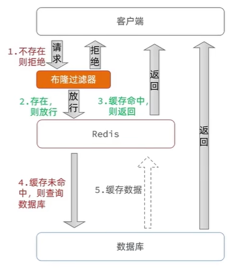

# 商户查询缓存

## 什么是缓存

缓存（cache）是数据交换的缓冲区，用于临时存储数据，通常具有较高的读写性能。


从上图可以看到，在现代应用架构中，缓存被广泛应用于多个层级，包括浏览器缓存、CDN 缓存、Nginx 缓存、Tomcat 进程缓存、Redis 缓存以及数据库缓存等，形成了完整的多级缓存体系。

### 缓存的作用与成本

| 缓存的作用 | 说明 | 缓存的成本 | 说明 |
| --- | --- | --- | --- |
| **降低后端负载** | 减少数据库等后端服务的访问压力 | **数据一致性成本** | 缓存与数据源之间可能存在数据不一致的问题 |
| **提高读写效率** | 利用高速存储介质加快数据访问速度 | **代码维护成本** | 需要额外编写和维护缓存相关的逻辑代码 |
| **降低响应时间** | 快速返回数据，提升用户体验 | **运维成本** | 需要部署和维护缓存服务器，增加系统复杂度 |

## 添加 Redis 缓存


当客户端发起查询请求时，系统首先从 Redis 缓存中查找数据。若缓存命中则直接返回结果；若缓存未命中，再查询数据库并将结果写入缓存，以便后续请求快速获取。

### 实现方案


根据 ID 查询商铺信息时，采用 Cache-Aside 模式：先查缓存，缓存命中则返回；缓存未命中则查数据库，查到后写入缓存并返回。

#### Controller 层

```java
@RestController
@RequestMapping("/shop")
public class ShopController {

    @Resource
    private ShopService shopService;

    @GetMapping("/{id}")
    public Result queryById(@PathVariable("id") Long id) {
        return shopService.queryById(id);
    }
}
```

#### Service 层

```java
@Service
public class ShopServiceImpl implements ShopService {

    @Resource
    private StringRedisTemplate stringRedisTemplate;

    @Resource
    private ShopMapper shopMapper;

    @Override
    public Result queryById(Long id) {
        String key = "cache:shop:" + id;

        // 1. 从 Redis 查询商铺缓存
        String shopJson = stringRedisTemplate.opsForValue().get(key);

        // 2. 判断缓存是否存在
        if (StrUtil.isNotBlank(shopJson)) {
            // 3. 存在，直接返回
            Shop shop = JSONUtil.toBean(shopJson, Shop.class);
            return Result.ok(shop);
        }

        // 4. 不存在，根据 id 查询数据库
        Shop shop = shopMapper.selectById(id);

        // 5. 数据库中不存在，返回错误
        if (shop == null) {
            return Result.fail("商铺不存在");
        }

        // 6. 存在，写入 Redis
        stringRedisTemplate.opsForValue().set(key, JSONUtil.toJsonStr(shop));

        // 7. 返回
        return Result.ok(shop);
    }
}
```

#### 依赖说明

代码中使用了以下工具类：
- `StrUtil`：Hutool 工具包中的字符串工具类，用于判断字符串是否为空
- `JSONUtil`：Hutool 工具包中的 JSON 工具类，用于对象与 JSON 字符串互转

Maven 依赖：

```xml
<dependency>
    <groupId>cn.hutool</groupId>
    <artifactId>hutool-all</artifactId>
    <version>5.8.16</version>
</dependency>
```

## 缓存更新策略

### 三种更新策略对比

| 策略 | 说明 | 一致性 | 维护成本 |
|---|---|---|---|
| **内存淘汰** | 依靠 Redis 内存淘汰机制,内存不足时自动淘汰数据,下次查询时重新加载 | 差 | 无 |
| **超时删除** | 为缓存设置 TTL 过期时间,到期自动删除,下次查询时重新加载 | 一般 | 低 |
| **主动更新** | 修改数据库时,同步更新缓存,保证数据实时一致 | 好 | 高 |

**如何选择**：根据业务场景的一致性要求选择合适的策略

- **低一致性需求**：使用内存淘汰策略，适用于允许短暂不一致的场景
  - 示例：店铺类型列表、商品分类等基础数据

- **高一致性需求**：采用主动更新策略，并配合 TTL 超时删除作为兜底
  - 示例：商品库存、用户余额、订单状态等核心业务数据

::: tip 选择建议
在实际应用中，需要根据业务特点在一致性和性能之间做出权衡。建议优先考虑数据的重要性、更新频率和访问量，核心业务数据采用主动更新保证一致性，非核心数据可适当降低一致性要求以提升性能。
:::

### 主动更新的三种实现模式

| 模式 | 说明 | 优点 | 缺点 |
|---|---|---|---|
| **Cache Aside**<br/>（旁路缓存） | 应用程序直接操作缓存和数据库。读取时先查缓存，未命中则查数据库并回写缓存；更新时先更新数据库，再删除缓存 | 实现简单，业务逻辑清晰，最常用的方案 | 需要应用程序维护缓存逻辑，增加代码复杂度 |
| **Read/Write Through**<br/>（读写穿透） | 缓存作为主存储，所有读写操作都通过缓存层，由缓存层负责与数据库同步。应用程序只需操作缓存，无需关心数据库 | 对应用透明，一致性由缓存层保证 | 实现复杂，需要缓存层具备完整的数据持久化能力 |
| **Write Behind Caching**<br/>（异步写入） | 写操作只更新缓存即可立即返回，由独立的异步线程负责将缓存数据批量写入数据库，类似消息队列的异步处理机制 | 写入性能极高，适合写多读少的场景 | 数据可能丢失，只能保证最终一致性 |

### Cache Aside 模式的实现细节

Cache Aside 是最常用的缓存模式，但在实现时需要仔细考虑以下三个关键问题：

#### 1. 删除缓存还是更新缓存？

**更新缓存**：每次修改数据库后立即更新缓存中的数据
- 缺点：如果数据被频繁写入但很少读取，会产生大量无效的缓存写操作
- 适用场景：读多写少，且每次写入后都会被读取的场景

**删除缓存**：每次修改数据库后删除缓存，下次读取时再从数据库加载（推荐）
- 优点：采用懒加载策略，只有被访问的数据才会加载到缓存
- 适用场景：通用场景，特别是写入后不一定会被读取的数据

#### 2. 如何保证缓存与数据库操作的原子性？

缓存和数据库是两个独立的系统，如何保证同时成功或同时失败？

**单体系统**：
- 利用 Spring 事务管理，将数据库和缓存操作放在同一事务中
- 如果缓存删除失败，回滚数据库事务

**分布式系统**：
- 采用 TCC（Try-Confirm-Cancel）等分布式事务方案
- 或使用消息队列实现最终一致性：先更新数据库，发送 MQ 消息，消费者删除缓存

#### 3. 先操作缓存还是先操作数据库？

这是 Cache Aside 模式中最容易出错的问题，操作顺序不同，并发安全性差异很大。

##### 方案一：先删除缓存，再更新数据库

**① 正常场景**（无并发冲突）

在两个线程串行执行、无时间重叠的情况下，数据保持一致：

| 时刻 | 线程 A（写操作） | 线程 B（读操作） | 数据库 | 缓存 |
|------|-----------------|---------|--------|------|
| T1   | 删除缓存        | -       | 旧值   | 无   |
| T2   | 更新数据库为新值 | -       | 新值   | 无   |
| T3   | -               | 查询缓存未命中 | 新值 | 无   |
| T4   | -               | 查询数据库得到新值 | 新值 | 无   |
| T5   | -               | 将新值写入缓存 | 新值 | 新值 |

**② 并发问题场景**（高并发下容易出现）

当线程 A 正在删除缓存和更新数据库时，线程 B 同时发起查询，出现数据不一致，数据库是新值，缓存是旧值：

| 时刻 | 线程 A（写操作） | 线程 B（读操作） | 数据库 | 缓存 |
|------|-----------------|-----------------|--------|------|
| T1   | 删除缓存        | -               | 旧值   | 无   |
| T2   | -               | 查询缓存未命中   | 旧值   | 无   |
| T3   | -               | 查询数据库得到旧值 | 旧值   | 无   |
| T4   | -               | 将旧值写入缓存   | 旧值   | 旧值 |
| T5   | 更新数据库为新值 | -               | 新值   | 旧值 |

**发生概率**：较高
- 删除缓存操作很快，线程 B 容易在 T1 之后立即进入
- 查询数据库通常比更新数据库快，线程 B 容易在 T5 之前完成查询并回写旧数据

---

##### 方案二：先更新数据库，再删除缓存（推荐）

**① 正常场景**（无并发冲突）

在两个线程串行执行、无时间重叠的情况下，数据保持一致：

| 时刻 | 线程 A（读操作） | 线程 B（写操作） | 数据库 | 缓存 |
|------|-----------------|-----------------|--------|------|
| T1   | -               | 更新数据库为新值 | 新值   | 旧值 |
| T2   | -               | 删除缓存        | 新值   | 无   |
| T3   | 查询缓存未命中   | -               | 新值   | 无   |
| T4   | 查询数据库得到新值 | -             | 新值   | 无   |
| T5   | 将新值写入缓存   | -               | 新值   | 新值 |

**② 并发问题场景**（极端情况下才会出现，如缓存刚好失效或不存在）

当线程 B 正在更新数据库和删除缓存时，线程 A 同时发起查询，出现数据不一致，数据库是新值，缓存是旧值：

| 时刻 | 线程 A（读操作） | 线程 B（写操作） | 数据库 | 缓存 |
|------|-----------------|-----------------|--------|------|
| T1   | 查询缓存未命中   | -               | 旧值   | 无   |
| T2   | 准备查询数据库   | -               | 旧值   | 无   |
| T3   | -               | 更新数据库为新值 | 新值   | 无   |
| T4   | -               | 删除缓存        | 新值   | 无   |
| T5   | 查询数据库得到旧值* | -            | 新值   | 无   |
| T6   | 将旧值写入缓存   | -               | 新值   | 旧值 |

<sub>*注：线程 A 的数据库查询在 T2 时刻发起，但由于数据库连接、查询执行等原因，实际返回结果时已是 T5，此时读取的是更新前的旧值。</sub>

**发生概率**：极低
- 必须在缓存失效的瞬间发生并发请求
- 线程 A 发起查询后，线程 B 完成"更新数据库+删除缓存"，线程 A 才收到结果
- 实际上，查询操作通常比"更新+删除"组合更快

**兜底方案**：设置 TTL 超时时间，即使出现不一致，缓存也会在过期后自动失效，下次查询时恢复一致。

---

##### 方案对比与结论

| 对比项 | 并发问题发生概率 | 数据一致性 | 推荐程度 |
|-------|-----------------|-----------|----------|
| 方案一（先删缓存） | 较高 | 差 | 不推荐 |
| 方案二（先更新DB） | 极低 | 好 | ✔ 推荐 |

**推荐方案**：先更新数据库，再删除缓存，并配合 TTL 作为兜底机制。

### 最佳实践

综合考虑一致性、性能和实现复杂度，推荐以下方案：

**1. 低一致性需求**

直接使用 Redis 的内存淘汰机制（如 LRU 策略），无需编写缓存更新逻辑，如字典数据、配置信息、统计数据等场景。

**2. 高一致性需求**

采用 **Cache Aside + 先更新数据库再删缓存** 的方案，并配合 TTL 兜底。

* 读操作流程：
  1. 查询缓存，如果命中则直接返回
  2. 如果未命中，查询数据库
  3. 将数据写入缓存，并设置合理的 TTL（如 30 分钟）
  4. 返回数据

* 写操作流程：
  1. 更新数据库
  2. 删除缓存（如果删除失败，依靠 TTL 保证最终一致性）
  3. 确保数据库与缓存操作的原子性（使用事务或 MQ）

**兜底机制**：
- 设置合理的 TTL，即使删除缓存失败，也能在过期后自动恢复一致性
- 添加监控告警，及时发现缓存删除失败的情况

### 实际案例

为商铺查询功能添加缓存策略，实现超时剔除和主动更新。

**需求说明**：

1. **查询操作**：根据 id 查询店铺时，如果缓存未命中，则查询数据库，将结果写入缓存并设置超时时间
2. **更新操作**：根据 id 修改店铺时，先修改数据库，再删除缓存

#### 代码实现

**Controller 层**

```java
@RestController
@RequestMapping("/shop")
public class ShopController {

    @Resource
    private ShopService shopService;

    /**
     * 根据 id 查询商铺信息
     */
    @GetMapping("/{id}")
    public Result queryById(@PathVariable("id") Long id) {
        return shopService.queryById(id);
    }

    /**
     * 更新商铺信息
     */
    @PutMapping
    public Result updateShop(@RequestBody Shop shop) {
        return shopService.updateShop(shop);
    }
}
```

**Service 层**

```java
@Service
public class ShopServiceImpl implements ShopService {

    @Resource
    private StringRedisTemplate stringRedisTemplate;

    @Resource
    private ShopMapper shopMapper;

    private static final String CACHE_SHOP_KEY = "cache:shop:";
    private static final Long CACHE_SHOP_TTL = 30L;

    @Override
    public Result queryById(Long id) {
        String key = CACHE_SHOP_KEY + id;

        // 1. 从 Redis 查询商铺缓存
        String shopJson = stringRedisTemplate.opsForValue().get(key);

        // 2. 判断缓存是否存在
        if (StrUtil.isNotBlank(shopJson)) {
            // 3. 存在，直接返回
            Shop shop = JSONUtil.toBean(shopJson, Shop.class);
            return Result.ok(shop);
        }

        // 4. 不存在，根据 id 查询数据库
        Shop shop = shopMapper.selectById(id);

        // 5. 数据库中不存在，返回错误
        if (shop == null) {
            return Result.fail("商铺不存在");
        }

        // 6. 存在，写入 Redis 并设置 30 分钟过期时间
        stringRedisTemplate.opsForValue().set(key, JSONUtil.toJsonStr(shop), CACHE_SHOP_TTL, TimeUnit.MINUTES);

        // 7. 返回
        return Result.ok(shop);
    }

    @Override
    @Transactional
    public Result updateShop(Shop shop) {
        Long id = shop.getId();
        if (id == null) {
            return Result.fail("店铺 id 不能为空");
        }

        // 1. 更新数据库
        shopMapper.updateById(shop);

        // 2. 删除缓存
        String key = CACHE_SHOP_KEY + id;
        stringRedisTemplate.delete(key);

        return Result.ok();
    }
}
```

**关键点说明**：

1. **查询操作**：使用 `set(key, value, timeout, unit)` 方法设置缓存时指定 TTL 为 30 分钟
2. **更新操作**：先调用 `updateById()` 更新数据库，再调用 `delete()` 删除缓存
3. **事务保证**：使用 `@Transactional` 注解确保数据库更新和缓存删除的原子性
4. **常量提取**：将缓存 key 前缀和 TTL 提取为常量，便于维护
5. **幂等性保证**：Redis 的 `delete()` 操作本身是幂等的，即使 key 不存在也不会报错，不会影响数据库更新

## 缓存穿透

### 问题描述

缓存穿透是指客户端请求的数据在缓存和数据库中都不存在，导致每次请求都会穿透缓存直接访问数据库。

**常见场景**：
- 用户恶意攻击，使用大量不存在的 ID 发起查询请求
- 业务逻辑错误，查询了本就不存在的数据

**危害**：
- 缓存失去保护作用，所有请求直接打到数据库
- 数据库压力骤增，可能导致数据库宕机
- 影响系统整体性能和可用性

### 解决方案

| 方案 | 实现原理 | 优点 | 缺点 | 适用场景 |
|---|---|---|---|---|
| **缓存空对象** | 当数据库查询结果为空时，将空值（null 或空对象）写入缓存，并设置较短的 TTL | 实现简单，维护方便 | 额外的内存消耗，可能造成短期的不一致 | 数据命中率较高，攻击风险较低的场景 |
| **布隆过滤器** | 在缓存前增加布隆过滤器，快速判断数据是否存在，不存在则直接拒绝请求 | 内存占用少，性能高，没有多余 key | 实现复杂，存在误判可能（可能把存在的数据判断为不存在），数据新增时需同步更新过滤器 | 数据量大，对内存敏感，能接受极小误判率的场景 |

除了上述缓存层面的技术方案，还应从系统设计和安全角度采取综合防护措施：

- **增强 ID 复杂度**：避免使用连续递增的数字 ID，改用 UUID、雪花算法等生成的分布式 ID，防止攻击者通过规律猜测有效 ID
- **数据基础校验**：在接口层对请求参数进行格式校验和合法性校验，及早拦截明显不合法的请求
- **用户权限校验**：加强身份认证和授权机制，限制匿名用户或低信用用户的访问频率
- **热点参数限流**：使用 Sentinel、Hystrix 等流控组件，对单个 ID 或用户的请求频率进行限制，防止恶意刷接口
- **监控告警**：监控缓存未命中率、数据库访问量等指标，异常时及时告警并采取应急措施

#### 缓存空对象方案


当查询数据库返回 null 时，将空值缓存起来，下次相同请求直接返回空结果，避免重复查询数据库。

**注意事项**：
- 设置较短的 TTL（如 2-5 分钟），避免数据新增后长时间查不到
- 考虑内存占用，如果恶意请求的 ID 数量巨大，可能占用大量内存

#### 布隆过滤器方案



布隆过滤器是一种空间效率极高的概率型数据结构，用于判断元素是否在集合中。

**工作原理**：
- 将所有可能存在的数据提前加载到布隆过滤器中
- 请求到来时，先查询布隆过滤器判断数据是否存在
- 若不存在则直接拒绝，若存在则继续查询缓存和数据库

**注意事项**：
- 存在误判率：可能将存在的数据判断为不存在（概率很低，可通过调整参数控制）
- 不支持删除：需要重建整个过滤器
- 数据新增时需要同步更新过滤器

### 实际案例

对前面的[商铺查询方案](#实现方案)进行优化，采用缓存空对象的方式解决缓存穿透问题。


#### 代码实现

**Service 层**

```java
@Service
public class ShopServiceImpl implements ShopService {

    @Resource
    private StringRedisTemplate stringRedisTemplate;

    @Resource
    private ShopMapper shopMapper;

    private static final String CACHE_SHOP_KEY = "cache:shop:";
    private static final Long CACHE_SHOP_TTL = 30L;
    private static final Long CACHE_NULL_TTL = 2L;

    @Override
    public Result queryById(Long id) {
        String key = CACHE_SHOP_KEY + id;

        // 1. 从 Redis 查询商铺缓存
        String shopJson = stringRedisTemplate.opsForValue().get(key);

        // 2. 判断缓存是否存在
        if (StrUtil.isNotBlank(shopJson)) {
            // 3. 存在，直接返回
            Shop shop = JSONUtil.toBean(shopJson, Shop.class);
            return Result.ok(shop);
        }

        // 判断命中的是否是空值
        if (shopJson != null) {
            // 返回错误信息
            return Result.fail("商铺不存在");
        }

        // 4. 不存在，根据 id 查询数据库
        Shop shop = shopMapper.selectById(id);

        // 5. 数据库中不存在，将空值写入 Redis
        if (shop == null) {
            stringRedisTemplate.opsForValue().set(key, "", CACHE_NULL_TTL, TimeUnit.MINUTES);
            return Result.fail("商铺不存在");
        }

        // 6. 存在，写入 Redis 并设置 30 分钟过期时间
        stringRedisTemplate.opsForValue().set(key, JSONUtil.toJsonStr(shop), CACHE_SHOP_TTL, TimeUnit.MINUTES);

        // 7. 返回
        return Result.ok(shop);
    }

    @Override
    @Transactional
    public Result updateShop(Shop shop) {
        Long id = shop.getId();
        if (id == null) {
            return Result.fail("店铺 id 不能为空");
        }

        // 1. 更新数据库
        shopMapper.updateById(shop);

        // 2. 删除缓存
        String key = CACHE_SHOP_KEY + id;
        stringRedisTemplate.delete(key);

        return Result.ok();
    }
}
```

**关键改进点**：

1. **空值缓存**：当数据库查询结果为 null 时，将空字符串 `""` 写入 Redis，TTL 设置为 2 分钟
2. **空值判断**：使用 `StrUtil.isNotBlank()` 和 `shopJson != null` 两次判断
   - `isNotBlank()` 返回 `true`：缓存命中且有数据，直接返回
   - `isNotBlank()` 返回 `false` 但 `shopJson != null`：缓存命中但是空值，返回错误
   - `shopJson == null`：缓存未命中，查询数据库
3. **TTL 差异化**：正常数据 TTL 为 30 分钟，空值 TTL 为 2 分钟，避免数据新增后长时间无法查询
4. **常量提取**：将空值 TTL 提取为常量 `CACHE_NULL_TTL`，便于维护

::: tip 为什么用空字符串而不是 null
Redis 的 `get()` 方法在 key 不存在时返回 null，无法区分"缓存未命中"和"缓存了 null 值"。因此使用空字符串 `""` 作为空值标记，通过 `isNotBlank()` 和 `!= null` 的组合判断来区分三种情况。
:::

## 缓存雪崩

### 问题描述

缓存雪崩是指在同一时段大量的缓存 key 同时失效或者 Redis 服务宕机，导致大量请求瞬间直达数据库，给数据库带来巨大压力。


**常见场景**：
- **大量 key 集中过期**：系统初始化或批量导入数据时，为大量 key 设置了相同的 TTL，导致同时失效
- **Redis 服务宕机**：Redis 节点故障或网络问题导致整个缓存服务不可用
- **缓存预热不当**：系统重启后未进行缓存预热，大量请求同时访问冷数据

**危害**：
- 数据库瞬间承受大量并发查询，可能直接宕机
- 系统整体性能急剧下降，响应时间大幅增加
- 可能引发连锁反应，导致整个系统雪崩

### 解决方案

| 方案 | 解决问题 | 实现原理 | 优点 | 缺点 | 实现难度 | 推荐程度 |
|---|---|---|---|---|---|---|
| **TTL 随机化** | key 集中过期 | 为不同的 key 设置不同的过期时间，在基础 TTL 上添加随机值 | 实现简单，成本低，有效防止 key 集中过期 | 只能解决 key 集中过期问题，无法应对服务宕机 | 低 | ⭐⭐⭐⭐⭐ 必须 |
| **Redis 集群** | 服务宕机 | 采用主从+哨兵或 Redis Cluster 架构，实现高可用和故障自动转移 | 提高服务可用性，支持故障自动恢复，可实现读写分离和数据分片 | 部署和运维成本较高，架构相对复杂 | 中 | ⭐⭐⭐⭐⭐ 生产必备 |
| **降级限流** | 数据库压力过大 | 通过服务降级返回默认值，使用 Sentinel/Hystrix 限流和熔断 | 保护数据库，防止系统崩溃，提供兜底保障 | 降级期间用户体验下降，需要额外开发降级逻辑 | 中 | ⭐⭐⭐⭐ 推荐 |
| **多级缓存** | 单点依赖 | 构建浏览器、CDN、Nginx、进程内、Redis 等多层缓存体系 | 分散流量，降低单点依赖，提升整体性能 | 架构复杂，数据一致性难以保证，开发和维护成本高 | 高 | ⭐⭐⭐ 高并发场景 |

#### TTL 随机化代码示例

```java
// 在基础 TTL 上添加随机值，避免大量 key 同时过期
Long ttl = CACHE_SHOP_TTL + RandomUtil.randomLong(0, 5);
stringRedisTemplate.opsForValue().set(key, value, ttl, TimeUnit.MINUTES);
```

::: tip 综合防护建议
实际生产环境中，应组合使用多种方案：
- **基础防护**：TTL 随机化（必须）
- **高可用保障**：Redis 集群部署（必须）
- **兜底机制**：降级限流策略（推荐）
- **性能优化**：多级缓存（可选，视业务规模而定）
:::

## 缓存击穿

## 缓存工具封装