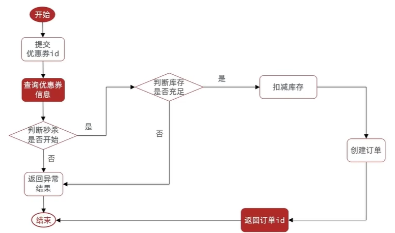
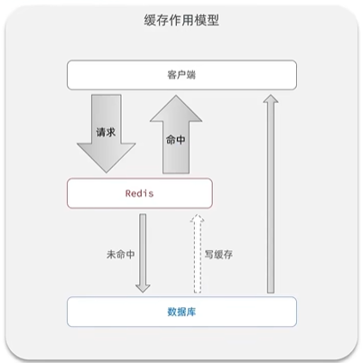
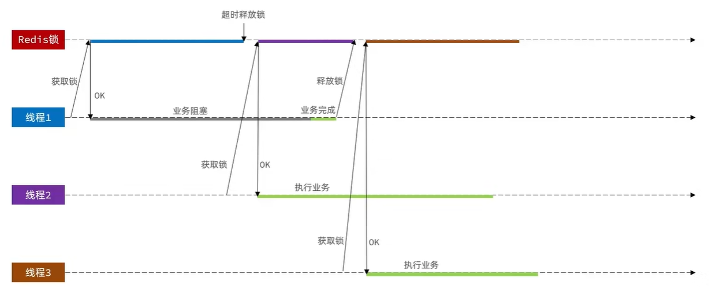
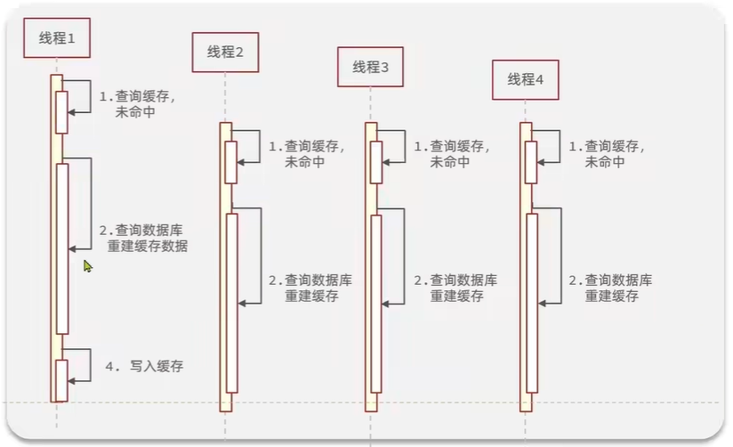

# 优惠券秒杀

## 全局唯一 ID

### 业务场景

在优惠券秒杀系统中，每个店铺可以发布优惠券，用户抢购成功后会生成订单并保存到 `tb_voucher_order` 表中。

**订单表结构：**

| 字段名 | 类型 | 说明 |
|--------|------|------|
| id | bigint | 订单 ID（主键） |
| user_id | bigint | 用户 ID |
| voucher_id | bigint | 优惠券 ID |
| pay_type | tinyint | 支付方式（1:余额 2:支付宝 3:微信） |
| status | tinyint | 订单状态（1:未支付 2:已支付 3:已核销 4:已取消 5:退款中 6:已退款） |
| create_time | timestamp | 创建时间 |
| pay_time | timestamp | 支付时间 |
| use_time | timestamp | 核销时间 |
| refund_time | timestamp | 退款时间 |
| update_time | timestamp | 更新时间 |

**为什么不能使用数据库自增 ID？**

- **安全性问题**：ID 规律性太明显，容易被恶意用户遍历订单信息，暴露业务量等敏感数据
- **扩展性问题**：分库分表后无法保证全局唯一性，需要额外配置起始值和步长

### 全局 ID 生成器

#### 设计要求

分布式系统下的全局 ID 生成器需要满足以下特性：

| 特性 | 说明 |
|------|------|
| **唯一性** | 在分布式环境下保证 ID 全局唯一 |
| **高可用** | 服务故障时仍能持续生成 ID，不成为系统瓶颈 |
| **高性能** | 生成速度快，能支撑高并发场景 |
| **递增性** | ID 呈趋势递增，利于数据库 B+ 树索引性能 |
| **安全性** | ID 不易被猜测，避免业务信息泄露 |

#### 方案选型

| 方案 | 优点 | 缺点 | 适用场景 |
|------|------|------|----------|
| **UUID** | 本地生成，无需依赖外部系统 | 无序，不利于索引；占用空间大（128位） | 对性能和存储空间要求不高的场景 |
| **数据库独立ID表** | 实现简单，ID严格递增，可按业务分配号段 | 性能瓶颈在数据库；存在单点故障风险 | 并发量中等的分布式系统 |
| **Redis自增** | 性能优秀（10W+ QPS），趋势递增，易于统计 | 依赖Redis；需考虑持久化策略 | **高并发秒杀场景（本方案）** |
| **Snowflake** | 性能极高，本地生成，趋势递增；MyBatis-Plus 已内置实现（`IdType.ASSIGN_ID`） | 依赖系统时钟；需维护机器ID | 超大规模分布式系统 |

:::tip 为什么选择 Redis 自增方案？

1. **性能满足需求**：Redis 的 INCR 命令单机 QPS 可达 10W+，足以支撑秒杀场景
2. **趋势递增**：通过时间戳+序列号组合，保证 ID 整体递增，利于数据库索引
3. **便于统计**：按日期分组的 Key 设计，可方便统计每日订单量
4. **实现简单**：相比 Snowflake，无需维护机器 ID 和处理复杂的时钟回拨问题

:::

#### ID 结构设计

采用 **64 位 Long 型** 整数，由以下三部分组成：

```
┌─────────┬──────────────────────────────┬────────────────────────────────┐
│ 符号位  │         时间戳（31位）        │        序列号（32位）           │
│  1 bit  │  当前秒数 - 起始时间（秒）     │   Redis 自增值（每秒重置）      │
└─────────┴──────────────────────────────┴────────────────────────────────┘
    0             可用约 69 年                  每秒最多 2^32 个 ID
```

| 组成部分 | 位数 | 说明 |
|---------|------|------|
| 符号位 | 1 bit | 固定为 0，表示正数 |
| 时间戳 | 31 bit | 当前时间戳减去起始时间（秒级），可用约 69 年 |
| 序列号 | 32 bit | Redis 自增计数器，按天分组，每秒最多生成 2^32 个不同 ID |

#### 代码实现

**RedisIdWorker 工具类：**

```java
@Component
public class RedisIdWorker {

    /**
     * 开始时间戳（2022-01-01 00:00:00）
     */
    private static final long BEGIN_TIMESTAMP = 1640995200L;

    /**
     * 序列号的位数
     */
    private static final int COUNT_BITS = 32;

    @Resource
    private StringRedisTemplate stringRedisTemplate;

    /**
     * 生成全局唯一ID
     * @param keyPrefix 业务前缀（如 "order"、"voucher"）
     * @return 全局唯一ID
     */
    public long nextId(String keyPrefix) {
        // 1. 生成时间戳（当前时间 - 开始时间）
        LocalDateTime now = LocalDateTime.now();
        long nowSecond = now.toEpochSecond(ZoneOffset.UTC);
        long timestamp = nowSecond - BEGIN_TIMESTAMP;

        // 2. 生成序列号
        // 2.1 获取当前日期，精确到天
        String date = now.format(DateTimeFormatter.ofPattern("yyyy:MM:dd"));
        // 2.2 Redis自增（Key格式：icr:业务前缀:日期）
        // 例如：icr:order:2024:08:13
        Long count = stringRedisTemplate.opsForValue()
                .increment("icr:" + keyPrefix + ":" + date);

        // 3. 拼接并返回：时间戳左移32位，然后与序列号按位或运算
        return timestamp << COUNT_BITS | count;
    }
}
```

**核心实现细节：**

1. **时间戳计算**
   - 使用相对时间戳（当前时间 - 起始时间），避免浪费高位存储空间
   - 起始时间设为 2022-01-01，31 位可用约 69 年

2. **序列号生成**
   - Redis Key 格式：`icr:业务前缀:日期`（如 `icr:order:2024:08:13`）
   - 使用 `INCR` 命令原子性自增，保证并发安全
   - 按天分组的好处：
     - 方便统计每天的业务量
     - 避免单个 Key 的值过大
     - 自动按天隔离，无需手动清理

3. **位运算拼接**
   - 时间戳左移 32 位，占据高 32 位
   - 与序列号进行按位或运算，序列号占据低 32 位
   - 最终组成 64 位 Long 型 ID

**使用示例：**

```java
@Service
public class VoucherOrderServiceImpl implements IVoucherOrderService {

    @Resource
    private RedisIdWorker redisIdWorker;

    @Override
    public Result seckillVoucher(Long voucherId) {
        // 1. 生成订单ID
        long orderId = redisIdWorker.nextId("order");

        // 2. 创建订单
        VoucherOrder order = new VoucherOrder();
        order.setId(orderId);
        order.setUserId(UserHolder.getUser().getId());
        order.setVoucherId(voucherId);

        // 3. 保存订单
        save(order);

        return Result.ok(orderId);
    }
}
```

**测试验证：**

```java
@Test
void testIdWorker() throws InterruptedException {
    CountDownLatch latch = new CountDownLatch(300);

    Runnable task = () -> {
        for (int i = 0; i < 100; i++) {
            long id = redisIdWorker.nextId("order");
            System.out.println("id = " + id);
        }
        latch.countDown();
    };

    long begin = System.currentTimeMillis();
    for (int i = 0; i < 300; i++) {
        executor.submit(task);
    }
    latch.await();
    long end = System.currentTimeMillis();

    System.out.println("生成3万个ID耗时：" + (end - begin) + "ms");
}
```

## 实现优惠券秒杀下单

### 业务场景

每个店铺都可以发布优惠券，用户可通过优惠券享受相应的折扣或满减优惠。

**优惠券类型：**

- **平价券**：无库存限制，用户可随时购买
- **特价券**：限量发放，需要秒杀抢购，具有时间限制和库存限制

### 数据表设计

**tb_voucher（优惠券基础表）：**

| 字段名 | 类型 | 说明 |
|--------|------|------|
| id | bigint | 优惠券 ID（主键） |
| shop_id | bigint | 店铺 ID |
| title | varchar | 优惠券标题 |
| sub_title | varchar | 优惠券副标题 |
| rules | varchar | 使用规则 |
| pay_value | bigint | 支付金额（单位：分） |
| actual_value | bigint | 抵扣金额（单位：分） |
| type | tinyint | 优惠券类型（0:平价券 1:特价券） |
| status | tinyint | 状态（1:上架 2:下架 3:过期） |
| create_time | timestamp | 创建时间 |
| update_time | timestamp | 更新时间 |

**tb_seckill_voucher（秒杀券扩展表）：**

| 字段名 | 类型 | 说明 |
|--------|------|------|
| voucher_id | bigint | 关联的优惠券 ID（主键） |
| stock | int | 库存数量 |
| begin_time | timestamp | 秒杀开始时间 |
| end_time | timestamp | 秒杀结束时间 |
| create_time | timestamp | 创建时间 |
| update_time | timestamp | 更新时间 |

:::tip 表设计说明
特价券的秒杀相关信息（库存、时间限制）单独存储在 `tb_seckill_voucher` 表中，通过 `voucher_id` 与 `tb_voucher` 表关联。这种设计可以避免在基础表中存储大量空值，提高查询效率。
:::

### 添加秒杀券接口

**接口功能：**

提供 RESTful API 接口，用于商家发布秒杀优惠券，同时将优惠券基本信息和秒杀信息分别保存到对应的数据表中。

**接口基本信息：**

| 项目 | 内容 |
|------|------|
| 请求方式 | POST |
| 请求路径 | `/voucher-order/seckill` |
| 请求参数 | Voucher 对象（JSON 格式） |
| 返回结果 | Result 对象（包含优惠券 ID） |

**Controller 实现：**

```java
@RestController
@RequestMapping("/voucher-order")
public class VoucherOrderController {

    @Resource
    private IVoucherService voucherService;

    /**
     * 新增秒杀券
     * @param voucher 优惠券信息（包含秒杀信息）
     * @return 优惠券ID
     */
    @PostMapping("/seckill")
    public Result addSeckillVoucher(@RequestBody Voucher voucher) {
        voucherService.addSeckillVoucher(voucher);
        return Result.ok(voucher.getId());
    }
}
```

**Service 实现：**

```java
@Service
public class VoucherServiceImpl extends ServiceImpl<VoucherMapper, Voucher>
        implements IVoucherService {

    @Resource
    private ISeckillVoucherService seckillVoucherService;

    @Override
    @Transactional
    public void addSeckillVoucher(Voucher voucher) {
        // 1. 保存优惠券基本信息
        save(voucher);

        // 2. 保存秒杀券扩展信息
        SeckillVoucher seckillVoucher = new SeckillVoucher();
        seckillVoucher.setVoucherId(voucher.getId());
        seckillVoucher.setStock(voucher.getStock());
        seckillVoucher.setBeginTime(voucher.getBeginTime());
        seckillVoucher.setEndTime(voucher.getEndTime());
        seckillVoucherService.save(seckillVoucher);
    }
}
```

**核心逻辑：**

1. **事务保证**：使用 `@Transactional` 注解保证两张表的数据一致性
2. **分表存储**：优惠券基本信息存入 `tb_voucher`，秒杀信息存入 `tb_seckill_voucher`
3. **关联关系**：通过 `voucher_id` 建立两表之间的关联

**请求示例：**

```json
POST /voucher-order/seckill
{
    "shopId": 1,
    "title": "100元代金券",
    "subTitle": "周一至周五可用",
    "rules": "全场通用",
    "payValue": 8000,
    "actualValue": 10000,
    "type": 1,
    "stock": 100,
    "beginTime": "2024-08-13 10:00:00",
    "endTime": "2024-08-13 18:00:00"
}
```

### 秒杀下单接口

**接口功能：**

用户抢购秒杀券时，需要校验秒杀时间和库存，并完成下单操作。

**业务规则：**

| 规则 | 说明 |
|------|------|
| 时间校验 | 秒杀尚未开始或已经结束时，无法下单 |
| 库存校验 | 库存不足时，无法下单 |
| 订单生成 | 校验通过后，扣减库存并生成订单 |

**业务流程：**

<span id="秒杀下单流程图"></span>



**接口基本信息：**

| 项目 | 内容 |
|------|------|
| 请求方式 | POST |
| 请求路径 | `/voucher-order/seckill/{voucherId}` |
| 请求参数 | voucherId（路径参数） |
| 返回结果 | Result 对象（包含订单 ID） |

**Controller 实现：**

```java
@RestController
@RequestMapping("/voucher-order")
public class VoucherOrderController {

    @Resource
    private IVoucherOrderService voucherOrderService;

    /**
     * 秒杀下单
     * @param voucherId 优惠券ID
     * @return 订单ID
     */
    @PostMapping("/seckill/{voucherId}")
    public Result seckillVoucher(@PathVariable("voucherId") Long voucherId) {
        return voucherOrderService.seckillVoucher(voucherId);
    }
}
```

**Service 实现：**

```java
@Service
public class VoucherOrderServiceImpl extends ServiceImpl<VoucherOrderMapper, VoucherOrder>
        implements IVoucherOrderService {

    @Resource
    private ISeckillVoucherService seckillVoucherService;

    @Resource
    private RedisIdWorker redisIdWorker;

    @Override
    @Transactional
    public Result seckillVoucher(Long voucherId) {
        // 1. 查询秒杀券信息
        SeckillVoucher voucher = seckillVoucherService.getById(voucherId);

        // 2. 判断秒杀是否开始
        if (voucher.getBeginTime().isAfter(LocalDateTime.now())) {
            return Result.fail("秒杀尚未开始！");
        }

        // 3. 判断秒杀是否结束
        if (voucher.getEndTime().isBefore(LocalDateTime.now())) {
            return Result.fail("秒杀已经结束！");
        }

        // 4. 判断库存是否充足
        if (voucher.getStock() < 1) {
            return Result.fail("库存不足！");
        }

        // 5. 扣减库存
        boolean success = seckillVoucherService.update()
                .setSql("stock = stock - 1")
                .eq("voucher_id", voucherId)
                .update();

        if (!success) {
            return Result.fail("库存不足！");
        }

        // 6. 创建订单
        VoucherOrder order = new VoucherOrder();
        // 6.1 生成订单ID
        long orderId = redisIdWorker.nextId("order");
        order.setId(orderId);
        // 6.2 设置用户ID
        Long userId = UserHolder.getUser().getId();
        order.setUserId(userId);
        // 6.3 设置优惠券ID
        order.setVoucherId(voucherId);

        // 7. 保存订单
        save(order);

        // 8. 返回订单ID
        return Result.ok(orderId);
    }
}
```

**核心实现细节：**

1. **时间校验**
   - 使用 `LocalDateTime.now()` 获取当前时间
   - 通过 `isAfter()` 和 `isBefore()` 方法判断是否在秒杀时间范围内

2. **库存扣减**
   - 使用 `setSql("stock = stock - 1")` 直接在数据库层面扣减库存
   - 避免先查询后更新导致的并发问题（此处仍存在超卖问题，后续章节解决）

3. **订单生成**
   - 使用 `RedisIdWorker` 生成全局唯一订单 ID
   - 从 ThreadLocal 中获取当前登录用户信息
   - 使用 `@Transactional` 保证订单创建和库存扣减的原子性

## 超卖问题

### 问题现象

使用 JMeter 对[秒杀下单接口](#秒杀下单接口)进行高并发测试时，会发现库存为 100 的秒杀券最终生成了超过 100 个订单，出现了**超卖问题**。

:::danger 超卖问题的严重性
在电商系统中，少卖（库存剩余但无法购买）虽然会影响用户体验，但超卖（实际库存不足却售出）会导致商家无法履约，造成资金损失和法律纠纷，是绝对不能容忍的问题。
:::

### 问题分析

超卖问题的根本原因是**多线程并发导致的竞态条件**。以库存为 100 的秒杀券为例：

| 时间点 | 线程 1 | 线程 2 | 数据库库存 |
|-------|--------|--------|-----------|
| T1 | 查询库存 = 1 | - | 1 |
| T2 | - | 查询库存 = 1 | 1 |
| T3 | 判断库存充足 ✓ | - | 1 |
| T4 | - | 判断库存充足 ✓ | 1 |
| T5 | 扣减库存 stock = 0 | - | 0 |
| T6 | - | 扣减库存 stock = -1 | **-1（超卖）** |

**问题核心：** 在"查询库存"和"扣减库存"之间存在时间窗口，多个线程可能同时通过库存校验，导致实际扣减次数超过库存数量。

### 解决方案对比

针对超卖问题，常见的解决方案是**加锁**，但锁的类型不同，性能和实现方式也不同：

| 锁类型 | 核心思想 | 实现方式 | 优点 | 缺点 |
|--------|---------|---------|------|------|
| **悲观锁** | 认为并发冲突一定会发生，操作前先加锁 | `synchronized`、`Lock`、`SELECT FOR UPDATE` | 实现简单，数据一致性强 | 性能较低，串行执行 |
| **乐观锁** | 认为并发冲突不一定发生，更新时判断是否被修改 | 版本号法、CAS | 性能高，无锁等待 | 可能重试，实现稍复杂 |

### 乐观锁实现方式

乐观锁的关键是**判断数据是否被其他线程修改过**，常见实现方式：

#### 1. 版本号法

在数据表中增加 `version` 字段，每次更新时版本号自增：

```sql
-- 查询时获取版本号
SELECT id, stock, version FROM tb_seckill_voucher WHERE voucher_id = 1

-- 更新时校验版本号
UPDATE tb_seckill_voucher
SET stock = stock - 1, version = version + 1
WHERE voucher_id = 1 AND version = 10
```

**优点：** 可以解决 ABA 问题（数据被修改后又改回原值）

**缺点：** 需要修改表结构，增加 `version` 字段

#### 2. CAS（Compare And Swap）法

利用原始值进行比较，只有值未变化时才执行更新：

```sql
-- 查询时获取库存
SELECT stock FROM tb_seckill_voucher WHERE voucher_id = 1  -- 假设查到 stock = 100

-- 更新时校验库存未被修改
UPDATE tb_seckill_voucher
SET stock = stock - 1
WHERE voucher_id = 1 AND stock = 100  -- 要求库存必须还是 100
```

**优点：** 无需修改表结构，实现简单

**缺点：** 在高并发场景下成功率极低

**失败场景分析：**

假设有 100 个线程同时抢购，初始库存为 100：

| 时间 | 线程 1 | 线程 2 | 线程 3 | ... | 线程 100 | 数据库库存 |
|------|--------|--------|--------|-----|----------|-----------|
| T1 | 查询 stock = 100 | 查询 stock = 100 | 查询 stock = 100 | ... | 查询 stock = 100 | 100 |
| T2 | `WHERE stock = 100` ✓ | `WHERE stock = 100` ✗ | `WHERE stock = 100` ✗ | ... | `WHERE stock = 100` ✗ | 99 |
| T3 | 更新成功 | 更新失败（stock 已变为 99） | 更新失败 | ... | 更新失败 | 99 |

**问题本质：** 严格的 CAS 判断（`stock = 100`）导致只有第一个线程能成功，其他 99 个线程因为库存值已改变而全部失败。即使库存还有 99 件，也无法继续售卖。

**实际影响：**
- 理论库存：100 件
- 实际成功订单：可能只有 1 件（极端情况）
- 性能浪费：大量线程失败后重试，造成数据库压力激增
- 用户体验：明明有库存却无法下单，出现"假性售罄"

### 乐观锁解决超卖

#### 优化思路

将 CAS 的判断条件从"库存值相等"改为"库存大于 0"，只要有库存就允许扣减：

```sql
-- 原始 CAS（有问题）
UPDATE tb_seckill_voucher
SET stock = stock - 1
WHERE voucher_id = 1 AND stock = 100  -- 必须等于查询时的值

-- 优化后的 CAS（推荐）
UPDATE tb_seckill_voucher
SET stock = stock - 1
WHERE voucher_id = 1 AND stock > 0    -- 只要大于 0 即可
```

#### 为什么要改成 `stock > 0`？

**问题对比：**

| 判断条件 | 并发场景表现 | 库存利用率 | 是否解决超卖 | 是否解决并发性能 |
|---------|-------------|-----------|------------|---------------|
| `stock = 100` | 第一个线程成功后，其他线程全部失败 | 极低（1%） | ✓ 解决 | ✗ 性能差 |
| `stock > 0` | 只要有库存，所有线程都有机会成功 | 100% | ✓ 解决 | ✓ 性能好 |

**关键原因：**

1. **不关心具体值，只关心是否有库存**
   - 秒杀场景下，我们的目标是"防止库存扣成负数"，而不是"防止库存被修改"
   - `stock = 100` 是典型的 CAS 思维（值没变才更新），但在库存扣减场景下过于严格
   - `stock > 0` 才是业务真正需要的条件（有货就能卖）

2. **避免无谓的失败**
   ```
   严格 CAS：库存从 100 → 99 后，其他线程更新失败（明明还有 99 件）
   优化 CAS：库存从 100 → 99 → 98 → ... → 1 → 0，每个线程都有机会成功
   ```

3. **数据库原子性保证安全**
   - SQL 的 `UPDATE` 语句本身是原子操作
   - 数据库会在执行时加行锁，确保 `WHERE stock > 0` 的判断和 `stock - 1` 的更新是原子的
   - 多个线程同时执行时，数据库保证串行执行，不会出现超卖

**并发执行示例：**

假设初始库存为 2，有 3 个线程并发请求：

| 时间 | 线程 1 | 线程 2 | 线程 3 | 数据库库存 |
|------|--------|--------|--------|-----------|
| T1 | 查询 stock = 2 | 查询 stock = 2 | 查询 stock = 2 | 2 |
| T2 | `WHERE stock > 0` ✓ | - | - | 1 |
| T3 | - | `WHERE stock > 0` ✓ | - | 0 |
| T4 | - | - | `WHERE stock > 0` ✗ | 0 |

**结果：**
- 线程 1、2 成功下单（库存充足）
- 线程 3 失败（库存为 0，条件不满足）
- 最终库存：0（不会出现 -1）

:::tip 核心要点
`stock > 0` 既保证了**线程安全**（不会超卖），又保证了**高并发性能**（不会因为值变化而全部失败），是秒杀场景下的最佳实践。
:::

**代码实现：**

```java
@Override
@Transactional
public Result seckillVoucher(Long voucherId) {
    // 1. 查询秒杀券信息
    SeckillVoucher voucher = seckillVoucherService.getById(voucherId);

    // 2. 判断秒杀是否开始
    if (voucher.getBeginTime().isAfter(LocalDateTime.now())) {
        return Result.fail("秒杀尚未开始！");
    }

    // 3. 判断秒杀是否结束
    if (voucher.getEndTime().isBefore(LocalDateTime.now())) {
        return Result.fail("秒杀已经结束！");
    }

    // 4. 判断库存是否充足
    if (voucher.getStock() < 1) {
        return Result.fail("库存不足！");
    }

    // 5. 扣减库存（乐观锁：只在库存大于 0 时扣减）
    boolean success = seckillVoucherService.update()
            .setSql("stock = stock - 1")
            .eq("voucher_id", voucherId)
            .gt("stock", 0)  // 添加乐观锁条件：stock > 0
            .update();

    if (!success) {
        return Result.fail("库存不足！");
    }

    // 6. 创建订单
    VoucherOrder order = new VoucherOrder();
    long orderId = redisIdWorker.nextId("order");
    order.setId(orderId);
    order.setUserId(UserHolder.getUser().getId());
    order.setVoucherId(voucherId);

    // 7. 保存订单
    save(order);

    // 8. 返回订单ID
    return Result.ok(orderId);
}
```

**核心改动：**

```java
// 修改前（会超卖）
.eq("voucher_id", voucherId)

// 修改后（乐观锁）
.eq("voucher_id", voucherId)
.gt("stock", 0)  // 只在库存大于 0 时才允许扣减
```

**执行的 SQL：**

```sql
UPDATE tb_seckill_voucher
SET stock = stock - 1
WHERE voucher_id = ? AND stock > 0
```

**原理分析：**

| 时间点 | 线程 1 | 线程 2 | 数据库库存 |
|-------|--------|--------|-----------|
| T1 | 查询库存 = 1 | - | 1 |
| T2 | - | 查询库存 = 1 | 1 |
| T3 | 执行 `UPDATE ... WHERE stock > 0` ✓ | - | 0 |
| T4 | - | 执行 `UPDATE ... WHERE stock > 0` ✗ | 0（条件不满足，更新失败） |

通过数据库的原子性更新操作，确保了库存扣减的线程安全，彻底解决了超卖问题。

## 一人一单

### 业务需求与优化流程

在当前的秒杀业务中，虽然通过乐观锁解决了超卖问题，但仍然存在一个业务漏洞：**同一个用户可以重复购买同一张优惠券**。

**新增业务规则：** 同一个优惠券，一个用户只能下一单。

**优化方案：** 在[秒杀下单流程](#秒杀下单流程图)的基础上，增加"一人一单"校验，在扣减库存之前先查询该用户是否已经购买过该优惠券。

<span id="一人一单流程图"></span>



### 初版实现（有问题）

**代码实现：**

```java
@Override
@Transactional
public Result seckillVoucher(Long voucherId) {
    // 1. 查询秒杀券信息
    SeckillVoucher voucher = seckillVoucherService.getById(voucherId);

    // 2. 判断秒杀是否开始
    if (voucher.getBeginTime().isAfter(LocalDateTime.now())) {
        return Result.fail("秒杀尚未开始！");
    }

    // 3. 判断秒杀是否结束
    if (voucher.getEndTime().isBefore(LocalDateTime.now())) {
        return Result.fail("秒杀已经结束！");
    }

    // 4. 判断库存是否充足
    if (voucher.getStock() < 1) {
        return Result.fail("库存不足！");
    }

    // 5. 一人一单校验：查询订单
    Long userId = UserHolder.getUser().getId();
    int count = query().eq("user_id", userId)
                       .eq("voucher_id", voucherId)
                       .count();

    // 6. 判断是否已经购买过
    if (count > 0) {
        return Result.fail("您已经购买过该优惠券了！");
    }

    // 7. 扣减库存（乐观锁）
    boolean success = seckillVoucherService.update()
            .setSql("stock = stock - 1")
            .eq("voucher_id", voucherId)
            .gt("stock", 0)
            .update();

    if (!success) {
        return Result.fail("库存不足！");
    }

    // 8. 创建订单
    VoucherOrder order = new VoucherOrder();
    long orderId = redisIdWorker.nextId("order");
    order.setId(orderId);
    order.setUserId(userId);
    order.setVoucherId(voucherId);

    // 9. 保存订单
    save(order);

    // 10. 返回订单ID
    return Result.ok(orderId);
}
```

**问题分析：**

经过高并发测试，发现同一个用户仍然可以下多单。问题原因与超卖问题类似，是**多线程并发导致的竞态条件**：

| 时间点 | 线程 1（用户 A） | 线程 2（用户 A） | 数据库订单数 |
|-------|---------------|---------------|------------|
| T1 | 查询订单 count = 0 | - | 0 |
| T2 | - | 查询订单 count = 0 | 0 |
| T3 | 判断未购买 ✓ | - | 0 |
| T4 | - | 判断未购买 ✓ | 0 |
| T5 | 创建订单 | - | 1 |
| T6 | - | 创建订单 | **2（违反一人一单）** |

**问题核心：** 在"查询订单"和"创建订单"之间存在时间窗口，同一用户的多个请求可能同时通过校验。

### 悲观锁解决方案

#### 方案选型：为什么选择悲观锁？

一人一单问题有三种可选方案，下面对比分析为什么选择悲观锁：

**方案对比：**

| 方案 | 实现方式 | 优点 | 缺点 | 是否可行 |
|------|---------|------|------|---------|
| **乐观锁** | CAS 判断（如 `WHERE stock > 0`） | 性能高，无阻塞 | 需要可用于比较的数值字段 | ✗ 不适用 |
| **唯一索引** | 数据库唯一约束 `(user_id, voucher_id)` | 数据库层面保证唯一性 | 并发时抛异常，需要异常处理 | ✓ 可行但不优雅 |
| **悲观锁** | `synchronized` 或分布式锁 | 实现简单，逻辑清晰 | 有阻塞，性能略低 | ✓ 推荐 |

**详细分析：**

1. **乐观锁不适用的原因**

   - **超卖问题**：纯粹的 **UPDATE 操作**，可以在 SQL 层面通过 `WHERE stock > 0` 实现原子性的判断和更新

   - **一人一单问题**：涉及 **SELECT（查询是否购买）+ INSERT（创建订单）** 两个操作，无法在单条 SQL 中原子性完成

   - 没有类似 `stock` 这样可用于 CAS 的数值字段来判断"是否已购买"

2. **唯一索引的局限性**

   虽然可以在 `tb_voucher_order` 表上建立 `(user_id, voucher_id)` 的唯一索引，让数据库保证唯一性：

   ```sql
   ALTER TABLE tb_voucher_order
   ADD UNIQUE KEY uk_user_voucher (user_id, voucher_id);
   ```

   **问题：**
   - 并发插入时，后续请求会抛出 `DuplicateKeyException`
   - 需要在代码中 `try-catch` 捕获并处理异常
   - 用异常处理业务逻辑不够优雅，影响代码可读性和性能
   - 异常栈的生成和处理有额外开销

3. **悲观锁的优势**

   使用 `synchronized` 悲观锁是最直接有效的方案：
   - 逻辑清晰：先查询后插入，符合业务直觉
   - 代码优雅：无需异常处理，正常的 if-else 逻辑
   - 细粒度锁：只锁定同一用户，不同用户并发不受影响
   - 易于理解和维护

#### 代码实现

将创建订单的逻辑抽取为独立方法，使用 `synchronized` 加锁：

**Service 实现：**

```java
@Override
@Transactional
public Result seckillVoucher(Long voucherId) {
    // 1. 查询秒杀券信息
    SeckillVoucher voucher = seckillVoucherService.getById(voucherId);

    // 2. 判断秒杀是否开始
    if (voucher.getBeginTime().isAfter(LocalDateTime.now())) {
        return Result.fail("秒杀尚未开始！");
    }

    // 3. 判断秒杀是否结束
    if (voucher.getEndTime().isBefore(LocalDateTime.now())) {
        return Result.fail("秒杀已经结束！");
    }

    // 4. 判断库存是否充足
    if (voucher.getStock() < 1) {
        return Result.fail("库存不足！");
    }

    // 5. 一人一单逻辑（加锁）
    Long userId = UserHolder.getUser().getId();
    synchronized (userId.toString().intern()) {
        // 获取代理对象（事务）
        IVoucherOrderService proxy = (IVoucherOrderService) AopContext.currentProxy();
        return proxy.createVoucherOrder(voucherId);
    }
}

/**
 * 创建优惠券订单（需要事务支持）
 */
@Transactional
public Result createVoucherOrder(Long voucherId) {
    // 1. 一人一单校验
    Long userId = UserHolder.getUser().getId();
    int count = query().eq("user_id", userId)
                       .eq("voucher_id", voucherId)
                       .count();

    if (count > 0) {
        return Result.fail("您已经购买过该优惠券了！");
    }

    // 2. 扣减库存（乐观锁）
    boolean success = seckillVoucherService.update()
            .setSql("stock = stock - 1")
            .eq("voucher_id", voucherId)
            .gt("stock", 0)
            .update();

    if (!success) {
        return Result.fail("库存不足！");
    }

    // 3. 创建订单
    VoucherOrder order = new VoucherOrder();
    long orderId = redisIdWorker.nextId("order");
    order.setId(orderId);
    order.setUserId(userId);
    order.setVoucherId(voucherId);

    // 4. 保存订单
    save(order);

    // 5. 返回订单ID
    return Result.ok(orderId);
}
```

**实现要点：锁和事务的位置关系**

**核心原则：锁必须包裹事务，而不是事务包裹锁。**

**❌ 错误示例：事务包裹锁**

```java
@Transactional  // ✗ 事务在外层
public Result seckillVoucher(Long voucherId) {
    synchronized (userId.toString().intern()) {  // ✗ 锁在内层
        // 校验 + 创建订单
    }  // ← 锁释放了，但事务还未提交！
}
```

**问题分析：**

| 时间点 | 线程 1 | 线程 2 | 数据库 | 问题 |
|-------|-------|-------|--------|------|
| T1 | 获取锁，查询订单=0 | 等待锁 | 0 | - |
| T2 | 创建订单，释放锁 | 获取锁 | 0 | 事务未提交，线程2查不到 |
| T3 | 事务提交 | 查询订单=0，创建订单 | 1 → 2 | **违反一人一单** |

**✅ 正确示例：锁包裹事务**

```java
public Result seckillVoucher(Long voucherId) {  // ✓ 无事务
    synchronized (userId.toString().intern()) {  // ✓ 锁在外层
        // 获取代理对象（解决事务失效问题）
        IVoucherOrderService proxy = (IVoucherOrderService) AopContext.currentProxy();
        return proxy.createVoucherOrder(voucherId);  // ✓ 事务在内层
    }  // ← 事务提交后才释放锁
}

@Transactional
public Result createVoucherOrder(Long voucherId) {
    // 校验 + 创建订单
}
```

**执行流程：**

| 时间点 | 线程 1 | 线程 2 | 数据库 | 结果 |
|-------|-------|-------|--------|------|
| T1 | 获取锁，查询订单=0 | 等待锁 | 0 | - |
| T2 | 创建订单，事务提交 | 等待锁 | 1 | 线程2仍在等待 |
| T3 | 释放锁 | 获取锁，查询订单=1 | 1 | **查到已存在订单** |
| T4 | - | 返回失败 | 1 | ✓ 保证一人一单 |

**实现说明：**

1. **锁对象选择**：使用 `userId.toString().intern()` 作为锁对象
   - `Long` 类型的对象，即使值相同，每次获取也可能是不同的对象实例
   - `synchronized` 锁住字符串对象本身，`toString()` 每次创建新对象无法互斥，`intern()` 保证锁住常量池中的同一对象
   - 确保相同用户 ID 的所有请求锁的是同一个对象

2. **锁的粒度**：只锁定同一个用户的请求，不同用户之间不互斥，性能优于全局锁（锁整个方法）

3. **代理对象调用**：由于 Spring 事务基于 AOP 代理实现，直接调用 `this.createVoucherOrder()` 会导致事务失效，必须通过 `AopContext.currentProxy()` 获取代理对象后调用。

4. **锁的范围**：锁必须覆盖整个事务生命周期，确保事务提交后才释放锁，后续线程才能读取到已提交的数据。

**相关配置：**

```java
// 启动类添加注解，启用代理暴露功能
@EnableAspectJAutoProxy(exposeProxy = true)
@SpringBootApplication
public class Application {
    public static void main(String[] args) {
        SpringApplication.run(Application.class, args);
    }
}
```

```xml
<!-- 添加 AspectJ 依赖 -->
<dependency>
    <groupId>org.aspectj</groupId>
    <artifactId>aspectjweaver</artifactId>
</dependency>
```


**并发执行示例：**

| 时间点 | 线程 1（用户 A） | 线程 2（用户 A） | 线程 3（用户 B） | 结果 |
|-------|---------------|---------------|---------------|------|
| T1 | 获取锁 A ✓ | - | 获取锁 B ✓ | - |
| T2 | 查询订单 | 等待锁 A | 查询订单 | 线程 2 被阻塞 |
| T3 | 创建订单 | 等待锁 A | 创建订单 | 线程 1、3 并发执行 |
| T4 | 释放锁 A | 获取锁 A ✓ | 释放锁 B | - |
| T5 | - | 查询订单（已存在） | - | - |
| T6 | - | 返回失败 ✗ | - | 保证一人一单 |

**结果验证：**
- 用户 A 的两个并发请求：只有第一个成功，第二个被阻塞后查询到已存在订单，返回失败
- 用户 B 的请求：不受用户 A 的锁影响，可以正常下单

### 集群模式下的并发安全问题

:::warning 单机锁的局限性
上述 `synchronized` 方案仅适用于单机环境。在集群部署时，不同服务器的 JVM 锁相互独立，无法实现跨服务器的互斥控制，仍可能出现一人多单问题。
:::

**问题场景：**

集群环境下（多台服务器），同一用户的并发请求可能被负载均衡分配到不同服务器：

| 时间点 | 服务器 1（线程 A） | 服务器 2（线程 B） | 数据库订单数 | 问题 |
|-------|-----------------|-----------------|------------|------|
| T1 | 获取锁 ✓，查询订单=0 | 获取锁 ✓，查询订单=0 | 0 | 两个服务器的锁互不影响 |
| T2 | 创建订单，提交事务 | 创建订单，提交事务 | 2 | ✗ 同一用户创建了两个订单 |
| T3 | 释放锁 | 释放锁 | 2 | 一人一单失败 |

**根本原因：**
- `synchronized` 是 JVM 级别的锁，只能保证同一个 JVM 进程内的线程安全
- 集群环境下每台服务器有独立的 JVM，锁无法跨 JVM 共享
- 需要使用分布式锁来实现跨服务器的互斥控制

**解决方案：**
使用 Redis 分布式锁等跨 JVM 的锁机制，详见下一章节。

## 分布式锁

分布式锁是满足分布式系统或集群模式下**多进程可见**并且**互斥**的锁机制。

**核心特性：**
- **多进程可见**：不同服务器、不同 JVM 进程都能识别同一把锁
- **互斥性**：同一时刻只有一个进程能获取锁
- **高可用**：锁服务本身要有高可用性保障
- **高性能**：加锁解锁操作要足够快，不能成为系统瓶颈

### 常见的分布式锁实现方案

| 实现方案 | MySQL | Redis | Zookeeper |
|---------|-------|-------|-----------|
| **互斥实现** | 利用 MySQL 本身的互斥锁机制 | 利用 `SETNX` 等互斥命令 | 利用节点的唯一性和有序性实现互斥 |
| **高可用** | 好 | 好 | 好 |
| **高性能** | 一般 | 好 | 一般 |
| **安全性** | 断开连接自动释放锁 | 利用过期时间自动释放 | 临时节点断开连接自动释放 |
| **适用场景** | 已有 MySQL，锁竞争不激烈 | 高并发场景（推荐） | 需要强一致性保证 |

**方案选择建议：**
- **Redis**：性能最优，适合高并发秒杀等场景（本项目采用）
- **Zookeeper**：强一致性，适合对数据一致性要求极高的场景
- **MySQL**：实现简单，适合已有 MySQL 且并发量不大的场景

### 基于 Redis 的分布式锁

实现分布式锁需要定义两个基本方法：

**1. 获取锁（tryLock）**

- **互斥性**：确保同一时刻只有一个线程能获取锁
- **非阻塞**：尝试一次即返回结果，成功返回 `true`，失败返回 `false`
  - 非阻塞式：获取失败立即返回，由业务层决定是重试、降级还是返回失败
  - 阻塞式：获取失败后线程会一直等待，直到获取成功或超时（实现复杂，需要额外的等待队列和通知机制）

Redis 实现：
```bash
# lock: 锁的 key
# thread1: 锁的持有者标识（线程或进程 ID）
# NX: 只在 key 不存在时设置（保证互斥）
# EX 10: 设置过期时间为 10 秒（防止死锁）
# 原子性：SET 命令的 NX 和 EX 选项在一条命令中执行，保证原子性
SET lock thread1 NX EX 10
```

**2. 释放锁（unlock）**

- **手动释放**：业务执行完成后主动删除锁
- **超时释放**：通过 `EX` 设置过期时间，防止业务异常或服务宕机导致死锁

Redis 实现：
```bash
DEL lock
```

### 初始版本

#### 定义分布式锁接口

```java
public interface ILock {
    /**
     * 尝试获取锁
     * @param timeoutSec 锁持有的超时时间，过期后自动释放
     * @return true 获取成功，false 获取失败
     */
    boolean tryLock(long timeoutSec);

    /**
     * 释放锁
     */
    void unlock();
}
```

#### Redis 分布式锁实现

```java
public class SimpleRedisLock implements ILock {

    private String name;  // 锁的名称（业务名称）
    private StringRedisTemplate stringRedisTemplate;

    private static final String KEY_PREFIX = "lock:";

    public SimpleRedisLock(String name, StringRedisTemplate stringRedisTemplate) {
        this.name = name;
        this.stringRedisTemplate = stringRedisTemplate;
    }

    @Override
    public boolean tryLock(long timeoutSec) {
        // 获取线程标识
        long threadId = Thread.currentThread().getId();
        // 获取锁
        Boolean success = stringRedisTemplate.opsForValue()
                .setIfAbsent(KEY_PREFIX + name, threadId + "", timeoutSec, TimeUnit.SECONDS);
        // 防止自动拆箱出现空指针
        return Boolean.TRUE.equals(success);
    }

    @Override
    public void unlock() {
        // 释放锁
        stringRedisTemplate.delete(KEY_PREFIX + name);
    }
}
```

**实现说明：**

1. **锁的 key 设计**：`lock:` + 业务名称，便于区分不同业务的锁
2. **锁的 value 设计**：使用线程 ID 作为标识，后续用于判断锁的持有者
3. **setIfAbsent 方法**：对应 Redis 的 `SET NX EX` 命令，保证原子性
4. **自动拆箱处理**：使用 `Boolean.TRUE.equals()` 避免空指针异常

:::details 为什么 name 作为构造参数而非方法参数？

```java
// 当前设计：name 在构造函数中
SimpleRedisLock lock = new SimpleRedisLock("order:" + userId, stringRedisTemplate);
lock.tryLock(10);
lock.unlock();

// 如果 name 作为方法参数
ILock lock = new SimpleRedisLock(stringRedisTemplate);
lock.tryLock("order:" + userId, 10);
lock.unlock("order:" + userId);  // 需要再次传入 name
```

**原因分析：**

1. **语义明确**：一个锁对象应该明确对应一个资源（如某个用户的订单），而不是一个可以锁任意资源的工具
2. **防止误用**：如果 name 作为方法参数，容易出现 `tryLock("lockA")` 但 `unlock("lockB")` 的错误，导致锁不匹配
3. **符合锁的本质**：现实中的锁是和特定的门绑定的（对象状态），而不是一把万能钥匙（工具类）
4. **线程安全**：同一个锁对象的 name 不变，避免并发场景下 name 参数不一致导致的问题
5. **简化使用**：`unlock()` 时无需再传参，减少出错可能

:::

#### 测试分布式锁

修改秒杀业务，使用分布式锁替代本地锁：

```java
@Override
public Result seckillVoucher(Long voucherId) {
    // 1. 查询优惠券
    SeckillVoucher voucher = seckillVoucherService.getById(voucherId);
    // 2. 判断秒杀是否开始
    if (voucher.getBeginTime().isAfter(LocalDateTime.now())) {
        return Result.fail("秒杀尚未开始！");
    }
    // 3. 判断秒杀是否结束
    if (voucher.getEndTime().isBefore(LocalDateTime.now())) {
        return Result.fail("秒杀已经结束！");
    }
    // 4. 判断库存是否充足
    if (voucher.getStock() < 1) {
        return Result.fail("库存不足！");
    }

    Long userId = UserHolder.getUser().getId();
    // 创建锁对象
    SimpleRedisLock lock = new SimpleRedisLock("order:" + userId, stringRedisTemplate);
    // 获取锁
    boolean isLock = lock.tryLock(10);
    if (!isLock) {
        // 获取锁失败，返回错误信息
        return Result.fail("不允许重复下单！");
    }

    try {
        // 获取代理对象（事务）
        IVoucherOrderService proxy = (IVoucherOrderService) AopContext.currentProxy();
        return proxy.createVoucherOrder(voucherId);
    } finally {
        // 释放锁
        lock.unlock();
    }
}
```

**测试步骤：**

1. 启动多个服务实例（如 8081、8082）
2. 使用 JMeter 或 Postman 进行并发测试
3. 观察数据库中的订单记录，验证一人一单是否生效

**预期结果：** 同一用户在集群环境下只能下一单，分布式锁有效防止了并发问题。

### 分布式锁误删问题

#### 问题场景

在极端情况下，业务执行时间过长可能导致锁超时自动释放，此时其他线程获取到锁，而原线程执行完成后会误删其他线程的锁，引发并发安全问题。



| 时间点 | 线程 1 | 线程 2 | 线程 3 | 锁状态 | 问题说明 |
|-------|--------|--------|--------|--------|----------|
| T1 | 获取锁成功 | - | - | 线程1持有 | 正常 |
| T2 | 执行业务中... | 尝试获取锁失败 | - | 线程1持有 | 正常 |
| T3（10秒后） | 仍在执行业务 | 尝试获取锁失败 | - | **自动释放**（超时） | 锁超时释放 |
| T4 | 仍在执行业务 | 获取锁成功 | - | 线程2持有 | 线程2获取到锁 |
| T5（12秒后） | 执行完成，调用unlock() | 执行业务中... | - | **被线程1删除** | ⚠️ 线程1误删线程2的锁 |
| T6 | - | 执行业务中（无锁保护） | 获取锁成功 | 线程3持有 | ⚠️ 并发问题！线程2、3同时执行 |

**问题根源：** 线程释放锁时没有判断锁是否是自己持有的，导致误删其他线程的锁。

#### 解决方案

在释放锁之前，先判断锁的持有者是否是当前线程：

1. **获取锁时**：存入线程标识（使用 UUID 而非线程 ID，避免不同 JVM 中线程 ID 重复）
2. **释放锁时**：先获取锁中的线程标识，判断是否与当前线程一致
   - 一致：说明是自己的锁，可以释放
   - 不一致：说明锁已超时释放或被其他线程持有，不能释放


#### 改进分布式锁实现

**修改锁实现代码：**

```java
public class SimpleRedisLock implements ILock {

    private String name;  // 锁的名称（业务名称）
    private StringRedisTemplate stringRedisTemplate;

    private static final String KEY_PREFIX = "lock:";
    private static final String ID_PREFIX = UUID.randomUUID().toString(true) + "-";

    public SimpleRedisLock(String name, StringRedisTemplate stringRedisTemplate) {
        this.name = name;
        this.stringRedisTemplate = stringRedisTemplate;
    }

    @Override
    public boolean tryLock(long timeoutSec) {
        // 获取线程标识：UUID + 线程ID
        String threadId = ID_PREFIX + Thread.currentThread().getId();
        // 获取锁
        Boolean success = stringRedisTemplate.opsForValue()
                .setIfAbsent(KEY_PREFIX + name, threadId, timeoutSec, TimeUnit.SECONDS);
        return Boolean.TRUE.equals(success);
    }

    @Override
    public void unlock() {
        // 获取线程标识
        String threadId = ID_PREFIX + Thread.currentThread().getId();
        // 获取锁中的标识
        String id = stringRedisTemplate.opsForValue().get(KEY_PREFIX + name);
        // 判断标识是否一致
        if (threadId.equals(id)) {
            // 释放锁
            stringRedisTemplate.delete(KEY_PREFIX + name);
        }
    }
}
```

**改进要点：**

1. **UUID 前缀**：使用 `UUID.randomUUID().toString(true) + "-"` 作为前缀，确保不同 JVM 实例的线程标识唯一
2. **线程标识组成**：UUID 前缀 + 线程 ID，既保证全局唯一性，又便于调试
3. **释放锁前校验**：通过 `threadId.equals(id)` 判断锁的持有者，只释放自己的锁
4. **防止误删**：如果锁已超时释放或被其他线程持有，当前线程不会删除该锁

### 分布式锁原子性问题

#### 问题描述

改进后的 `unlock()` 方法虽然解决了误删问题，但仍然存在原子性隐患：

```java
public void unlock() {
    String threadId = ID_PREFIX + Thread.currentThread().getId();
    String id = stringRedisTemplate.opsForValue().get(KEY_PREFIX + name);  // 步骤1：获取锁标识
    if (threadId.equals(id)) {                                             // 步骤2：判断是否一致
        stringRedisTemplate.delete(KEY_PREFIX + name);                     // 步骤3：释放锁
    }
}
```

**问题场景：** 三个步骤分别是三条 Redis 命令，不是原子操作。



| 时间点 | 线程 1 | 线程 2 | 线程 3 | 锁状态 | 问题说明 |
|-------|--------|--------|--------|--------|----------|
| T1 | 获取锁标识（步骤1） | - | - | 线程1持有 | 判断通过 |
| T2 | 判断标识一致（步骤2） | 尝试获取锁失败 | - | 线程1持有 | 准备释放 |
| T3 | **阻塞**（如发生 GC） | 尝试获取锁失败 | - | **超时释放** | 锁已失效 |
| T4 | 仍在阻塞中 | 获取锁成功 | - | 线程2持有 | 线程2获取到锁 |
| T5 | 执行 delete（步骤3） | 执行业务中... | 尝试获取锁失败 | **被线程1删除** | ⚠️ 误删了线程2的锁 |
| T6 | - | 执行业务中（无锁保护） | 获取锁成功 | 线程3持有 | ⚠️ 并发问题！线程2、3同时执行 |

**问题根源：** 判断和释放是两个独立操作，中间可能发生锁超时，导致删除了其他线程的锁。

#### 解决方案：Redis Lua 脚本

Redis 从 **2.6.0 版本**开始支持 Lua 脚本，将 Lua 运行环境集成到 Redis Server 中。客户端可以将一段 Lua 脚本发送到 Redis，由 Redis 在服务端**原子性执行**，从而解决多条命令的竞态问题。

:::details Lua 是什么？

Lua 是一种轻量级、高效的脚本语言，诞生于 1993 年的巴西。由于其小巧灵活的特性，被广泛嵌入到各种应用程序中，如游戏引擎（魔兽世界、愤怒的小鸟）、Web 服务器（Nginx、OpenResty）以及数据库（Redis）等。

Lua 的主要特点：
- **轻量级**：核心库只有几百 KB
- **高效**：执行速度快，内存占用低
- **可嵌入**：易于集成到 C/C++ 等宿主程序中
- **简单易学**：语法简洁，学习曲线平缓

完整语法可参考：[Lua 教程](https://www.runoob.com/lua/lua-tutorial.html)
:::

:::details 为什么 Lua 脚本能保证原子性？

Lua 脚本的原子性并非由 Lua 语言本身提供，而是 **Redis 的执行机制保证的**：

1. **单线程模型**：Redis 使用单线程处理命令，Lua 脚本执行期间会独占 Redis 的执行线程
2. **不可中断**：脚本执行过程中，Redis 不会处理其他客户端的命令请求
3. **整体执行**：整个脚本作为一个原子操作，要么全部执行成功，要么全部不执行

**对比普通命令执行：**

```
普通方式（非原子）：
客户端1: GET key       ← 可能被打断
客户端2:   SET key 100 ← 插入执行
客户端1: SET key value ← 继续执行

Lua 脚本（原子）：
客户端1: EVAL script ← 开始执行
         └─ GET key
         └─ SET key value
         └─ 其他命令...   ← 期间其他客户端命令会等待
客户端2: 等待中...
```

这就是为什么使用 Lua 脚本可以解决"判断锁 + 释放锁"的原子性问题。

:::

Redis 在 Lua 执行环境中提供了 `redis.call()` 函数，使 Lua 脚本能够调用 Redis 命令：

```lua
-- 基本语法
redis.call('命令名称', 'key', '其它参数', ...)

-- 示例1：设置值
redis.call('set', 'name', 'jack')

-- 示例2：获取值并返回
local name = redis.call('get', 'name')
return name
```

:::warning 注意
`redis.call()` 是 Redis 提供给 Lua 的 API，不是 Lua 语言本身的函数。只能在 Redis Server 的 Lua 执行环境中使用，普通 Lua 环境无法调用。
:::

**在 Redis 中执行 Lua 脚本：**

```bash
# 基本用法
EVAL "脚本内容" key的数量 [key ...] [arg ...]

# 示例1：直接写死值
EVAL "redis.call('set', 'name', 'jack')" 0

# 示例2：使用参数传递（推荐）
EVAL "redis.call('set', KEYS[1], ARGV[1])" 1 name rose
```

**参数说明：**

- `KEYS` 数组：存放 key 类型参数，下标从 1 开始
- `ARGV` 数组：存放其他参数，下标从 1 开始
- 第一个数字：表示 KEYS 数组的长度

:::tip Lua 脚本的优势

1. **原子性**：整个脚本作为一个整体执行，不会被其他命令插入
2. **减少网络开销**：多个命令一次性发送，减少往返次数
3. **可复用**：脚本可以被缓存到 Redis 服务器，通过 SHA1 值调用

:::

#### 使用 Lua 脚本改进释放锁

**创建 Lua 脚本文件 `unlock.lua`：**

在 `resources` 目录下创建 `unlock.lua` 文件：

```lua
-- 获取锁中的线程标识
local id = redis.call('get', KEYS[1])
-- 比较线程标识与锁标识是否一致
if (id == ARGV[1]) then
    -- 释放锁
    return redis.call('del', KEYS[1])
end
return 0
```

**RedisTemplate 调用 Lua 脚本的 API：**

Spring Data Redis 提供了 `execute()` 方法来执行 Lua 脚本：

```java
/**
 * 执行 Lua 脚本
 * @param script  封装 Lua 脚本内容和返回值类型（对应 RedisScript<T>）
 * @param keys    对应 Lua 脚本中的 KEYS 数组
 * @param args    对应 Lua 脚本中的 ARGV 数组
 * @return T      脚本执行结果，类型由 RedisScript<T> 指定
 */
public <T> T execute(RedisScript<T> script, List<K> keys, Object... args)
```

**RedisScript 对象创建：**

```java
DefaultRedisScript<Long> script = new DefaultRedisScript<>();
script.setScriptText("lua脚本内容");              // 方式1：直接设置脚本内容
script.setLocation(new ClassPathResource("xx.lua")); // 方式2：从文件加载（推荐）
script.setResultType(Long.class);                  // 设置返回值类型
```

**修改 unlock() 方法：**

```java
public class SimpleRedisLock implements ILock {

    private StringRedisTemplate stringRedisTemplate;

    // Lua 脚本：判断并释放锁
    private static final DefaultRedisScript<Long> UNLOCK_SCRIPT;
    static {
        UNLOCK_SCRIPT = new DefaultRedisScript<>();
        UNLOCK_SCRIPT.setLocation(new ClassPathResource("unlock.lua"));
        UNLOCK_SCRIPT.setResultType(Long.class);
    }

    @Override
    public void unlock() {
        // 调用 Lua 脚本
        stringRedisTemplate.execute(
            UNLOCK_SCRIPT,
            Collections.singletonList(KEY_PREFIX + name),
            ID_PREFIX + Thread.currentThread().getId()
        );
    }
}
```

**改进效果：**

- 判断和释放在一个 Lua 脚本中完成，保证原子性
- 即使判断后发生阻塞，整个脚本已执行完毕，不会误删
- 彻底解决了分布式锁的误删问题

## 分布式锁 Redisson

其实上述基于 setnx 实现的分布式锁还存在很多问题，例如：

* **不可重入**：同一个线程无法多次获取同一把锁
* **不可重试**：获取锁只尝试一次就返回 false，没有重试机制
* **超时释放**：锁超时释放虽然可以避免死锁，但如果业务执行耗时较长，也会导致锁释放，存在安全隐患
* **主从一致性**：如果 Redis 提供了主从集群，主从同步存在延迟，当主节点宕机时，如果从节点未同步主节点中的锁数据，则会出现锁失效问题

Redisson 是一个在 Redis 的基础上实现的 Java 驻内存数据网格（In-Memory Data Grid）。它不仅提供了一系列的分布式 Java 常用对象，还提供了许多分布式服务，其中就包含了各种分布式锁的实现。

**Redisson 提供的分布式锁类型：**

* 可重入锁（Reentrant Lock）
* 公平锁（Fair Lock）
* 联锁（MultiLock）
* 红锁（RedLock）
* 读写锁（ReadWriteLock）
* 信号量（Semaphore）
* 可过期性信号量（PermitExpirableSemaphore）
* 闭锁（CountDownLatch）

**参考资料：**

* 官网地址：https://redisson.org
* GitHub 地址：https://github.com/redisson/redisson

## Redis 优化秒杀

## Redis 消息队列实现异步秒杀