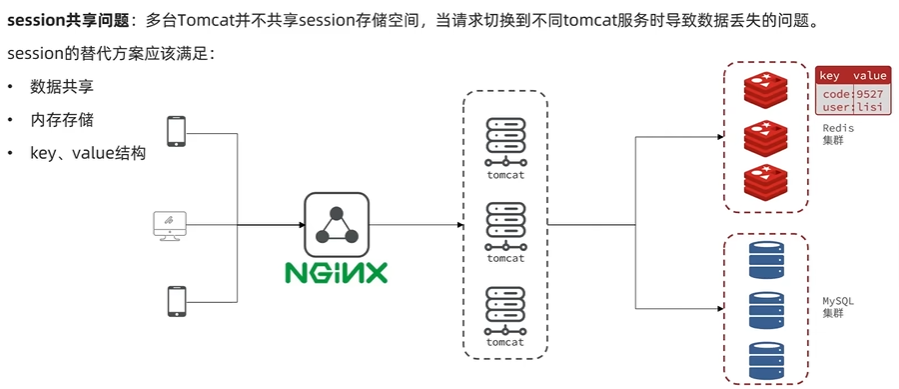
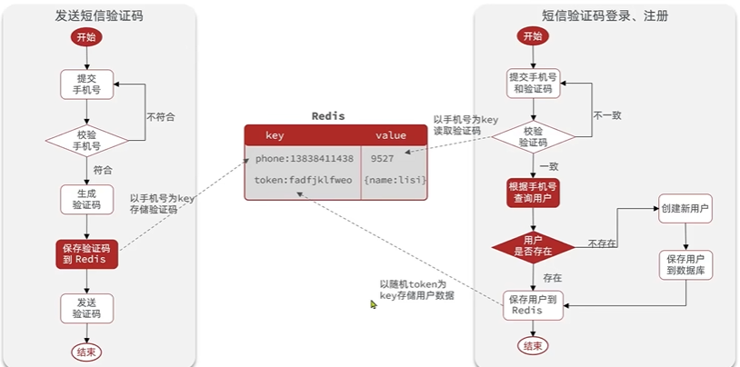
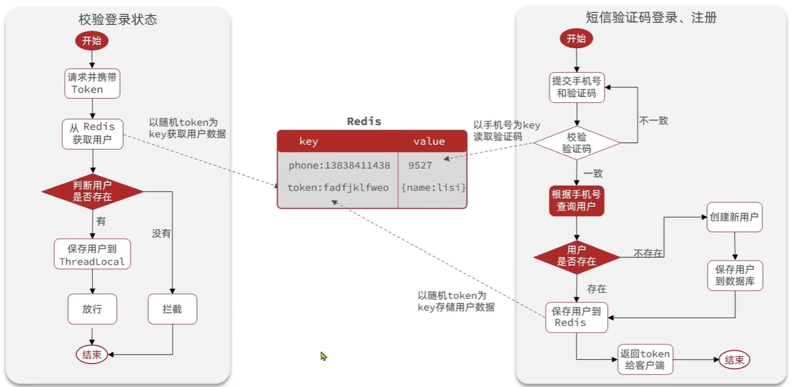
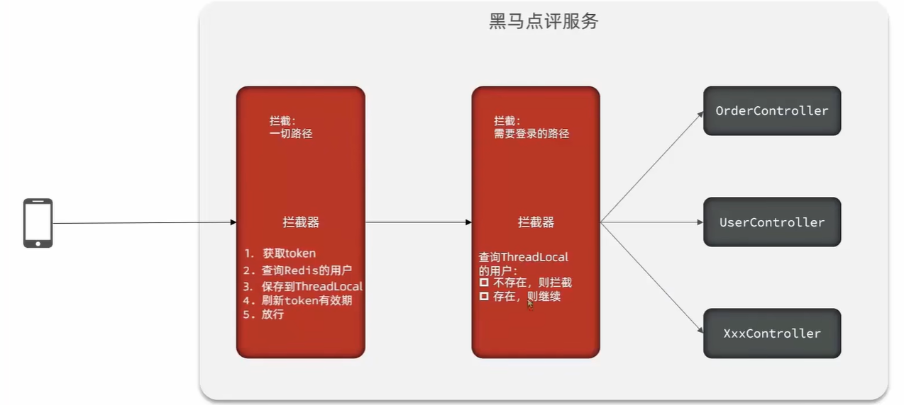

# 短信登录

## 概述

短信验证码登录是现代Web应用中最常见的身份认证方式之一。相比传统的用户名密码登录，短信登录具有更好的安全性和用户体验：用户无需记忆复杂密码，只需输入手机号和验证码即可快速登录，同时手机号还能作为找回账号的重要凭证。

**本文学习路径**：

本文将从最基础的 Session 登录开始，逐步演进到适应分布式环境的 Redis 方案，帮助你理解身份认证技术在实际项目中的应用和优化：

1. **基于 Session 的登录实现**：掌握传统的 Session 登录流程
2. **集群环境的挑战**：理解 Session 共享问题的本质
3. **Redis 方案实战**：学习如何使用 Redis 解决分布式认证
4. **活跃续期机制**：实现用户体验优化
5. **双拦截器架构**：掌握责任链模式在实际项目中的应用

通过本文的学习，你不仅能掌握短信登录的完整实现，还能理解从单体到分布式架构演进过程中的技术选型和权衡。

## Web 身份认证技术演进

| 阶段       | 核心技术          | 解决问题         | 本文涉及 |
| -------- | ------------- | ------------ | ---- |
| 早期 Web   | HTTP 无状态      | 简单文档传输       |      |
| 1990s    | Cookie        | 客户端保存状态      |      |
| 1995+    | **Session**   | 安全保存用户状态     | ✓    |
| 2000+    | 分布式 Session   | 解决集群问题       | ✓    |
| 2010+    | **Token**     | 适应移动端和 API   | ✓    |
| 2010+    | JWT           | 无状态身份验证      |      |
| 2012+    | OAuth2/OIDC   | 第三方登录和统一身份   |      |
| 2020+    | Passkey       | 替代密码（无密码认证）  |      |

::: tip 为什么从 Session 学起？

虽然现代应用倾向于使用 Token/JWT，但从 Session 开始学习有以下优势：

1. **渐进式理解**：Session 是最经典的会话管理方式，理解 Session 的原理和局限性，才能更好地理解为什么需要 Token
2. **对比学习**：通过对比 Session 和 Redis 方案的实现差异，加深对分布式认证的理解
3. **实际需求**：许多传统项目仍在使用 Session，掌握如何将其改造为 Redis 方案是实际的技能需求
4. **技术演进**：了解技术的演进过程，有助于在实际项目中做出合理的技术选型

本文重点讲解 **Session → Redis Session 共享 → Token** 这一演进路径，并在文末对比其他方案（JWT、OAuth2）。

:::

## 基于 Session 实现登录


### 发送短信验证码

发送验证码是登录流程的第一步，主要负责生成并发送验证码到用户手机，同时将验证码保存到 Session 中供后续校验使用。


#### 代码实现

**Controller层**

```java
@RestController
@RequestMapping("/user")
@Slf4j
public class UserController {

    @Resource
    private IUserService userService;

    /**
     * 发送短信验证码
     */
    @PostMapping("/code")
    public Result sendCode(@RequestParam("phone") String phone, HttpSession session) {
        return userService.sendCode(phone, session);
    }
}
```

**Service接口**

```java
public interface IUserService {
    Result sendCode(String phone, HttpSession session);
}
```

**Service实现**

```java
@Service
@Slf4j
public class UserServiceImpl implements IUserService {

    @Override
    public Result sendCode(String phone, HttpSession session) {
        // 1. 校验手机号
        if (RegexUtils.isPhoneInvalid(phone)) {
            // 2. 如果不符合，返回错误信息
            return Result.fail("手机号格式错误");
        }

        // 3. 符合，生成验证码
        String code = RandomUtil.randomNumbers(6);

        // 4. 保存验证码到 session
        session.setAttribute("code", code);

        // 5. 发送验证码（这里模拟发送，实际需要调用短信服务）
        log.debug("发送短信验证码成功，验证码: {}", code);

        // 6. 返回 ok
        return Result.ok();
    }
}
```

**工具类实现**

```java
public class RegexUtils {
    /**
     * 校验手机号是否符合规范
     */
    public static boolean isPhoneInvalid(String phone) {
        return mismatch(phone, RegexPatterns.PHONE_REGEX);
    }

    /**
     * 校验是否不符合正则格式
     */
    private static boolean mismatch(String str, String regex) {
        if (StrUtil.isBlank(str)) {
            return true;
        }
        return !str.matches(regex);
    }
}

public class RegexPatterns {
    /**
     * 手机号正则
     */
    public static final String PHONE_REGEX = "^1[3-9]\\d{9}$";
}
```

**统一返回结果封装**

```java
@Data
@NoArgsConstructor
@AllArgsConstructor
public class Result {
    private Boolean success;
    private String errorMsg;
    private Object data;
    private Long total;

    public static Result ok() {
        return new Result(true, null, null, null);
    }

    public static Result ok(Object data) {
        return new Result(true, null, data, null);
    }

    public static Result fail(String errorMsg) {
        return new Result(false, errorMsg, null, null);
    }
}
```

### 实现短信验证码登录、注册功能

用户输入手机号和验证码后，系统需要完成验证码校验、用户查询、自动注册（如果用户不存在）以及Session登录等一系列操作。


#### 代码实现

**Controller层**

```java
@RestController
@RequestMapping("/user")
@Slf4j
public class UserController {

    @Resource
    private IUserService userService;

    /**
     * 短信验证码登录
     */
    @PostMapping("/login")
    public Result login(@RequestBody LoginFormDTO loginForm, HttpSession session) {
        return userService.login(loginForm, session);
    }
}
```

**LoginFormDTO**

```java
@Data
public class LoginFormDTO {
    private String phone;
    private String code;
}
```

**Service实现**

```java
@Service
@Slf4j
public class UserServiceImpl extends ServiceImpl<UserMapper, User> implements IUserService {

    @Override
    public Result login(LoginFormDTO loginForm, HttpSession session) {
        // 1. 校验手机号
        String phone = loginForm.getPhone();
        if (RegexUtils.isPhoneInvalid(phone)) {
            return Result.fail("手机号格式错误");
        }

        // 2. 校验验证码
        String cacheCode = (String) session.getAttribute("code");
        String code = loginForm.getCode();
        if (cacheCode == null || !cacheCode.equals(code)) {
            return Result.fail("验证码错误");
        }

        // 3. 根据手机号查询用户
        User user = query().eq("phone", phone).one();

        // 4. 判断用户是否存在
        if (user == null) {
            // 5. 不存在，创建新用户并保存
            user = createUserWithPhone(phone);
        }

        // 6. 保存用户信息到 session 中
        session.setAttribute("user", user);

        return Result.ok();
    }

    private User createUserWithPhone(String phone) {
        User user = new User();
        user.setPhone(phone);
        user.setNickName("user_" + RandomUtil.randomString(10));
        save(user);
        return user;
    }
}
```

**User实体类**

```java
@Data
@TableName("tb_user")
public class User {
    @TableId(type = IdType.AUTO)
    private Long id;
    private String phone;
    private String password;
    private String nickName;
    private String icon;
    private LocalDateTime createTime;
    private LocalDateTime updateTime;
}
```

### 登录验证功能

在完成登录后，需要对后续请求进行登录状态校验。通过拦截器统一处理登录验证逻辑，使用 [ThreadLocal](/posts/thread-local.md) 保存当前用户信息，避免在每个接口中重复编写校验代码。


#### 代码实现

**ThreadLocal工具类**

```java
public class UserHolder {
    private static final ThreadLocal<User> tl = new ThreadLocal<>();

    public static void saveUser(User user) {
        tl.set(user);
    }

    public static User getUser() {
        return tl.get();
    }

    public static void removeUser() {
        tl.remove();
    }
}
```

**登录拦截器**

```java
@Slf4j
public class LoginInterceptor implements HandlerInterceptor {

    @Override
    public boolean preHandle(HttpServletRequest request, HttpServletResponse response, Object handler) throws Exception {
        // 1. 获取 session
        HttpSession session = request.getSession();

        // 2. 获取 session 中的用户
        User user = (User) session.getAttribute("user");

        // 3. 判断用户是否存在
        if (user == null) {
            // 4. 不存在，拦截，返回 401 状态码
            response.setStatus(401);
            return false;
        }

        // 5. 存在，保存用户信息到 ThreadLocal
        UserHolder.saveUser(user);

        // 6. 放行
        return true;
    }

    @Override
    public void afterCompletion(HttpServletRequest request, HttpServletResponse response, Object handler, Exception ex) throws Exception {
        // 移除用户，避免内存泄漏
        UserHolder.removeUser();
    }
}
```

**拦截器配置**

```java
@Configuration
public class MvcConfig implements WebMvcConfigurer {

    @Override
    public void addInterceptors(InterceptorRegistry registry) {
        registry.addInterceptor(new LoginInterceptor())
                .excludePathPatterns(
                        "/user/code",     // 发送验证码
                        "/user/login",    // 登录
                        "/shop/**",       // 商铺相关（示例）
                        "/shop-type/**",  // 商铺类型（示例）
                        "/upload/**",     // 文件上传（示例）
                        "/voucher/**"     // 优惠券（示例）
                );
    }
}
```

**在Controller中使用**

```java
@RestController
@RequestMapping("/user")
public class UserController {

    /**
     * 获取当前登录用户信息
     */
    @GetMapping("/me")
    public Result me() {
        // 从 ThreadLocal 中获取当前用户
        User user = UserHolder.getUser();
        return Result.ok(user);
    }
}
```

::: tip 为什么要分离 login 和 me 接口？

**职责分离**
- `/user/login`：负责身份认证，校验凭证并创建登录状态
- `/user/me`：负责获取当前登录用户信息

**实际意义**

1. **安全性**：login 只在认证时提交敏感信息，me 接口仅依赖已建立的登录状态，避免重复传输密码、验证码

2. **性能**：me 直接从 Session/ThreadLocal 读取，无需重复校验和查库

3. **使用场景**：login 用于建立身份（调用一次），me 用于获取信息（可多次调用，如页面刷新、状态恢复）

4. **符合 RESTful 规范**：POST 创建会话，GET 查询资源

:::

### 隐藏用户敏感信息

在前面的实现中，我们直接将完整的 `User` 对象保存到 Session 并返回给前端。但 `User` 实体类包含了所有数据库字段，其中部分字段属于敏感信息，不应该暴露给客户端。

**存在的安全问题**：

当前代码中，`/user/me` 接口直接返回完整的 User 对象：

```java
@GetMapping("/me")
public Result me() {
    User user = UserHolder.getUser();
    return Result.ok(user);  // 直接返回完整对象
}
```

返回的数据可能包含：
- `password`：用户密码（即使加密后也不应返回）
- `phone`：完整手机号
- `createTime`、`updateTime`：内部时间戳

**解决方案**：创建 UserDTO 只返回必要信息

#### 代码实现

**创建 UserDTO 类**

```java
@Data
public class UserDTO {
    private Long id;
    private String nickName;
    private String icon;
}
```

**修改 Service 层**

在用户登录时，只保存必要信息到 Session：

```java
@Override
public Result login(LoginFormDTO loginForm, HttpSession session) {
    // ... 前面的校验和用户查询逻辑 ...

    // 6. 保存用户信息到 session 中（使用 DTO）
    UserDTO userDTO = BeanUtil.copyProperties(user, UserDTO.class);
    session.setAttribute("user", userDTO);

    return Result.ok();
}
```

**修改拦截器**

```java
@Override
public boolean preHandle(HttpServletRequest request, HttpServletResponse response, Object handler) throws Exception {
    HttpSession session = request.getSession();

    // 获取 session 中的用户（现在是 UserDTO）
    UserDTO user = (UserDTO) session.getAttribute("user");

    if (user == null) {
        response.setStatus(401);
        return false;
    }

    UserHolder.saveUser(user);
    return true;
}
```

**修改 UserHolder 工具类**

```java
public class UserHolder {
    private static final ThreadLocal<UserDTO> tl = new ThreadLocal<>();

    public static void saveUser(UserDTO user) {
        tl.set(user);
    }

    public static UserDTO getUser() {
        return tl.get();
    }

    public static void removeUser() {
        tl.remove();
    }
}
```

**修改 Controller**

```java
@GetMapping("/me")
public Result me() {
    // 返回的是 UserDTO，只包含必要信息
    UserDTO user = UserHolder.getUser();
    return Result.ok(user);
}
```

::: tip 数据安全最佳实践
1. **最小化原则**：只返回前端必需的数据
2. **敏感字段脱敏**：手机号可以显示为 `138****1234`
3. **分层隔离**：Entity 用于数据库操作，DTO 用于数据传输
4. **字段白名单**：明确列出可返回字段，而非黑名单排除
:::

## 集群的 Session 共享问题

在单体应用中，基于 Session 的登录方案运行良好。但当应用部署为集群时，会遇到 Session 数据无法共享的问题。

### 问题场景



在集群环境下，通常会使用 Nginx 等负载均衡器将请求分发到不同的 Tomcat 服务器：

1. **登录请求**：用户在 Tomcat1 上完成登录，Session 数据保存在 Tomcat1 的内存中
2. **后续请求**：Nginx 将下一次请求分发到 Tomcat2，但 Tomcat2 的内存中没有该用户的 Session
3. **认证失败**：Tomcat2 认为用户未登录，拒绝访问

**核心问题**：Session 数据只存在于单个 Tomcat 的内存中，无法在多个服务器之间共享。

### 解决方案对比

| 方案             | 实现方式                | 优点     | 缺点              |
| -------------- | ------------------- | ------ | --------------- |
| Session 粘性    | Nginx 绑定用户到固定服务器   | 简单     | 负载不均衡，单点故障      |
| Session 复制    | Tomcat 间同步 Session  | 无需改代码  | 性能差，数据延迟        |
| Session 集中存储 | 使用 Redis 等外部存储     | 性能好，扩展性强 | 需要改代码，增加依赖      |

**推荐方案**：使用 Redis 实现 Session 集中存储，这是目前主流的解决方案。

::: tip 其他分布式认证方案

除了 Redis Session 共享，还可以考虑以下方案：

**JWT (JSON Web Token)**
- **原理**：将用户信息加密后存储在客户端，服务端无状态验证
- **优点**：完全无状态，天然支持分布式，减轻服务端存储压力
- **缺点**：Token 无法主动失效，续期机制复杂，Token 体积较大
- **适用场景**：微服务架构、跨域认证、移动端 APP

**OAuth 2.0 / OpenID Connect**
- **原理**：统一认证中心，颁发访问令牌
- **优点**：支持第三方登录，单点登录（SSO）
- **适用场景**：企业级应用、多系统集成

本文以 Redis Session 共享为例，因为它对现有 Session 代码改动最小，适合学习和快速迁移。

:::

## 基于 Redis 实现 Session 共享登录

使用 Redis 替代 Tomcat 内置的 Session 存储，将用户登录信息保存到独立的 Redis 服务器中。所有 Tomcat 实例共享同一个 Redis，从而实现 Session 数据的集群共享。

### 实现流程

**发送验证码流程**



**登录认证流程**



### 发送短信验证码

相比前面的 Session 方案，Redis 方案的主要改动：

1. **存储位置变化**：验证码从 Session 改为保存到 Redis 中
2. **Key 设计**：使用 `login:code:{phone}` 作为 Redis Key
3. **有效期控制**：通过 Redis TTL 设置验证码过期时间（如 5 分钟）

#### 代码实现

**Redis 常量类**

```java
public class RedisConstants {
    public static final String LOGIN_CODE_KEY = "login:code:";
    public static final Long LOGIN_CODE_TTL = 5L;
}
```

**Service 实现**

```java
@Service
@Slf4j
public class UserServiceImpl implements IUserService {

    @Resource
    private StringRedisTemplate stringRedisTemplate;

    @Override
    public Result sendCode(String phone, HttpSession session) {
        // 1. 校验手机号
        if (RegexUtils.isPhoneInvalid(phone)) {
            return Result.fail("手机号格式错误");
        }

        // 2. 生成验证码
        String code = RandomUtil.randomNumbers(6);

        // 3. 保存验证码到 Redis，设置有效期 5 分钟
        stringRedisTemplate.opsForValue().set(
            RedisConstants.LOGIN_CODE_KEY + phone,
            code,
            RedisConstants.LOGIN_CODE_TTL,
            TimeUnit.MINUTES
        );

        // 4. 发送验证码（这里模拟发送）
        log.debug("发送短信验证码成功，验证码: {}", code);

        return Result.ok();
    }
}
```

**关键变化对比**

| 变化点    | Session 方案                       | Redis 方案                                                  |
| ------ | -------------------------------- | --------------------------------------------------------- |
| 依赖注入   | `HttpSession session`            | `StringRedisTemplate stringRedisTemplate`                 |
| 保存验证码  | `session.setAttribute("code", code)` | `stringRedisTemplate.opsForValue().set(key, code, ttl, unit)` |
| 有效期管理  | Tomcat 自动管理（通常 30 分钟）            | 手动设置 TTL（5 分钟）                                            |
| Key 设计 | 固定的 "code"                       | `login:code:{phone}`，按手机号隔离                               |


### 短信验证码登录、注册功能

用户输入手机号和验证码后，系统需要从 Redis 校验验证码，完成用户查询和自动注册，最后生成 Token 并将用户信息保存到 Redis 中。

#### 实现思路

相比 Session 方案，Redis 方案的核心变化：

1. **验证码校验**：从 Redis 中获取验证码进行校验，而不是从 Session
2. **用户标识**：生成随机 Token（如 UUID）作为用户标识，替代 JSESSIONID
3. **用户存储**：使用 Redis Hash 结构保存用户信息
   - Key：`login:token:{token}`
   - Value：Hash 结构存储 UserDTO 的字段（id、nickName、icon）
4. **Token 返回**：将 Token 返回给客户端，客户端在后续请求中携带

#### 代码实现

**Redis 常量类补充**

```java
public class RedisConstants {
    public static final String LOGIN_CODE_KEY = "login:code:";
    public static final Long LOGIN_CODE_TTL = 5L;

    public static final String LOGIN_USER_KEY = "login:token:";
    public static final Long LOGIN_USER_TTL = 30L;
}
```

**Service 实现**

```java
@Service
@Slf4j
public class UserServiceImpl extends ServiceImpl<UserMapper, User> implements IUserService {

    @Resource
    private StringRedisTemplate stringRedisTemplate;

    @Override
    public Result login(LoginFormDTO loginForm, HttpSession session) {
        // 1. 校验手机号
        String phone = loginForm.getPhone();
        if (RegexUtils.isPhoneInvalid(phone)) {
            return Result.fail("手机号格式错误");
        }

        // 2. 从 Redis 获取验证码并校验
        String cacheCode = stringRedisTemplate.opsForValue()
                .get(RedisConstants.LOGIN_CODE_KEY + phone);
        String code = loginForm.getCode();
        if (cacheCode == null || !cacheCode.equals(code)) {
            return Result.fail("验证码错误");
        }

        // 3. 根据手机号查询用户
        User user = query().eq("phone", phone).one();

        // 4. 判断用户是否存在
        if (user == null) {
            // 5. 不存在，创建新用户
            user = createUserWithPhone(phone);
        }

        // 6. 保存用户信息到 Redis
        // 6.1 生成随机 token
        String token = UUID.randomUUID().toString(true);

        // 6.2 将 User 转为 UserDTO（隐藏敏感信息）
        UserDTO userDTO = BeanUtil.copyProperties(user, UserDTO.class);

        // 6.3 将 UserDTO 转为 HashMap（StringRedisTemplate 要求 String 类型）
        Map<String, Object> userMap = BeanUtil.beanToMap(userDTO, new HashMap<>(),
                CopyOptions.create()
                        .setIgnoreNullValue(true)
                        .setFieldValueEditor((fieldName, fieldValue) -> fieldValue.toString()));

        // 6.4 存储到 Redis Hash 结构
        String tokenKey = RedisConstants.LOGIN_USER_KEY + token;
        stringRedisTemplate.opsForHash().putAll(tokenKey, userMap);

        // 6.5 设置 token 有效期
        stringRedisTemplate.expire(tokenKey, RedisConstants.LOGIN_USER_TTL, TimeUnit.MINUTES);

        // 7. 返回 token 给客户端
        return Result.ok(token);
    }

    private User createUserWithPhone(String phone) {
        User user = new User();
        user.setPhone(phone);
        user.setNickName("user_" + RandomUtil.randomString(10));
        save(user);
        return user;
    }
}
```

**关键变化对比**

| 变化点      | Session 方案                                      | Redis 方案                                                        |
| -------- | ----------------------------------------------- | -------------------------------------------------------------- |
| 验证码获取    | `session.getAttribute("code")`                  | `stringRedisTemplate.opsForValue().get(key)`                   |
| 用户标识     | JSESSIONID（自动生成）                                | UUID Token（手动生成）                                               |
| 用户信息存储   | `session.setAttribute("user", userDTO)`         | `stringRedisTemplate.opsForHash().putAll(tokenKey, userMap)`   |
| 数据结构     | Java 对象                                         | Redis Hash（字段值必须是 String）                                      |
| 有效期设置    | Tomcat 默认管理                                     | `stringRedisTemplate.expire(tokenKey, ttl, unit)`              |
| Token 返回 | 无需返回（Cookie 自动携带）                              | `Result.ok(token)`（客户端需保存）                                     |

::: tip 为什么使用 Hash 结构？

**Hash vs String**

- **String 结构**：`set login:token:xxx "{\"id\":1,\"nickName\":\"张三\"}"`
  - 优点：存储简单
  - 缺点：修改单个字段需要反序列化整个对象

- **Hash 结构**：`hset login:token:xxx id 1 nickName 张三`
  - 优点：可以单独修改某个字段（如 `hset key nickName 李四`）
  - 缺点：所有字段值必须是 String 类型

**字段值转 String 的处理**

```java
BeanUtil.beanToMap(userDTO, new HashMap<>(),
    CopyOptions.create()
        .setFieldValueEditor((fieldName, fieldValue) -> fieldValue.toString())
);
```

这段代码确保 UserDTO 的所有字段（包括 Long 类型的 id）都转为 String，满足 Hash 结构的要求。

:::

### 登录验证与活跃续期

用户登录成功后，后续的每个请求都需要验证用户身份。在 Redis 方案中，我们通过拦截器从请求头获取 Token，根据 Token 从 Redis 获取用户信息，同时实现活跃续期机制。

::: tip 活跃续期机制

**Session 的自动续期**

Tomcat 的 Session 自动实现了续期机制：
- 每次用户访问时，Tomcat 会自动更新 Session 的 `lastAccessedTime`（最后访问时间）
- Session 的超时判断基于"距离最后访问的时间"，而非"距离创建的时间"
- 例如：Session 超时设置为 30 分钟，用户在第 25 分钟访问了一次，那么超时时间会重置，再过 30 分钟后才会过期

这个机制由 Tomcat 容器自动完成，开发者无需编写任何代码。

**Redis 方案需要手动续期**

但在 Redis 方案中，我们使用的是 Redis 的 TTL（Time To Live）机制：
- TTL 是从设置的那一刻开始倒计时，不会自动更新
- 如果不手动刷新，用户在第 25 分钟访问时，Redis 中的数据依然会在第 30 分钟过期
- 因此需要在拦截器中主动调用 `expire` 命令刷新 TTL

所以我们需要在代码中模拟 Session 的自动续期行为，每次用户访问时刷新 Redis 中用户信息的 TTL。

:::

#### 实现思路

**核心流程**：

1. 从请求头（如 `authorization`）获取 Token
2. 根据 Token 从 Redis 获取用户信息
3. 如果用户存在，保存到 ThreadLocal 并**刷新 TTL**（活跃续期）
4. 如果用户不存在，拦截请求返回 401

#### 代码实现

**拦截器实现**

```java
@Slf4j
public class LoginInterceptor implements HandlerInterceptor {

    private StringRedisTemplate stringRedisTemplate;

    public LoginInterceptor(StringRedisTemplate stringRedisTemplate) {
        this.stringRedisTemplate = stringRedisTemplate;
    }

    @Override
    public boolean preHandle(HttpServletRequest request, HttpServletResponse response, Object handler) throws Exception {
        // 1. 获取请求头中的 token
        String token = request.getHeader("authorization");
        if (StrUtil.isBlank(token)) {
            // 不存在，拦截
            response.setStatus(401);
            return false;
        }

        // 2. 基于 token 从 Redis 获取用户信息
        String tokenKey = RedisConstants.LOGIN_USER_KEY + token;
        Map<Object, Object> userMap = stringRedisTemplate.opsForHash().entries(tokenKey);

        // 3. 判断用户是否存在
        if (userMap.isEmpty()) {
            // 不存在，拦截
            response.setStatus(401);
            return false;
        }

        // 4. 将 HashMap 转为 UserDTO 对象
        UserDTO userDTO = BeanUtil.fillBeanWithMap(userMap, new UserDTO(), false);

        // 5. 保存用户信息到 ThreadLocal
        UserHolder.saveUser(userDTO);

        // 6. 刷新 token 有效期（活跃续期）
        stringRedisTemplate.expire(tokenKey, RedisConstants.LOGIN_USER_TTL, TimeUnit.MINUTES);

        // 7. 放行
        return true;
    }

    @Override
    public void afterCompletion(HttpServletRequest request, HttpServletResponse response, Object handler, Exception ex) throws Exception {
        // 移除用户，避免内存泄漏
        UserHolder.removeUser();
    }
}
```

**拦截器配置**

```java
@Configuration
public class MvcConfig implements WebMvcConfigurer {

    @Resource
    private StringRedisTemplate stringRedisTemplate;

    @Override
    public void addInterceptors(InterceptorRegistry registry) {
        registry.addInterceptor(new LoginInterceptor(stringRedisTemplate))
                .excludePathPatterns(
                        "/user/code",     // 发送验证码
                        "/user/login",    // 登录
                        "/shop/**",       // 商铺相关
                        "/shop-type/**",  // 商铺类型
                        "/upload/**",     // 文件上传
                        "/voucher/**"     // 优惠券
                );
    }
}
```

#### 关键变化对比

| 变化点        | Session 方案                               | Redis 方案                                                   |
| ---------- | ---------------------------------------- | ---------------------------------------------------------- |
| Token 获取   | 自动获取（通过 Cookie）                         | 从请求头手动获取：`request.getHeader("authorization")`            |
| 用户信息获取     | `session.getAttribute("user")`           | `stringRedisTemplate.opsForHash().entries(tokenKey)`       |
| 数据转换       | 无需转换（直接是对象）                            | HashMap 转 UserDTO：`BeanUtil.fillBeanWithMap()`            |
| 活跃续期       | Tomcat 自动续期                             | 手动刷新 TTL：`stringRedisTemplate.expire(tokenKey, ttl, unit)` |
| 拦截器构造函数    | 无需注入依赖                                 | 需要注入 `StringRedisTemplate`                                |
| 不存在时的处理    | 返回 401                                  | 返回 401（逻辑相同）                                              |

::: tip 为什么拦截器需要注入 StringRedisTemplate？

拦截器不是 Spring Bean，不能直接使用 `@Resource` 注入依赖。因此需要：

1. **构造函数注入**：在拦截器类中定义构造函数接收依赖
2. **配置类中创建**：在 `MvcConfig` 中使用 `new LoginInterceptor(stringRedisTemplate)` 创建实例并传入依赖

```java
// 拦截器中接收依赖
public LoginInterceptor(StringRedisTemplate stringRedisTemplate) {
    this.stringRedisTemplate = stringRedisTemplate;
}

// 配置类中注入并传递
@Resource
private StringRedisTemplate stringRedisTemplate;

registry.addInterceptor(new LoginInterceptor(stringRedisTemplate))
```

:::

::: tip 活跃续期的性能考虑

**续期频率问题**

如果用户频繁访问，每次请求都刷新 TTL 会增加 Redis 压力。优化方案：

**方案一：时间阈值续期**
```java
// 只有当剩余时间少于一半时才续期
Long ttl = stringRedisTemplate.getExpire(tokenKey, TimeUnit.MINUTES);
if (ttl != null && ttl < RedisConstants.LOGIN_USER_TTL / 2) {
    stringRedisTemplate.expire(tokenKey, RedisConstants.LOGIN_USER_TTL, TimeUnit.MINUTES);
}
```

**方案二：固定间隔续期**
```java
// 使用 Redis 的 EXPIRE NX（仅在无过期时间时设置）或在应用层控制
// 例如：记录上次续期时间，间隔 5 分钟才续期一次
```

根据业务场景选择：
- 用户量小、并发低：每次都续期（实现简单）
- 用户量大、并发高：使用时间阈值或固定间隔续期（减少 Redis 压力）

:::


### 登录拦截器的优化

前面实现的拦截器存在一个问题：只有访问需要登录的路径时才会刷新 Token。如果用户一直在访问公开路径（如首页、商品列表），即使用户在线，Token 也会过期。

#### 优化方案：双拦截器架构



**设计思路**：

将原来的单一拦截器拆分为两个拦截器，职责分离：

1. **Token 刷新拦截器**（RefreshTokenInterceptor）
   - 拦截所有路径（包括公开路径）
   - 如果请求携带 Token，则刷新用户信息到 ThreadLocal 并刷新 TTL
   - 不做登录校验，即使 Token 不存在也放行

2. **登录校验拦截器**（LoginInterceptor）
   - 只拦截需要登录的路径
   - 检查 ThreadLocal 中是否有用户信息
   - 如果没有用户信息，则拦截并返回 401

**优势**：

- 用户访问任何路径（包括公开路径）都会刷新 Token，提升用户体验
- 职责分离，代码更清晰
- 登录校验拦截器变得更简单（只需检查 ThreadLocal）

#### 代码实现

**Token 刷新拦截器**

```java
@Slf4j
public class RefreshTokenInterceptor implements HandlerInterceptor {

    private StringRedisTemplate stringRedisTemplate;

    public RefreshTokenInterceptor(StringRedisTemplate stringRedisTemplate) {
        this.stringRedisTemplate = stringRedisTemplate;
    }

    @Override
    public boolean preHandle(HttpServletRequest request, HttpServletResponse response, Object handler) throws Exception {
        // 1. 获取请求头中的 token
        String token = request.getHeader("authorization");
        if (StrUtil.isBlank(token)) {
            // Token 不存在，直接放行（由登录拦截器判断是否需要拦截）
            return true;
        }

        // 2. 基于 token 从 Redis 获取用户信息
        String tokenKey = RedisConstants.LOGIN_USER_KEY + token;
        Map<Object, Object> userMap = stringRedisTemplate.opsForHash().entries(tokenKey);

        // 3. 判断用户是否存在
        if (userMap.isEmpty()) {
            // 用户不存在，直接放行（由登录拦截器判断是否需要拦截）
            return true;
        }

        // 4. 将 HashMap 转为 UserDTO 对象
        UserDTO userDTO = BeanUtil.fillBeanWithMap(userMap, new UserDTO(), false);

        // 5. 保存用户信息到 ThreadLocal
        UserHolder.saveUser(userDTO);

        // 6. 刷新 token 有效期
        stringRedisTemplate.expire(tokenKey, RedisConstants.LOGIN_USER_TTL, TimeUnit.MINUTES);

        // 7. 放行
        return true;
    }

    @Override
    public void afterCompletion(HttpServletRequest request, HttpServletResponse response, Object handler, Exception ex) throws Exception {
        // 移除用户
        UserHolder.removeUser();
    }
}
```

**登录校验拦截器（简化版）**

```java
@Slf4j
public class LoginInterceptor implements HandlerInterceptor {

    @Override
    public boolean preHandle(HttpServletRequest request, HttpServletResponse response, Object handler) throws Exception {
        // 判断 ThreadLocal 中是否有用户
        if (UserHolder.getUser() == null) {
            // 没有用户，拦截
            response.setStatus(401);
            return false;
        }
        // 有用户，放行
        return true;
    }
}
```

**拦截器配置**

```java
@Configuration
public class MvcConfig implements WebMvcConfigurer {

    @Resource
    private StringRedisTemplate stringRedisTemplate;

    @Override
    public void addInterceptors(InterceptorRegistry registry) {
        // Token 刷新拦截器（拦截所有路径，order = 0）
        registry.addInterceptor(new RefreshTokenInterceptor(stringRedisTemplate))
                .addPathPatterns("/**")
                .order(0);

        // 登录校验拦截器（拦截需要登录的路径，order = 1）
        registry.addInterceptor(new LoginInterceptor())
                .excludePathPatterns(
                        "/user/code",     // 发送验证码
                        "/user/login",    // 登录
                        "/shop/**",       // 商铺相关
                        "/shop-type/**",  // 商铺类型
                        "/upload/**",     // 文件上传
                        "/voucher/**"     // 优惠券
                )
                .order(1);
    }
}
```

#### 优化前后对比

| 对比项      | 优化前（单拦截器）                 | 优化后（双拦截器）                        |
| -------- | ------------------------- | -------------------------------- |
| 拦截器数量    | 1个                        | 2个（Token刷新 + 登录校验）               |
| Token刷新  | 仅访问需要登录的路径时刷新           | 访问任何路径都刷新（如果携带Token）            |
| 用户体验     | 访问公开路径不刷新，可能导致Token过期    | 访问任何路径都刷新，用户体验更好                 |
| 登录校验拦截器  | 需要处理Token获取、Redis查询、TTL刷新 | 只需检查ThreadLocal，逻辑简单              |
| 职责划分     | 单一拦截器职责过多                | 职责分离，Token刷新和登录校验各司其职            |

::: tip 拦截器执行顺序

Spring MVC 拦截器按 `order` 值从小到大执行：

1. **order = 0**：RefreshTokenInterceptor 先执行，将用户信息放入 ThreadLocal
2. **order = 1**：LoginInterceptor 后执行，从 ThreadLocal 判断是否有用户

如果不设置 `order`，拦截器的执行顺序取决于注册顺序，可能导致逻辑错误。

:::

::: tip 设计模式：责任链模式

双拦截器架构体现了**责任链模式（Chain of Responsibility Pattern）**。

**什么是责任链模式？**

责任链模式是一种行为设计模式，它将请求沿着处理者链进行传递，每个处理者都可以决定：
- 处理该请求并继续传递
- 处理该请求并终止传递
- 不处理直接传递给下一个处理者

**在双拦截器中的体现**：

1. **处理链**：请求按顺序经过 RefreshTokenInterceptor → LoginInterceptor
2. **职责分离**：
   - RefreshTokenInterceptor：负责Token刷新，总是放行（return true）
   - LoginInterceptor：负责登录校验，决定是否拦截（return true/false）
3. **灵活扩展**：可以轻松添加更多拦截器（如日志拦截器、权限拦截器）而不影响现有代码

**其他设计原则**：

- **单一职责原则（SRP）**：每个拦截器只负责一件事
- **开闭原则（OCP）**：对扩展开放（可添加新拦截器），对修改封闭（不需要修改现有拦截器）

Spring MVC 的拦截器机制本身就是责任链模式的经典实现。

:::
