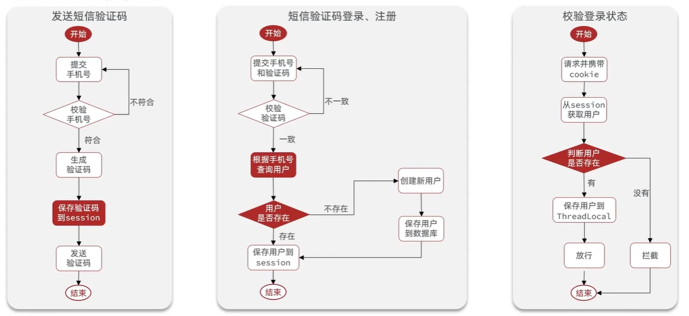
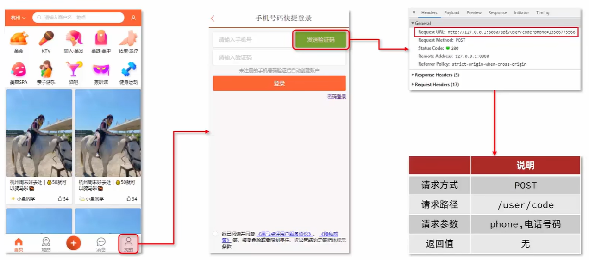
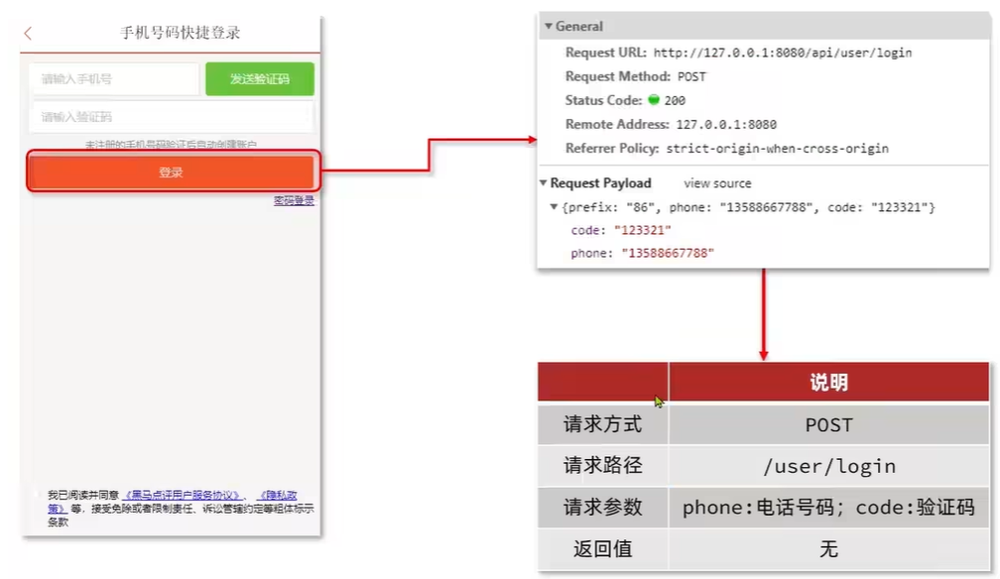
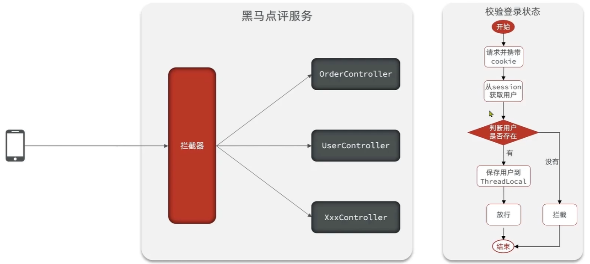

# 短信登录

## Web 身份认证技术演进

| 阶段     | 核心技术        | 解决问题       |
| ------ | ----------- | ---------- |
| 早期 Web | HTTP 无状态    | 简单文档传输     |
| 1990s  | Cookie      | 客户端保存状态    |
| 1995+  | Session     | 安全保存用户状态   |
| 2000+  | 分布式 Session | 解决集群问题     |
| 2010+  | Token       | 适应移动端和 API |
| 2010+  | JWT         | 无状态身份验证    |
| 2012+  | OAuth2/OIDC | 第三方登录和统一身份 |
| 2020+  | Passkey     | 替代密码       |

## 基于 Session 实现登录



### 发送短信验证码

发送验证码是登录流程的第一步，主要负责生成并发送验证码到用户手机，同时将验证码保存到 Session 中供后续校验使用。



#### 代码实现

**Controller层**

```java
@RestController
@RequestMapping("/user")
@Slf4j
public class UserController {

    @Resource
    private IUserService userService;

    /**
     * 发送短信验证码
     */
    @PostMapping("/code")
    public Result sendCode(@RequestParam("phone") String phone, HttpSession session) {
        return userService.sendCode(phone, session);
    }
}
```

**Service接口**

```java
public interface IUserService {
    Result sendCode(String phone, HttpSession session);
}
```

**Service实现**

```java
@Service
@Slf4j
public class UserServiceImpl implements IUserService {

    @Override
    public Result sendCode(String phone, HttpSession session) {
        // 1. 校验手机号
        if (RegexUtils.isPhoneInvalid(phone)) {
            // 2. 如果不符合，返回错误信息
            return Result.fail("手机号格式错误");
        }

        // 3. 符合，生成验证码
        String code = RandomUtil.randomNumbers(6);

        // 4. 保存验证码到 session
        session.setAttribute("code", code);

        // 5. 发送验证码（这里模拟发送，实际需要调用短信服务）
        log.debug("发送短信验证码成功，验证码: {}", code);

        // 6. 返回 ok
        return Result.ok();
    }
}
```

**工具类实现**

```java
public class RegexUtils {
    /**
     * 校验手机号是否符合规范
     */
    public static boolean isPhoneInvalid(String phone) {
        return mismatch(phone, RegexPatterns.PHONE_REGEX);
    }

    /**
     * 校验是否不符合正则格式
     */
    private static boolean mismatch(String str, String regex) {
        if (StrUtil.isBlank(str)) {
            return true;
        }
        return !str.matches(regex);
    }
}

public class RegexPatterns {
    /**
     * 手机号正则
     */
    public static final String PHONE_REGEX = "^1[3-9]\\d{9}$";
}
```

**统一返回结果封装**

```java
@Data
@NoArgsConstructor
@AllArgsConstructor
public class Result {
    private Boolean success;
    private String errorMsg;
    private Object data;
    private Long total;

    public static Result ok() {
        return new Result(true, null, null, null);
    }

    public static Result ok(Object data) {
        return new Result(true, null, data, null);
    }

    public static Result fail(String errorMsg) {
        return new Result(false, errorMsg, null, null);
    }
}
```

### 实现短信验证码登录、注册功能

用户输入手机号和验证码后，系统需要完成验证码校验、用户查询、自动注册（如果用户不存在）以及Session登录等一系列操作。



#### 代码实现

**Controller层**

```java
@RestController
@RequestMapping("/user")
@Slf4j
public class UserController {

    @Resource
    private IUserService userService;

    /**
     * 短信验证码登录
     */
    @PostMapping("/login")
    public Result login(@RequestBody LoginFormDTO loginForm, HttpSession session) {
        return userService.login(loginForm, session);
    }
}
```

**LoginFormDTO**

```java
@Data
public class LoginFormDTO {
    private String phone;
    private String code;
}
```

**Service实现**

```java
@Service
@Slf4j
public class UserServiceImpl extends ServiceImpl<UserMapper, User> implements IUserService {

    @Override
    public Result login(LoginFormDTO loginForm, HttpSession session) {
        // 1. 校验手机号
        String phone = loginForm.getPhone();
        if (RegexUtils.isPhoneInvalid(phone)) {
            return Result.fail("手机号格式错误");
        }

        // 2. 校验验证码
        String cacheCode = (String) session.getAttribute("code");
        String code = loginForm.getCode();
        if (cacheCode == null || !cacheCode.equals(code)) {
            return Result.fail("验证码错误");
        }

        // 3. 根据手机号查询用户
        User user = query().eq("phone", phone).one();

        // 4. 判断用户是否存在
        if (user == null) {
            // 5. 不存在，创建新用户并保存
            user = createUserWithPhone(phone);
        }

        // 6. 保存用户信息到 session 中
        session.setAttribute("user", user);

        return Result.ok();
    }

    private User createUserWithPhone(String phone) {
        User user = new User();
        user.setPhone(phone);
        user.setNickName("user_" + RandomUtil.randomString(10));
        save(user);
        return user;
    }
}
```

**User实体类**

```java
@Data
@TableName("tb_user")
public class User {
    @TableId(type = IdType.AUTO)
    private Long id;
    private String phone;
    private String password;
    private String nickName;
    private String icon;
    private LocalDateTime createTime;
    private LocalDateTime updateTime;
}
```

### 登录验证功能

在完成登录后，需要对后续请求进行登录状态校验。通过拦截器统一处理登录验证逻辑，使用 [ThreadLocal](/posts/thread-local.md) 保存当前用户信息，避免在每个接口中重复编写校验代码。



#### 代码实现

**ThreadLocal工具类**

```java
public class UserHolder {
    private static final ThreadLocal<User> tl = new ThreadLocal<>();

    public static void saveUser(User user) {
        tl.set(user);
    }

    public static User getUser() {
        return tl.get();
    }

    public static void removeUser() {
        tl.remove();
    }
}
```

**登录拦截器**

```java
@Slf4j
public class LoginInterceptor implements HandlerInterceptor {

    @Override
    public boolean preHandle(HttpServletRequest request, HttpServletResponse response, Object handler) throws Exception {
        // 1. 获取 session
        HttpSession session = request.getSession();

        // 2. 获取 session 中的用户
        User user = (User) session.getAttribute("user");

        // 3. 判断用户是否存在
        if (user == null) {
            // 4. 不存在，拦截，返回 401 状态码
            response.setStatus(401);
            return false;
        }

        // 5. 存在，保存用户信息到 ThreadLocal
        UserHolder.saveUser(user);

        // 6. 放行
        return true;
    }

    @Override
    public void afterCompletion(HttpServletRequest request, HttpServletResponse response, Object handler, Exception ex) throws Exception {
        // 移除用户，避免内存泄漏
        UserHolder.removeUser();
    }
}
```

**拦截器配置**

```java
@Configuration
public class MvcConfig implements WebMvcConfigurer {

    @Override
    public void addInterceptors(InterceptorRegistry registry) {
        registry.addInterceptor(new LoginInterceptor())
                .excludePathPatterns(
                        "/user/code",     // 发送验证码
                        "/user/login",    // 登录
                        "/shop/**",       // 商铺相关（示例）
                        "/shop-type/**",  // 商铺类型（示例）
                        "/upload/**",     // 文件上传（示例）
                        "/voucher/**"     // 优惠券（示例）
                );
    }
}
```

**在Controller中使用**

```java
@RestController
@RequestMapping("/user")
public class UserController {

    /**
     * 获取当前登录用户信息
     */
    @GetMapping("/me")
    public Result me() {
        // 从 ThreadLocal 中获取当前用户
        User user = UserHolder.getUser();
        return Result.ok(user);
    }
}
```

::: tip 为什么要分离 login 和 me 接口？

**职责分离**
- `/user/login`：负责身份认证，校验凭证并创建登录状态
- `/user/me`：负责获取当前登录用户信息

**实际意义**

1. **安全性**：login 只在认证时提交敏感信息，me 接口仅依赖已建立的登录状态，避免重复传输密码、验证码

2. **性能**：me 直接从 Session/ThreadLocal 读取，无需重复校验和查库

3. **使用场景**：login 用于建立身份（调用一次），me 用于获取信息（可多次调用，如页面刷新、状态恢复）

4. **符合 RESTful 规范**：POST 创建会话，GET 查询资源

:::

### 隐藏用户敏感信息

在前面的实现中，我们直接将完整的 `User` 对象保存到 Session 并返回给前端。但 `User` 实体类包含了所有数据库字段，其中部分字段属于敏感信息，不应该暴露给客户端。

**存在的安全问题**：

当前代码中，`/user/me` 接口直接返回完整的 User 对象：

```java
@GetMapping("/me")
public Result me() {
    User user = UserHolder.getUser();
    return Result.ok(user);  // 直接返回完整对象
}
```

返回的数据可能包含：
- `password`：用户密码（即使加密后也不应返回）
- `phone`：完整手机号
- `createTime`、`updateTime`：内部时间戳

**解决方案**：创建 UserDTO 只返回必要信息

#### 代码实现

**创建 UserDTO 类**

```java
@Data
public class UserDTO {
    private Long id;
    private String nickName;
    private String icon;
}
```

**修改 Service 层**

在用户登录时，只保存必要信息到 Session：

```java
@Override
public Result login(LoginFormDTO loginForm, HttpSession session) {
    // ... 前面的校验和用户查询逻辑 ...

    // 6. 保存用户信息到 session 中（使用 DTO）
    UserDTO userDTO = BeanUtil.copyProperties(user, UserDTO.class);
    session.setAttribute("user", userDTO);

    return Result.ok();
}
```

**修改拦截器**

```java
@Override
public boolean preHandle(HttpServletRequest request, HttpServletResponse response, Object handler) throws Exception {
    HttpSession session = request.getSession();

    // 获取 session 中的用户（现在是 UserDTO）
    UserDTO user = (UserDTO) session.getAttribute("user");

    if (user == null) {
        response.setStatus(401);
        return false;
    }

    UserHolder.saveUser(user);
    return true;
}
```

**修改 UserHolder 工具类**

```java
public class UserHolder {
    private static final ThreadLocal<UserDTO> tl = new ThreadLocal<>();

    public static void saveUser(UserDTO user) {
        tl.set(user);
    }

    public static UserDTO getUser() {
        return tl.get();
    }

    public static void removeUser() {
        tl.remove();
    }
}
```

**修改 Controller**

```java
@GetMapping("/me")
public Result me() {
    // 返回的是 UserDTO，只包含必要信息
    UserDTO user = UserHolder.getUser();
    return Result.ok(user);
}
```

::: tip 数据安全最佳实践
1. **最小化原则**：只返回前端必需的数据
2. **敏感字段脱敏**：手机号可以显示为 `138****1234`
3. **分层隔离**：Entity 用于数据库操作，DTO 用于数据传输
4. **字段白名单**：明确列出可返回字段，而非黑名单排除
:::

## 集群的 Session 共享问题

## 基于 Redis 实现 Session 共享登录